```python

```

# High-resolution mapping of the neutralizing and binding specificities of polyclonal rabbit serum elicited by HIV trimer immunization 

### Adam S. Dingens, Jesse D. Bloom
### In collaboration with PJ Klasse, John Moore et al. (who provided serum samples and did initial TZM-bl point mutant mapping) and Payal Pratap, Andrew Ward et al. (who performed emPEM). 

We are performing mutational antigenic profiling of BG505 SOSIP trimer vaccinated rabbit serum, provided by John and PJ. We used BG505.T332N mutant Env libraries, first described and characterized in [Haddox, Dingens et al 2018](https://elifesciences.org/articles/34420). The triplicate mutant libraries examined here correspond to the three BG505 replicates in this paper. Replicates annotated with an additional letter (i.e. "rep 1b" or rep "1v2a", with the "v2" refering to the second time raplicate 1 libraries were generated) were done on an indepdent day and have their own mock selected control. 

The _differential selection_ statistic used in this analysis is explained in detail [here](https://jbloomlab.github.io/dms_tools2/diffsel.html).

We use [dms_tools2](https://jbloomlab.github.io/dms_tools2/) to analyze these data. This notebook processes the Illumina deep sequencing data software package, and then analyzes the selection in the context of each sera. Experiments and analysis performed by Adam Dingens in the [Bloom lab](http://research.fhcrc.org/bloom/en.html) in Summer 2019 - Summer 2020. 


## Configure analysis
We first configure the analysis by importing packages and getting information on the samples that we will analyze.

### Import Python modules / packages
Import modules / packages.
In particular, we use:

 - [plotnine](https://plotnine.readthedocs.io) for ggplot2-like plotting syntax
 - [dmslogo](https://jbloomlab.github.io/dmslogo/) to draw sequence logo plots
 - [dms_tools2](https://jbloomlab.github.io/dms_tools2/) for much of the analysis


```python
import itertools
import os
import subprocess
import warnings

from IPython.display import display, HTML

import matplotlib
import matplotlib.pyplot as plt
backend = matplotlib.get_backend()

import numpy

import pandas as pd

from plotnine import *

import yaml

import dmslogo
from dmslogo.colorschemes import AA_CHARGE
from dmslogo.colorschemes import AA_FUNCTIONAL_GROUP

import dms_tools2
from dms_tools2.ipython_utils import showPDF

from dms_variants.constants import CBPALETTE
import dms_variants.plotnine_themes

# needed because dms_tools2 sets backend to pdf
matplotlib.use(backend, force=True)
```

    /fh/fast/bloom_j/software/conda_v2/envs/BloomLab/lib/python3.6/site-packages/dmslogo/logo.py:40: MatplotlibDeprecationWarning: 
    The createFontList function was deprecated in Matplotlib 3.2 and will be removed two minor releases later. Use FontManager.addfont instead.
      matplotlib.font_manager.findSystemFonts(_FONT_PATH)))


```python
# Set plotnine theme to the gray-grid one defined in dms_variants:

_ = theme_set(dms_variants.plotnine_themes.theme_graygrid())
```

Turn on interactive matplotlib plotting:


```python
plt.ion()  # turn on interactive plotting
```

Print versions of Bloom lab software:


```python
print(f"Using dms_tools2 version {dms_tools2.__version__}")
print(f"Using dmslogo version {dmslogo.__version__}")
```

    Using dms_tools2 version 2.6.6
    Using dmslogo version 0.3.2


Set data frame display options:


```python
pd.set_option('display.max_colwidth', 200)
```

Ignore warnings that can clutter notebook:


```python
warnings.simplefilter('ignore')
```

### Get config variables
Read the variables from the config file.
These variables specify input / output paths and key parameters for analysis:


```python
configfile = 'config.yaml'

with open(configfile) as f:
    config = yaml.safe_load(f)

print(f"Read the following configuration from {configfile}:")
display(HTML(pd.Series(config)
             .to_frame('value')
             .to_html()
             ))
```

    Read the following configuration from config.yaml:


<table border="1" class="dataframe">
  <thead>
    <tr style="text-align: right;">
      <th></th>
      <th>value</th>
    </tr>
  </thead>
  <tbody>
    <tr>
      <th>serum_info</th>
      <td>data/serum_info.yaml</td>
    </tr>
    <tr>
      <th>sample_list</th>
      <td>data/sample_list.csv</td>
    </tr>
    <tr>
      <th>refseq</th>
      <td>data/BG505.W6.C2.T332N_env.fasta</td>
    </tr>
    <tr>
      <th>renumbering_scheme</th>
      <td>data/BG505_to_HXB2_new.csv</td>
    </tr>
    <tr>
      <th>seq_data_source</th>
      <td>SRA_accession</td>
    </tr>
    <tr>
      <th>fastq_dir</th>
      <td>results/FASTQ_files</td>
    </tr>
    <tr>
      <th>fastq_dump</th>
      <td>fastq-dump</td>
    </tr>
    <tr>
      <th>ascp</th>
      <td>None</td>
    </tr>
    <tr>
      <th>asperakey</th>
      <td>None</td>
    </tr>
    <tr>
      <th>alignspecs</th>
      <td>87,375,39,36 376,666,36,39 663,954,33,41 955,1228,33,37 1228,1527,34,35 1527,1815,32,39 1816,2098,36,41</td>
    </tr>
    <tr>
      <th>R1trim</th>
      <td>200</td>
    </tr>
    <tr>
      <th>R2trim</th>
      <td>170</td>
    </tr>
    <tr>
      <th>ncpus</th>
      <td>16</td>
    </tr>
    <tr>
      <th>use_existing</th>
      <td>yes</td>
    </tr>
    <tr>
      <th>avg_type</th>
      <td>median</td>
    </tr>
    <tr>
      <th>countsdir</th>
      <td>results/codoncounts</td>
    </tr>
    <tr>
      <th>renumbcountsdir</th>
      <td>results/renumbered_codoncounts</td>
    </tr>
    <tr>
      <th>diffseldir</th>
      <td>results/diffsel</td>
    </tr>
    <tr>
      <th>avgdiffseldir</th>
      <td>results/diffsel</td>
    </tr>
    <tr>
      <th>avgdiffsel_zoom_dir</th>
      <td>results/diffsel/zoom</td>
    </tr>
    <tr>
      <th>avgdiffsel_full_dir</th>
      <td>results/diffsel/full_logo_plots</td>
    </tr>
  </tbody>
</table>


### Get sera information
Read information on the sera that are being mapped.

For each serum sample below, we get:
   - *name*: a more informative name used when displaying results
   - *description*: description of the serum
   - *group*: group of samples to which serum belong, based on preliminary point mutant mapping only
   - *vaccination*:  timing of sera "pre" (wk0) or "post" vaccination
   - *immunogen*: the BG505 SOSIP trimer version used as immunogen, and how many times it was administered
   - *dilution*: the serum dilution used


```python
with open(config['serum_info']) as f:
    Abs = (pd.DataFrame(yaml.safe_load(f))
            .transpose()
            .add_prefix('serum_')
            .rename_axis('serum')
            .reset_index()
            )

assert len(Abs) == len(Abs['serum'].unique()), 'serum not unique'

print(f"Read the following antibody information from {config['serum_info']}:")
display(HTML(Abs.to_html(index=False)))
```

    Read the following antibody information from data/serum_info.yaml:


<table border="1" class="dataframe">
  <thead>
    <tr style="text-align: right;">
      <th>serum</th>
      <th>serum_name</th>
      <th>serum_description</th>
      <th>serum_group</th>
      <th>serum_vaccination</th>
      <th>serum_immunogen</th>
      <th>serum_dilution</th>
    </tr>
  </thead>
  <tbody>
    <tr>
      <td>mock</td>
      <td>no-antibody</td>
      <td>no-antibody control</td>
      <td>mock</td>
      <td>NaN</td>
      <td>NaN</td>
      <td>NaN</td>
    </tr>
    <tr>
      <td>plasmid</td>
      <td>plasmid</td>
      <td>plasmid used as control to estimate sequencing error rate</td>
      <td>plasmid</td>
      <td>NaN</td>
      <td>NaN</td>
      <td>NaN</td>
    </tr>
    <tr>
      <td>BG5-M2E-5724-Wk26-d10</td>
      <td>5724-Wk26-d10</td>
      <td>rabbit sera provided by John Moore. et al, vaccinated with BG505 trimer</td>
      <td>C3/465</td>
      <td>post</td>
      <td>BG505 SOSIP.664 x 4</td>
      <td>10</td>
    </tr>
    <tr>
      <td>BG5-M2E-5724-Wk26-d30</td>
      <td>5724-Wk26-d30</td>
      <td>rabbit sera provided by John Moore. et al, vaccinated with BG505 trimer</td>
      <td>C3/465</td>
      <td>post</td>
      <td>BG505 SOSIP.664 x 4</td>
      <td>30</td>
    </tr>
    <tr>
      <td>BG5-M2E-5724-Wk0-d30</td>
      <td>5724-Wk0-d30</td>
      <td>rabbit sera provided by John Moore. et al, vaccinated with BG505 trimer</td>
      <td>C3/465</td>
      <td>pre</td>
      <td>None</td>
      <td>30</td>
    </tr>
    <tr>
      <td>BG5-M2E-5727-Wk26-d10</td>
      <td>5727-Wk26-d10</td>
      <td>rabbit sera provided by John Moore. et al, vaccinated with BG505 trimer</td>
      <td>mainly 465</td>
      <td>post</td>
      <td>BG505 SOSIP.664 x 4</td>
      <td>10</td>
    </tr>
    <tr>
      <td>BG5-M2E-5727-Wk0-d10</td>
      <td>5727-Wk0-d10</td>
      <td>rabbit sera provided by John Moore. et al, vaccinated with BG505 trimer</td>
      <td>mainly 465</td>
      <td>pre</td>
      <td>None</td>
      <td>10</td>
    </tr>
    <tr>
      <td>BG5-M2E-2124-Wk22-d10</td>
      <td>2124-Wk22-d10</td>
      <td>rabbit sera provided by John Moore. et al, vaccinated with BG505 trimer</td>
      <td>Weak 241/289 effect, nearly pan-resistant</td>
      <td>post</td>
      <td>BG505 SOSIP.664 x 3</td>
      <td>10</td>
    </tr>
    <tr>
      <td>BG5-M2E-2124-Wk22-d30</td>
      <td>2124-Wk22-d30</td>
      <td>rabbit sera provided by John Moore. et al, vaccinated with BG505 trimer</td>
      <td>Weak 241/289 effect, nearly pan-resistant</td>
      <td>post</td>
      <td>BG505 SOSIP.664 x 3</td>
      <td>30</td>
    </tr>
    <tr>
      <td>BG5-M2E-2124-Wk0-d10</td>
      <td>2124-Wk0-d10</td>
      <td>rabbit sera provided by John Moore. et al, vaccinated with BG505 trimer</td>
      <td>Weak 241/289 effect, nearly pan-resistant</td>
      <td>pre</td>
      <td>None</td>
      <td>10</td>
    </tr>
    <tr>
      <td>BG5-M2E-2124-Wk0-d30</td>
      <td>2124-Wk0-d30</td>
      <td>rabbit sera provided by John Moore. et al, vaccinated with BG505 trimer</td>
      <td>Weak 241/289 effect, nearly pan-resistant</td>
      <td>pre</td>
      <td>None</td>
      <td>30</td>
    </tr>
    <tr>
      <td>BG5-M2E-2214-Wk43-d10</td>
      <td>2214-Wk43-d10</td>
      <td>rabbit sera provided by John Moore. et al, vaccinated with BG505 trimer</td>
      <td>double epitope cluster</td>
      <td>post</td>
      <td>BG505 SOSIP.v4.1 x 4</td>
      <td>10</td>
    </tr>
    <tr>
      <td>BG5-M2E-2214-Wk0-d10</td>
      <td>2214-Wk0-d10</td>
      <td>rabbit sera provided by John Moore. et al, vaccinated with BG505 trimer</td>
      <td>double epitope cluster</td>
      <td>pre</td>
      <td>None</td>
      <td>10</td>
    </tr>
    <tr>
      <td>BG5-M2E-2423-Wk18-d10</td>
      <td>2423-Wk18-d10</td>
      <td>rabbit sera provided by John Moore. et al, vaccinated with BG505 trimer</td>
      <td>mainly 241/289</td>
      <td>post</td>
      <td>BG505 SOSIP.v4.1 x 3</td>
      <td>10</td>
    </tr>
    <tr>
      <td>BG5-M2E-2423-Wk18-d30</td>
      <td>2423-Wk18-d30</td>
      <td>rabbit sera provided by John Moore. et al, vaccinated with BG505 trimer</td>
      <td>mainly 241/289</td>
      <td>post</td>
      <td>BG505 SOSIP.v4.1 x 3</td>
      <td>30</td>
    </tr>
    <tr>
      <td>BG5-M2E-2423-Wk0-d10</td>
      <td>2423-Wk0-d10</td>
      <td>rabbit sera provided by John Moore. et al, vaccinated with BG505 trimer</td>
      <td>mainly 241/289</td>
      <td>pre</td>
      <td>None</td>
      <td>10</td>
    </tr>
    <tr>
      <td>BG5-M2E-2425-Wk18-d30</td>
      <td>2425-Wk18-d30</td>
      <td>rabbit sera provided by John Moore. et al, vaccinated with BG505 trimer</td>
      <td>C3/465</td>
      <td>post</td>
      <td>BG505 SOSIP.v4.1 x 3</td>
      <td>30</td>
    </tr>
    <tr>
      <td>BG5-M2E-2425-Wk0-d30</td>
      <td>2425-Wk0-d30</td>
      <td>rabbit sera provided by John Moore. et al, vaccinated with BG505 trimer</td>
      <td>C3/465</td>
      <td>pre</td>
      <td>None</td>
      <td>30</td>
    </tr>
    <tr>
      <td>BG5-M2E-5724-Wk26-d77</td>
      <td>5724-Wk26-d77</td>
      <td>rabbit sera provided by John Moore. et al, vaccinated with BG505 trimer</td>
      <td>C3/465</td>
      <td>post</td>
      <td>BG505 SOSIP.664 x 4</td>
      <td>77</td>
    </tr>
    <tr>
      <td>BG5-M3E-5724-Wk26-d30</td>
      <td>5724-Wk26-d30</td>
      <td>rabbit sera provided by John Moore. et al, vaccinated with BG505 trimer</td>
      <td>C3/465</td>
      <td>post</td>
      <td>BG505 SOSIP.664 x 4</td>
      <td>30</td>
    </tr>
    <tr>
      <td>BG5-M3E-2425-Wk18-d20</td>
      <td>2425-Wk18-d20</td>
      <td>rabbit sera provided by John Moore. et al, vaccinated with BG505 trimer</td>
      <td>C3/465</td>
      <td>pre</td>
      <td>None</td>
      <td>20</td>
    </tr>
    <tr>
      <td>BG5-M3E-2423-Wk18-d5</td>
      <td>2423-Wk18-d5</td>
      <td>rabbit sera provided by John Moore. et al, vaccinated with BG505 trimer</td>
      <td>mainly 241/289</td>
      <td>post</td>
      <td>BG505 SOSIP.v4.1 x 3</td>
      <td>5</td>
    </tr>
    <tr>
      <td>BG5-M3E-2214-Wk43-d5</td>
      <td>2214-Wk43-d5</td>
      <td>rabbit sera provided by John Moore. et al, vaccinated with BG505 trimer</td>
      <td>double epitope cluster</td>
      <td>post</td>
      <td>BG505 SOSIP.v4.1 x 4</td>
      <td>5</td>
    </tr>
    <tr>
      <td>BG5-M3E-2214-Wk43-d3-75</td>
      <td>2214-Wk43-d3.75</td>
      <td>rabbit sera provided by John Moore. et al, vaccinated with BG505 trimer</td>
      <td>double epitope cluster</td>
      <td>post</td>
      <td>BG505 SOSIP.v4.1 x 4</td>
      <td>3.75</td>
    </tr>
    <tr>
      <td>BG5-M3E-5727-Wk26-d3-75</td>
      <td>5727-Wk26-d3.75</td>
      <td>rabbit sera provided by John Moore. et al, vaccinated with BG505 trimer</td>
      <td>mainly 465</td>
      <td>post</td>
      <td>BG505 SOSIP.664 x 4</td>
      <td>3.75</td>
    </tr>
    <tr>
      <td>BG5-M3E-2124-Wk22-d3-75</td>
      <td>2124-Wk22-d3.75</td>
      <td>rabbit sera provided by John Moore. et al, vaccinated with BG505 trimer</td>
      <td>Weak 241/289 effect, nearly pan-resistant</td>
      <td>post</td>
      <td>BG505 SOSIP.664 x 3</td>
      <td>3.75</td>
    </tr>
    <tr>
      <td>BG5-M1v2A-5724-Wk26-d20</td>
      <td>5724-Wk26-d20</td>
      <td>rabbit sera provided by John Moore. et al, vaccinated with BG505 trimer</td>
      <td>C3/465</td>
      <td>post</td>
      <td>BG505 SOSIP.664 x 4</td>
      <td>20</td>
    </tr>
    <tr>
      <td>BG5-M1v2A-5727-Wk26-d4</td>
      <td>5727-Wk26-d4</td>
      <td>rabbit sera provided by John Moore. et al, vaccinated with BG505 trimer</td>
      <td>mainly 465</td>
      <td>post</td>
      <td>BG505 SOSIP.664 x 4</td>
      <td>4</td>
    </tr>
    <tr>
      <td>BG5-M1v2A-2124-Wk22-d5</td>
      <td>2124-Wk22-d5</td>
      <td>rabbit sera provided by John Moore. et al, vaccinated with BG505 trimer</td>
      <td>Weak 241/289 effect, nearly pan-resistant</td>
      <td>post</td>
      <td>BG505 SOSIP.664 x 3</td>
      <td>5</td>
    </tr>
    <tr>
      <td>BG5-M1v2A-2124-Wk22-d7-5</td>
      <td>2124-Wk22-d7.5</td>
      <td>rabbit sera provided by John Moore. et al, vaccinated with BG505 trimer</td>
      <td>Weak 241/289 effect, nearly pan-resistant</td>
      <td>post</td>
      <td>BG505 SOSIP.664 x 3</td>
      <td>7.5</td>
    </tr>
    <tr>
      <td>BG5-M1v2A-2214-Wk43-d2-5</td>
      <td>2214-Wk43-d2.5</td>
      <td>rabbit sera provided by John Moore. et al, vaccinated with BG505 trimer</td>
      <td>double epitope cluster</td>
      <td>post</td>
      <td>BG505 SOSIP.v4.1 x 4</td>
      <td>2.5</td>
    </tr>
    <tr>
      <td>BG5-M1v2A-2214-Wk43-d4</td>
      <td>2214-Wk43-d4</td>
      <td>rabbit sera provided by John Moore. et al, vaccinated with BG505 trimer</td>
      <td>double epitope cluster</td>
      <td>post</td>
      <td>BG505 SOSIP.v4.1 x 4</td>
      <td>4</td>
    </tr>
    <tr>
      <td>BG5-M1v2A-2214-Wk43-d6</td>
      <td>2214-Wk43-d6</td>
      <td>rabbit sera provided by John Moore. et al, vaccinated with BG505 trimer</td>
      <td>double epitope cluster</td>
      <td>post</td>
      <td>BG505 SOSIP.v4.1 x 4</td>
      <td>6</td>
    </tr>
    <tr>
      <td>BG5-M1v2A-2423-Wk18-d2-5</td>
      <td>2423-Wk18-d2.5</td>
      <td>rabbit sera provided by John Moore. et al, vaccinated with BG505 trimer</td>
      <td>mainly 241/289</td>
      <td>post</td>
      <td>BG505 SOSIP.v4.1 x 3</td>
      <td>2.5</td>
    </tr>
    <tr>
      <td>BG5-M1v2A-2423-Wk18-d3-75</td>
      <td>2423-Wk18-d3.75</td>
      <td>rabbit sera provided by John Moore. et al, vaccinated with BG505 trimer</td>
      <td>mainly 241/289</td>
      <td>post</td>
      <td>BG505 SOSIP.v4.1 x 3</td>
      <td>3.75</td>
    </tr>
    <tr>
      <td>BG5-M1v2A-2425-Wk18-d30</td>
      <td>2425-Wk18-d30</td>
      <td>rabbit sera provided by John Moore. et al, vaccinated with BG505 trimer</td>
      <td>C3/465</td>
      <td>post</td>
      <td>BG505 SOSIP.v4.1 x 3</td>
      <td>30</td>
    </tr>
  </tbody>
</table>


### Get list of samples
Read information about all of the samples that we have deep sequenced.

For each sample, we have information on the serum to which it corresponds, the virus library, the date of sequencing, the serum dilution, the percent infectivity, and (depending on the value of *seq_data_source* in the config file) either the [Sequence Read Archive (SRA)](https://www.ncbi.nlm.nih.gov/sra) accession or the location of the R1 files on the Hutch server:


```python
#import numpy as np
samples = pd.read_csv(config['sample_list'])#, dtype={'rabbit_id':np.int32})


# don't need any R1 column if we are using SRA accession
#if config['seq_data_source'] == 'SRA_accession':
    #samples = samples.drop(columns='R1', errors='ignore')
    
#change R1 location to specify old file location

assert len(samples) == len(samples['sample'].unique()), 'non-unique samples'

print(f"Read the following samples from {config['sample_list']}:")
display(HTML(samples.to_html(index=False)))
```

    Read the following samples from data/sample_list.csv:


<table border="1" class="dataframe">
  <thead>
    <tr style="text-align: right;">
      <th>sample</th>
      <th>rabbit_id</th>
      <th>vaccine_status</th>
      <th>library</th>
      <th>dilution</th>
      <th>fraction_surviving</th>
      <th>percent_infectivity</th>
      <th>R1</th>
      <th>SRA_accession</th>
    </tr>
  </thead>
  <tbody>
    <tr>
      <td>wt-DNA-rep1</td>
      <td>NaN</td>
      <td>NaN</td>
      <td>1</td>
      <td>NaN</td>
      <td>NaN</td>
      <td>NaN</td>
      <td>BG505_wt_DNA_rep1_R1.fastq.gz</td>
      <td>SRR7693989</td>
    </tr>
    <tr>
      <td>wt-DNA-rep2</td>
      <td>NaN</td>
      <td>NaN</td>
      <td>2</td>
      <td>NaN</td>
      <td>NaN</td>
      <td>NaN</td>
      <td>BG505_wt_DNA_rep2_R1.fastq.gz</td>
      <td>SRR7693998</td>
    </tr>
    <tr>
      <td>wt-DNA-rep3</td>
      <td>NaN</td>
      <td>NaN</td>
      <td>3</td>
      <td>NaN</td>
      <td>NaN</td>
      <td>NaN</td>
      <td>BG505_wt_DNA_rep3_R1.fastq.gz</td>
      <td>SRR7694017</td>
    </tr>
    <tr>
      <td>mut-DNA-rep1</td>
      <td>NaN</td>
      <td>NaN</td>
      <td>1</td>
      <td>NaN</td>
      <td>NaN</td>
      <td>NaN</td>
      <td>BG505_mut_DNA_rep1_R1.fastq.gz</td>
      <td>SRR7693986</td>
    </tr>
    <tr>
      <td>mut-DNA-rep2</td>
      <td>NaN</td>
      <td>NaN</td>
      <td>2</td>
      <td>NaN</td>
      <td>NaN</td>
      <td>NaN</td>
      <td>BG505_mut_DNA_rep2_R1.fastq.gz</td>
      <td>SRR7694002</td>
    </tr>
    <tr>
      <td>mut-DNA-rep3</td>
      <td>NaN</td>
      <td>NaN</td>
      <td>3</td>
      <td>NaN</td>
      <td>NaN</td>
      <td>NaN</td>
      <td>BG505_mut_DNA_rep3_R1.fastq.gz</td>
      <td>SRR7694021</td>
    </tr>
    <tr>
      <td>mut-virus-rep2e</td>
      <td>NaN</td>
      <td>NaN</td>
      <td>2e</td>
      <td>NaN</td>
      <td>0.269024</td>
      <td>26.902397</td>
      <td>BG505_BG5-M2E-mock_R1.fastq.gz</td>
      <td>SRR12431156</td>
    </tr>
    <tr>
      <td>mut-virus-rep2e-2124-Wk0-d10</td>
      <td>2124.0</td>
      <td>pre</td>
      <td>2e</td>
      <td>10.00</td>
      <td>0.090581</td>
      <td>9.058139</td>
      <td>BG505_BG5-M2E-2124-Wk0-d10_R1.fastq.gz</td>
      <td>SRR12431155</td>
    </tr>
    <tr>
      <td>mut-virus-rep2e-2124-Wk0-d30</td>
      <td>2124.0</td>
      <td>pre</td>
      <td>2e</td>
      <td>30.00</td>
      <td>0.243552</td>
      <td>24.355172</td>
      <td>BG505_BG5-M2E-2124-Wk0-d30_R1.fastq.gz</td>
      <td>SRR12431181</td>
    </tr>
    <tr>
      <td>mut-virus-rep2e-2124-Wk22-d10</td>
      <td>2124.0</td>
      <td>post</td>
      <td>2e</td>
      <td>10.00</td>
      <td>0.011684</td>
      <td>1.168417</td>
      <td>BG505_BG5-M2E-2124-Wk22-d10_R1.fastq.gz</td>
      <td>SRR12431170</td>
    </tr>
    <tr>
      <td>mut-virus-rep2e-2124-Wk22-d30</td>
      <td>2124.0</td>
      <td>post</td>
      <td>2e</td>
      <td>30.00</td>
      <td>0.092672</td>
      <td>9.267217</td>
      <td>BG505_BG5-M2E-2124-Wk22-d30_R1.fastq.gz</td>
      <td>SRR12431162</td>
    </tr>
    <tr>
      <td>mut-virus-rep2e-2214-Wk0-d10</td>
      <td>2214.0</td>
      <td>pre</td>
      <td>2e</td>
      <td>10.00</td>
      <td>0.090936</td>
      <td>9.093577</td>
      <td>BG505_BG5-M2E-2214-Wk0-d10_R1.fastq.gz</td>
      <td>SRR12431161</td>
    </tr>
    <tr>
      <td>mut-virus-rep2e-2214-Wk43-d10</td>
      <td>2214.0</td>
      <td>post</td>
      <td>2e</td>
      <td>10.00</td>
      <td>0.040577</td>
      <td>4.057690</td>
      <td>BG505_BG5-M2E-2214-Wk43-d10_R1.fastq.gz</td>
      <td>SRR12431160</td>
    </tr>
    <tr>
      <td>mut-virus-rep2e-2423-Wk0-d10</td>
      <td>2423.0</td>
      <td>pre</td>
      <td>2e</td>
      <td>10.00</td>
      <td>0.099651</td>
      <td>9.965059</td>
      <td>BG505_BG5-M2E-2423-Wk0-d10_R1.fastq.gz</td>
      <td>SRR12431159</td>
    </tr>
    <tr>
      <td>mut-virus-rep2e-2423-Wk18-d10</td>
      <td>2423.0</td>
      <td>post</td>
      <td>2e</td>
      <td>10.00</td>
      <td>0.029337</td>
      <td>2.933714</td>
      <td>BG505_BG5-M2E-2423-Wk18-d10_R1.fastq.gz</td>
      <td>SRR12431158</td>
    </tr>
    <tr>
      <td>mut-virus-rep2e-2423-Wk18-d30</td>
      <td>2423.0</td>
      <td>post</td>
      <td>2e</td>
      <td>30.00</td>
      <td>0.080388</td>
      <td>8.038812</td>
      <td>BG505_BG5-M2E-2423-Wk18-d30_R1.fastq.gz</td>
      <td>SRR12431157</td>
    </tr>
    <tr>
      <td>mut-virus-rep2e-2425-Wk0-d30</td>
      <td>2425.0</td>
      <td>pre</td>
      <td>2e</td>
      <td>30.00</td>
      <td>0.297575</td>
      <td>29.757478</td>
      <td>BG505_BG5-M2E-2425-Wk0-d30_R1.fastq.gz</td>
      <td>SRR12431154</td>
    </tr>
    <tr>
      <td>mut-virus-rep2e-2425-Wk18-d30</td>
      <td>2425.0</td>
      <td>post</td>
      <td>2e</td>
      <td>30.00</td>
      <td>0.017565</td>
      <td>1.756546</td>
      <td>BG505_BG5-M2E-2425-Wk18-d30_R1.fastq.gz</td>
      <td>SRR12431153</td>
    </tr>
    <tr>
      <td>mut-virus-rep2e-5724-Wk0-d30</td>
      <td>5724.0</td>
      <td>pre</td>
      <td>2e</td>
      <td>30.00</td>
      <td>0.192259</td>
      <td>19.225925</td>
      <td>BG505_BG5-M2E-5724-Wk0-d30_R1.fastq.gz</td>
      <td>SRR12431189</td>
    </tr>
    <tr>
      <td>mut-virus-rep2e-5724-Wk26-d10</td>
      <td>5724.0</td>
      <td>post</td>
      <td>2e</td>
      <td>10.00</td>
      <td>0.000218</td>
      <td>0.021838</td>
      <td>BG505_BG5-M2E-5724-Wk26-d10_R1.fastq.gz</td>
      <td>SRR12431188</td>
    </tr>
    <tr>
      <td>mut-virus-rep2e-5724-Wk26-d30</td>
      <td>5724.0</td>
      <td>post</td>
      <td>2e</td>
      <td>30.00</td>
      <td>0.001877</td>
      <td>0.187737</td>
      <td>BG505_BG5-M2E-5724-Wk26-d30_R1.fastq.gz</td>
      <td>SRR12431187</td>
    </tr>
    <tr>
      <td>mut-virus-rep2e-5724-Wk26-d77</td>
      <td>5724.0</td>
      <td>post</td>
      <td>2e</td>
      <td>77.00</td>
      <td>0.013022</td>
      <td>1.302213</td>
      <td>BG505_BG5-M2E-5724-Wk26-d77_R1.fastq.gz</td>
      <td>SRR12431186</td>
    </tr>
    <tr>
      <td>mut-virus-rep2e-5727-Wk0-d10</td>
      <td>5727.0</td>
      <td>pre</td>
      <td>2e</td>
      <td>10.00</td>
      <td>0.089526</td>
      <td>8.952593</td>
      <td>BG505_BG5-M2E-5727-Wk0-d10_R1.fastq.gz</td>
      <td>SRR12431185</td>
    </tr>
    <tr>
      <td>mut-virus-rep2e-5727-Wk26-d10</td>
      <td>5727.0</td>
      <td>post</td>
      <td>2e</td>
      <td>10.00</td>
      <td>0.028932</td>
      <td>2.893160</td>
      <td>BG505_BG5-M2E-5727-Wk26-d10_R1.fastq.gz</td>
      <td>SRR12431184</td>
    </tr>
    <tr>
      <td>mut-virus-rep3e-2124-Wk22-d3-75</td>
      <td>2124.0</td>
      <td>post</td>
      <td>3e</td>
      <td>3.75</td>
      <td>0.000431</td>
      <td>0.043140</td>
      <td>BG505_BG5-M3E-2124-Wk22-1-3-75_R1.fastq.gz</td>
      <td>SRR12431183</td>
    </tr>
    <tr>
      <td>mut-virus-rep3e-2214-Wk43-d3-75</td>
      <td>2214.0</td>
      <td>post</td>
      <td>3e</td>
      <td>3.75</td>
      <td>0.012109</td>
      <td>1.210875</td>
      <td>BG505_BG5-M3E-2214-Wk43-1-3-75_R1.fastq.gz</td>
      <td>SRR12431182</td>
    </tr>
    <tr>
      <td>mut-virus-rep3e-2214-Wk43-d5</td>
      <td>2214.0</td>
      <td>post</td>
      <td>3e</td>
      <td>5.00</td>
      <td>0.019072</td>
      <td>1.907208</td>
      <td>BG505_BG5-M3E-2214-Wk43-1-5_R1.fastq.gz</td>
      <td>SRR12431180</td>
    </tr>
    <tr>
      <td>mut-virus-rep3e-2423-Wk18-d5</td>
      <td>2423.0</td>
      <td>post</td>
      <td>3e</td>
      <td>5.00</td>
      <td>0.018708</td>
      <td>1.870821</td>
      <td>BG505_BG5-M3E-2423-Wk18-1-5_R1.fastq.gz</td>
      <td>SRR12431179</td>
    </tr>
    <tr>
      <td>mut-virus-rep3e-2425-Wk18-d20</td>
      <td>2425.0</td>
      <td>post</td>
      <td>3e</td>
      <td>20.00</td>
      <td>0.007487</td>
      <td>0.748662</td>
      <td>BG505_BG5-M3E-2425-Wk18-1-20_R1.fastq.gz</td>
      <td>SRR12431178</td>
    </tr>
    <tr>
      <td>mut-virus-rep3e-5724-Wk26-d30</td>
      <td>5724.0</td>
      <td>post</td>
      <td>3e</td>
      <td>30.00</td>
      <td>0.000955</td>
      <td>0.095505</td>
      <td>BG505_BG5-M3E-5724-Wk26-1-30_R1.fastq.gz</td>
      <td>SRR12431177</td>
    </tr>
    <tr>
      <td>mut-virus-rep3e-5727-Wk26-d3-75</td>
      <td>5727.0</td>
      <td>post</td>
      <td>3e</td>
      <td>3.75</td>
      <td>0.002762</td>
      <td>0.276168</td>
      <td>BG505_BG5-M3E-5727-Wk26-1-3-75_R1.fastq.gz</td>
      <td>SRR12431176</td>
    </tr>
    <tr>
      <td>mut-virus-rep3e</td>
      <td>NaN</td>
      <td>NaN</td>
      <td>NaN</td>
      <td>NaN</td>
      <td>NaN</td>
      <td>NaN</td>
      <td>BG505_BG5-M3E-mock_R1.fastq.gz</td>
      <td>SRR12431175</td>
    </tr>
    <tr>
      <td>mut-virus-rep1v2a-5724-Wk26-d20</td>
      <td>5724.0</td>
      <td>post</td>
      <td>1v2a</td>
      <td>20.00</td>
      <td>0.000163</td>
      <td>0.016343</td>
      <td>BG505_BG5-M1v2A-5724-Wk26-1-20_R1.fastq.gz</td>
      <td>SRR12431174</td>
    </tr>
    <tr>
      <td>mut-virus-rep1v2a-5727-Wk26-d4</td>
      <td>5727.0</td>
      <td>post</td>
      <td>1v2a</td>
      <td>4.00</td>
      <td>0.001466</td>
      <td>0.146609</td>
      <td>BG505_BG5-M1v2A-5727-Wk26-1-4_R1.fastq.gz</td>
      <td>SRR12431173</td>
    </tr>
    <tr>
      <td>mut-virus-rep1v2a-2124-Wk22-d5</td>
      <td>2124.0</td>
      <td>post</td>
      <td>1v2a</td>
      <td>5.00</td>
      <td>0.000725</td>
      <td>0.072538</td>
      <td>BG505_BG5-M1v2A-2124-Wk22-1-5_R1.fastq.gz</td>
      <td>SRR12431172</td>
    </tr>
    <tr>
      <td>mut-virus-rep1v2a-2124-Wk22-d7-5</td>
      <td>2124.0</td>
      <td>post</td>
      <td>1v2a</td>
      <td>7.50</td>
      <td>0.004091</td>
      <td>0.409104</td>
      <td>BG505_BG5-M1v2A-2124-Wk22-1-7-5_R1.fastq.gz</td>
      <td>SRR12431171</td>
    </tr>
    <tr>
      <td>mut-virus-rep1v2a-2214-Wk43-d2-5</td>
      <td>2214.0</td>
      <td>post</td>
      <td>1v2a</td>
      <td>2.50</td>
      <td>0.001888</td>
      <td>0.188846</td>
      <td>BG505_BG5-M1v2A-2214-Wk43-1-2-5_R1.fastq.gz</td>
      <td>SRR12431169</td>
    </tr>
    <tr>
      <td>mut-virus-rep1v2a-2214-Wk43-d4</td>
      <td>2214.0</td>
      <td>post</td>
      <td>1v2a</td>
      <td>4.00</td>
      <td>0.007768</td>
      <td>0.776803</td>
      <td>BG505_BG5-M1v2A-2214-Wk43-1-4_R1.fastq.gz</td>
      <td>SRR12431168</td>
    </tr>
    <tr>
      <td>mut-virus-rep1v2a-2214-Wk43-d6</td>
      <td>2214.0</td>
      <td>post</td>
      <td>1v2a</td>
      <td>6.00</td>
      <td>0.015223</td>
      <td>1.522294</td>
      <td>BG505_BG5-M1v2A-2214-Wk43-1-6_R1.fastq.gz</td>
      <td>SRR12431167</td>
    </tr>
    <tr>
      <td>mut-virus-rep1v2a-2423-Wk18-d2-5</td>
      <td>2423.0</td>
      <td>post</td>
      <td>1v2a</td>
      <td>2.50</td>
      <td>0.003153</td>
      <td>0.315325</td>
      <td>BG505_BG5-M1v2A-2423-Wk18-1-2-5_R1.fastq.gz</td>
      <td>SRR12431166</td>
    </tr>
    <tr>
      <td>mut-virus-rep1v2a-2423-Wk18-d3-75</td>
      <td>2423.0</td>
      <td>post</td>
      <td>1v2a</td>
      <td>3.75</td>
      <td>0.003128</td>
      <td>0.312757</td>
      <td>BG505_BG5-M1v2A-2423-Wk18-1-3-75_R1.fastq.gz</td>
      <td>SRR12431165</td>
    </tr>
    <tr>
      <td>mut-virus-rep1v2a-2425-Wk18-d30</td>
      <td>2425.0</td>
      <td>post</td>
      <td>1v2a</td>
      <td>30.00</td>
      <td>0.003342</td>
      <td>0.334152</td>
      <td>BG505_BG5-M1v2A-2425-Wk18-1-30_R1.fastq.gz</td>
      <td>SRR12431164</td>
    </tr>
    <tr>
      <td>mut-virus-rep1v2a</td>
      <td>NaN</td>
      <td>NaN</td>
      <td>1v2a</td>
      <td>NaN</td>
      <td>NaN</td>
      <td>NaN</td>
      <td>BG505_BG5-M1v2A-mock_R1.fastq.gz</td>
      <td>SRR12431163</td>
    </tr>
  </tbody>
</table>


### Download deep sequencing data

The sequencing data was uploaded to the  as [Bioproject PRJNA656582](https://www.ncbi.nlm.nih.gov/Traces/study/?acc=PRJNA656582&o=acc_s%3Aa), corresponding to runs SRR12431153-SRR12431189. We also dowload previously uploaded and published data for sequencing wtDNA and mutDNA, as specified below. 

The config file specifies whether we get the data from existing *R1* files on the Hutch server, or download the data from the [Sequence Read Archive](https://www.ncbi.nlm.nih.gov/sra) (SRA) using [dms_tools2.sra.fastqFromSRA](https://jbloomlab.github.io/dms_tools2/dms_tools2.sra.html):


```python
if config['seq_data_source'] == 'SRA_accession':
    
    # are we using Aspera for rapid downloads?
    if config['ascp'] and config['asperakey']:
        aspera = (config['ascp'], config['asperakey'])
    else:
        aspera = None
        
    # do the downloads
    print(f"Downloading FASTQ files to {config['fastq_dir']} (takes a while)...")
    os.makedirs(config['fastq_dir'], exist_ok=True)
    samples = samples.rename(columns={'sample': 'name',
                                      'SRA_accession': 'run'})
    dms_tools2.sra.fastqFromSRA(
            samples=samples,
            fastq_dump=config['fastq_dump'],
            fastqdir=config['fastq_dir'],
            aspera=aspera,
            ncpus=config['ncpus'],
            )
    samples = samples.rename(columns={'name': 'sample',
                                      'run': 'SRA_accession'})
    print('Completed downloading files.')
        
elif config['seq_data_source'] != 'R1':
    raise ValueError('invalid value of `seq_data_source`')
```

    Downloading FASTQ files to results/FASTQ_files (takes a while)...


    INFO:numexpr.utils:Note: NumExpr detected 16 cores but "NUMEXPR_MAX_THREADS" not set, so enforcing safe limit of 8.
    INFO:numexpr.utils:NumExpr defaulting to 8 threads.


    Completed downloading files.


## Align sequencing and count mutations
The samples were sequenced using [barcoded subamplicon sequencing](https://jbloomlab.github.io/dms_tools2/bcsubamp.html) to obtain high accuracy.
So we need to process these data to determine the counts of each codon mutation in each sample.

First, create the directory used for the results of this part of the analysis:


```python
os.makedirs(config['countsdir'], exist_ok=True)

print(f"Results from counting mutations go to {config['countsdir']}")
```

    Results from counting mutations go to results/codoncounts


### Run `dms2_batch_bcsubamp`
We process the sequencing data by using [dms2_batch_bcsubamp](https://jbloomlab.github.io/dms_tools2/dms2_batch_bcsubamp.html#dms2-batch-bcsubamp) to generate "codon counts" files that give the counts of each codon mutation for each sample.

First, write the batch file used as input by this program:


```python
bcsubamp_batchfile = os.path.join(config['countsdir'], 'batch.csv')

(samples
 .rename(columns={'sample': 'name'})
 [['name', 'R1']]
 .to_csv(bcsubamp_batchfile, index=False)
 )

print(f"Creating batch file {bcsubamp_batchfile}")
```

    Creating batch file results/codoncounts/batch.csv


Now run the program:


```python
cmds = ['dms2_batch_bcsubamp',
        '--batchfile', bcsubamp_batchfile,
        '--refseq', config['refseq'],
        '--alignspecs'] + config['alignspecs'].split() + [
        '--R1trim', str(config['R1trim']),
        '--R2trim', str(config['R2trim']),
        '--outdir', config['countsdir'],
        '--fastqdir', config['fastq_dir'],
        '--summaryprefix', 'summary',
        '--ncpus', str(config['ncpus']),
        '--use_existing', config['use_existing'],
        ]

print(f"Running dms2_batch_bcsubamp with this command:\n{' '.join(cmds)}")
subprocess.check_output(cmds)
print('Completed running dms2_batch_bcsubamp.')
```

    Running dms2_batch_bcsubamp with this command:
    dms2_batch_bcsubamp --batchfile results/codoncounts/batch.csv --refseq data/BG505.W6.C2.T332N_env.fasta --alignspecs 87,375,39,36 376,666,36,39 663,954,33,41 955,1228,33,37 1228,1527,34,35 1527,1815,32,39 1816,2098,36,41 --R1trim 200 --R2trim 170 --outdir results/codoncounts --fastqdir results/FASTQ_files --summaryprefix summary --ncpus 16 --use_existing yes
    Completed running dms2_batch_bcsubamp.


Confirm that all the expected counts files exist:


```python
assert all(os.path.isfile(f) for f in
           config['countsdir'] + '/' + samples['sample'] + '_codoncounts.csv'
           ), 'missing counts files'
```

### Plot sequencing and mutation counts summaries
Running [dms2_batch_bcsubamp](https://jbloomlab.github.io/dms_tools2/dms2_batch_bcsubamp.html#dms2-batch-bcsubamp) created some summary plots.
The prefix on those plots should be as follows:


```python
countsplotprefix = os.path.join(config['countsdir'], 'summary_')
```

#### Reads and barcodes per sample
Total sequencing reads per sample:


```python
showPDF(countsplotprefix + 'readstats.pdf')
```


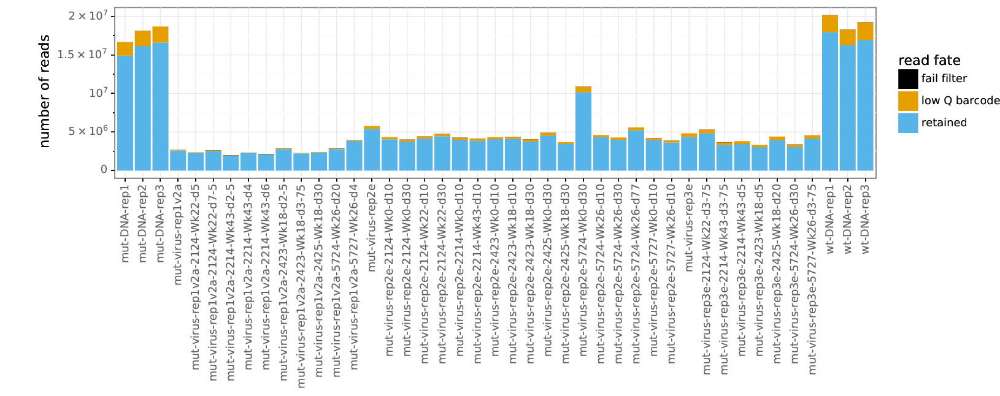


Distribution of sequencing reads per barcode on subamplicons:


```python
showPDF(countsplotprefix + 'readsperbc.pdf')
```


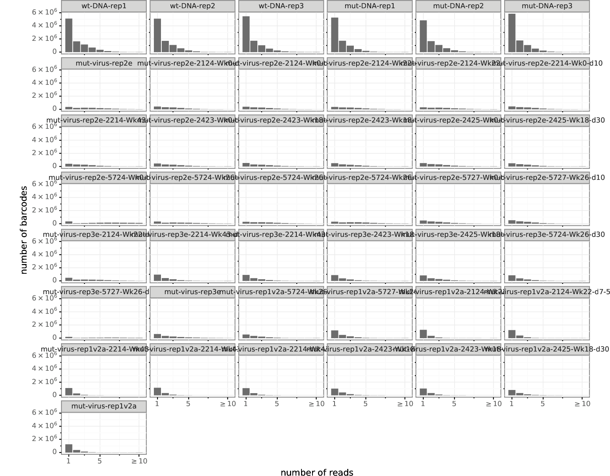


Number of barcoded subamplicons that align and have sufficient reads:


```python
showPDF(countsplotprefix + 'bcstats.pdf')
```


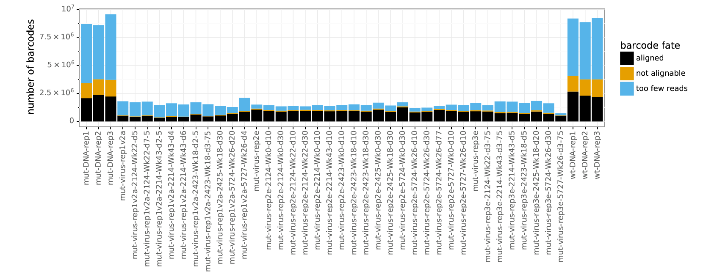


#### Coverage across gene
Depth of valid barcoded subamplicons covering each site in the gene:


```python
showPDF(countsplotprefix + 'depth.pdf')
```


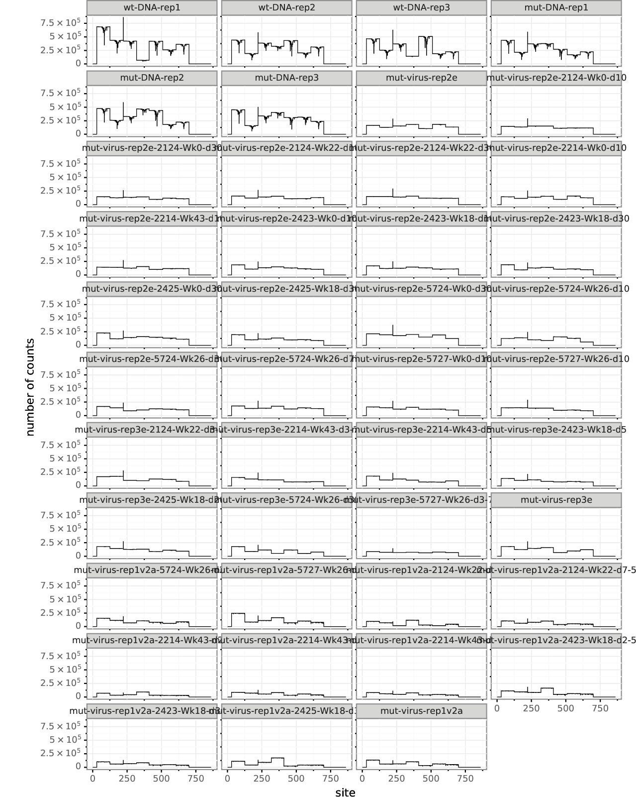


#### Mutation frequencies
The average mutation frequency for each sample, stratifying by codon mutation type:


```python
showPDF(countsplotprefix + 'codonmuttypes.pdf')
```


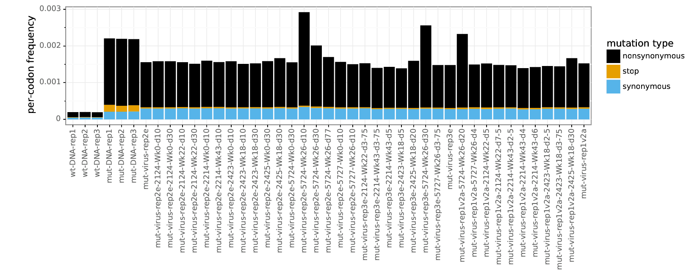


Average mutation frequency per sample, stratifying by number of nucleotide changes per codon mutation:


```python
showPDF(countsplotprefix + 'codonntchanges.pdf')
```


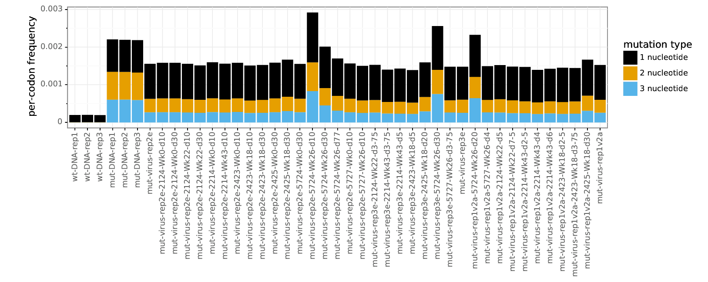


Per-codon mutation frequencies across all sites in gene for each sample:


```python
showPDF(countsplotprefix + 'mutfreq.pdf')
```


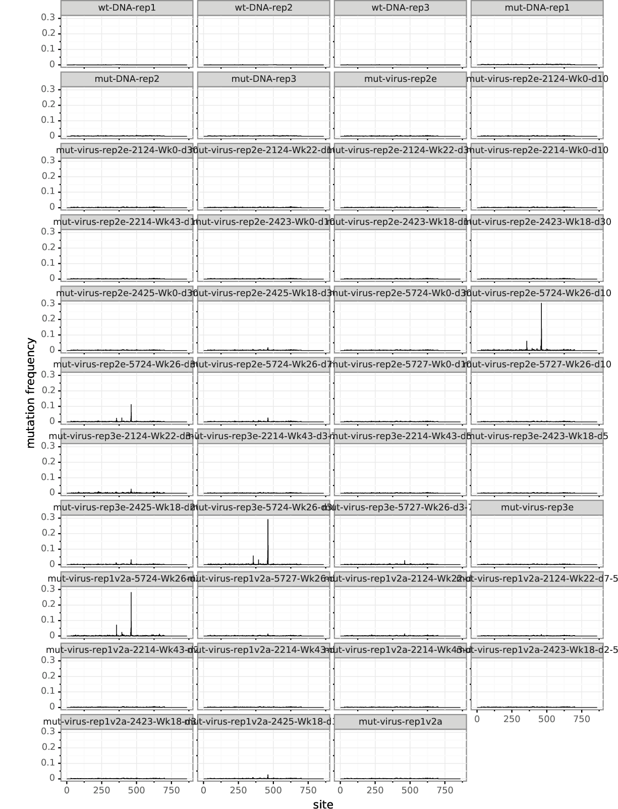


#### Check for oxidative damage
Sometimes there is oxidative damage which manifests as an enrichment of `G`->`T` and `C`->`A` mutations among the single-nucleotide codon mutations.
Check for this by plotting frequencies of different single-nucleotide mutation types:


```python
showPDF(countsplotprefix + 'singlentchanges.pdf')
```


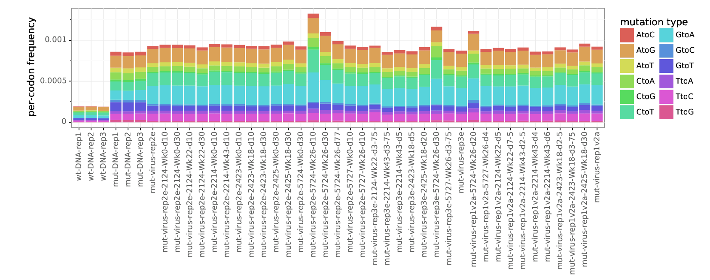


### Renumber to HXB2 Env numbering
The above alignments use sequential 1, 2, ... numbering of the codons.
This is not the standard numbering scheme used for HA, so we use [dms_tools2.utils.renumbSites](https://jbloomlab.github.io/dms_tools2/dms_tools2.utils.html#dms_tools2.utils.renumberSites) to renumber to the standard HA numbering scheme:


```python
dms_tools2.utils.renumberSites(
    renumbfile=config['renumbering_scheme'],
    infiles=list(config['countsdir'] + '/' + samples['sample'] +
                 '_codoncounts.csv'),
    missing='drop',
    outdir=config['renumbcountsdir'])

assert all(os.path.isfile(f) for f in
           config['renumbcountsdir'] + '/' + samples['sample'] +
           '_codoncounts.csv'
           ), 'missing renumbered counts files'

print(f"Renumbered codon counts are in {config['renumbcountsdir']}")
```

    Renumbered codon counts are in results/renumbered_codoncounts


## Compute immune selection on mutations
We will now determine the immune selection on each mutation by comparing its frequency in each serum-selected sample to an appropriate mock-selected control.
Specifically, we will quantify the immune selection as the *differential selection (diffsel)*, which is essentially the log enrichment of each mutation relative to wildtype in the immune-selected versus mock sample.
See [Doud et al (2017)](https://journals.plos.org/plospathogens/article?id=10.1371/journal.ppat.1006271) for the paper introducing this metric, and see [here](https://jbloomlab.github.io/dms_tools2/diffsel.html) for a more detailed description.


```python
Abs["sample"] = Abs["serum"]
Abs["sample"].replace("BG5-M2E-", "mut-virus-rep2e-", regex=True, inplace=True)
Abs["sample"].replace("BG5-M3E-", "mut-virus-rep3e-", regex=True, inplace=True)
Abs["sample"].replace("BG5-M1v2A-", "mut-virus-rep1v2a-", regex=True, inplace=True)
Abs["sample"].replace("BG-M12b-", "mut-virus-rep1v2b-", regex=True, inplace=True)

```

Now, I will merge the Abs dataframe (containing info from serum_info.yaml) into the samples dataframe (containing the list of samples used for dms_tools processing) into a single datafram called selections. 


```python
selections = (

    # get all immune selected (sel) samples
    samples
    .merge(Abs,left_on='sample', right_on='sample', validate='many_to_one')
    )
```


```python
tempnames = list(set(selections["rabbit_id"].tolist()))
#tempnames
```


```python
selections['rabbit_id'] = selections['rabbit_id'].astype(str)
selections['rabbit_id'] = selections['rabbit_id'].str.replace('.0', '')
#selections[rabbit_id] = selections[rabbit_id].fillna(0) # or 0 or any value you want here
#selections[rabbit_id] = selections[rabbit_id].astype(int)
selections
```


<div>
<style scoped>
    .dataframe tbody tr th:only-of-type {
        vertical-align: middle;
    }

    .dataframe tbody tr th {
        vertical-align: top;
    }

    .dataframe thead th {
        text-align: right;
    }
</style>
<table border="1" class="dataframe">
  <thead>
    <tr style="text-align: right;">
      <th></th>
      <th>sample</th>
      <th>rabbit_id</th>
      <th>vaccine_status</th>
      <th>library</th>
      <th>dilution</th>
      <th>fraction_surviving</th>
      <th>percent_infectivity</th>
      <th>R1</th>
      <th>SRA_accession</th>
      <th>R2</th>
      <th>serum</th>
      <th>serum_name</th>
      <th>serum_description</th>
      <th>serum_group</th>
      <th>serum_vaccination</th>
      <th>serum_immunogen</th>
      <th>serum_dilution</th>
    </tr>
  </thead>
  <tbody>
    <tr>
      <th>0</th>
      <td>mut-virus-rep2e-2124-Wk0-d10</td>
      <td>2124</td>
      <td>pre</td>
      <td>2e</td>
      <td>10.00</td>
      <td>0.090581</td>
      <td>9.058139</td>
      <td>mut-virus-rep2e-2124-Wk0-d10_R1.fastq.gz</td>
      <td>SRR12431155</td>
      <td>mut-virus-rep2e-2124-Wk0-d10_R2.fastq.gz</td>
      <td>BG5-M2E-2124-Wk0-d10</td>
      <td>2124-Wk0-d10</td>
      <td>rabbit sera provided by John Moore. et al, vaccinated with BG505 trimer</td>
      <td>Weak 241/289 effect, nearly pan-resistant</td>
      <td>pre</td>
      <td>None</td>
      <td>10</td>
    </tr>
    <tr>
      <th>1</th>
      <td>mut-virus-rep2e-2124-Wk0-d30</td>
      <td>2124</td>
      <td>pre</td>
      <td>2e</td>
      <td>30.00</td>
      <td>0.243552</td>
      <td>24.355172</td>
      <td>mut-virus-rep2e-2124-Wk0-d30_R1.fastq.gz</td>
      <td>SRR12431181</td>
      <td>mut-virus-rep2e-2124-Wk0-d30_R2.fastq.gz</td>
      <td>BG5-M2E-2124-Wk0-d30</td>
      <td>2124-Wk0-d30</td>
      <td>rabbit sera provided by John Moore. et al, vaccinated with BG505 trimer</td>
      <td>Weak 241/289 effect, nearly pan-resistant</td>
      <td>pre</td>
      <td>None</td>
      <td>30</td>
    </tr>
    <tr>
      <th>2</th>
      <td>mut-virus-rep2e-2124-Wk22-d10</td>
      <td>2124</td>
      <td>post</td>
      <td>2e</td>
      <td>10.00</td>
      <td>0.011684</td>
      <td>1.168417</td>
      <td>mut-virus-rep2e-2124-Wk22-d10_R1.fastq.gz</td>
      <td>SRR12431170</td>
      <td>mut-virus-rep2e-2124-Wk22-d10_R2.fastq.gz</td>
      <td>BG5-M2E-2124-Wk22-d10</td>
      <td>2124-Wk22-d10</td>
      <td>rabbit sera provided by John Moore. et al, vaccinated with BG505 trimer</td>
      <td>Weak 241/289 effect, nearly pan-resistant</td>
      <td>post</td>
      <td>BG505 SOSIP.664 x 3</td>
      <td>10</td>
    </tr>
    <tr>
      <th>3</th>
      <td>mut-virus-rep2e-2124-Wk22-d30</td>
      <td>2124</td>
      <td>post</td>
      <td>2e</td>
      <td>30.00</td>
      <td>0.092672</td>
      <td>9.267217</td>
      <td>mut-virus-rep2e-2124-Wk22-d30_R1.fastq.gz</td>
      <td>SRR12431162</td>
      <td>mut-virus-rep2e-2124-Wk22-d30_R2.fastq.gz</td>
      <td>BG5-M2E-2124-Wk22-d30</td>
      <td>2124-Wk22-d30</td>
      <td>rabbit sera provided by John Moore. et al, vaccinated with BG505 trimer</td>
      <td>Weak 241/289 effect, nearly pan-resistant</td>
      <td>post</td>
      <td>BG505 SOSIP.664 x 3</td>
      <td>30</td>
    </tr>
    <tr>
      <th>4</th>
      <td>mut-virus-rep2e-2214-Wk0-d10</td>
      <td>2214</td>
      <td>pre</td>
      <td>2e</td>
      <td>10.00</td>
      <td>0.090936</td>
      <td>9.093577</td>
      <td>mut-virus-rep2e-2214-Wk0-d10_R1.fastq.gz</td>
      <td>SRR12431161</td>
      <td>mut-virus-rep2e-2214-Wk0-d10_R2.fastq.gz</td>
      <td>BG5-M2E-2214-Wk0-d10</td>
      <td>2214-Wk0-d10</td>
      <td>rabbit sera provided by John Moore. et al, vaccinated with BG505 trimer</td>
      <td>double epitope cluster</td>
      <td>pre</td>
      <td>None</td>
      <td>10</td>
    </tr>
    <tr>
      <th>5</th>
      <td>mut-virus-rep2e-2214-Wk43-d10</td>
      <td>2214</td>
      <td>post</td>
      <td>2e</td>
      <td>10.00</td>
      <td>0.040577</td>
      <td>4.057690</td>
      <td>mut-virus-rep2e-2214-Wk43-d10_R1.fastq.gz</td>
      <td>SRR12431160</td>
      <td>mut-virus-rep2e-2214-Wk43-d10_R2.fastq.gz</td>
      <td>BG5-M2E-2214-Wk43-d10</td>
      <td>2214-Wk43-d10</td>
      <td>rabbit sera provided by John Moore. et al, vaccinated with BG505 trimer</td>
      <td>double epitope cluster</td>
      <td>post</td>
      <td>BG505 SOSIP.v4.1 x 4</td>
      <td>10</td>
    </tr>
    <tr>
      <th>6</th>
      <td>mut-virus-rep2e-2423-Wk0-d10</td>
      <td>2423</td>
      <td>pre</td>
      <td>2e</td>
      <td>10.00</td>
      <td>0.099651</td>
      <td>9.965059</td>
      <td>mut-virus-rep2e-2423-Wk0-d10_R1.fastq.gz</td>
      <td>SRR12431159</td>
      <td>mut-virus-rep2e-2423-Wk0-d10_R2.fastq.gz</td>
      <td>BG5-M2E-2423-Wk0-d10</td>
      <td>2423-Wk0-d10</td>
      <td>rabbit sera provided by John Moore. et al, vaccinated with BG505 trimer</td>
      <td>mainly 241/289</td>
      <td>pre</td>
      <td>None</td>
      <td>10</td>
    </tr>
    <tr>
      <th>7</th>
      <td>mut-virus-rep2e-2423-Wk18-d10</td>
      <td>2423</td>
      <td>post</td>
      <td>2e</td>
      <td>10.00</td>
      <td>0.029337</td>
      <td>2.933714</td>
      <td>mut-virus-rep2e-2423-Wk18-d10_R1.fastq.gz</td>
      <td>SRR12431158</td>
      <td>mut-virus-rep2e-2423-Wk18-d10_R2.fastq.gz</td>
      <td>BG5-M2E-2423-Wk18-d10</td>
      <td>2423-Wk18-d10</td>
      <td>rabbit sera provided by John Moore. et al, vaccinated with BG505 trimer</td>
      <td>mainly 241/289</td>
      <td>post</td>
      <td>BG505 SOSIP.v4.1 x 3</td>
      <td>10</td>
    </tr>
    <tr>
      <th>8</th>
      <td>mut-virus-rep2e-2423-Wk18-d30</td>
      <td>2423</td>
      <td>post</td>
      <td>2e</td>
      <td>30.00</td>
      <td>0.080388</td>
      <td>8.038812</td>
      <td>mut-virus-rep2e-2423-Wk18-d30_R1.fastq.gz</td>
      <td>SRR12431157</td>
      <td>mut-virus-rep2e-2423-Wk18-d30_R2.fastq.gz</td>
      <td>BG5-M2E-2423-Wk18-d30</td>
      <td>2423-Wk18-d30</td>
      <td>rabbit sera provided by John Moore. et al, vaccinated with BG505 trimer</td>
      <td>mainly 241/289</td>
      <td>post</td>
      <td>BG505 SOSIP.v4.1 x 3</td>
      <td>30</td>
    </tr>
    <tr>
      <th>9</th>
      <td>mut-virus-rep2e-2425-Wk0-d30</td>
      <td>2425</td>
      <td>pre</td>
      <td>2e</td>
      <td>30.00</td>
      <td>0.297575</td>
      <td>29.757478</td>
      <td>mut-virus-rep2e-2425-Wk0-d30_R1.fastq.gz</td>
      <td>SRR12431154</td>
      <td>mut-virus-rep2e-2425-Wk0-d30_R2.fastq.gz</td>
      <td>BG5-M2E-2425-Wk0-d30</td>
      <td>2425-Wk0-d30</td>
      <td>rabbit sera provided by John Moore. et al, vaccinated with BG505 trimer</td>
      <td>C3/465</td>
      <td>pre</td>
      <td>None</td>
      <td>30</td>
    </tr>
    <tr>
      <th>10</th>
      <td>mut-virus-rep2e-2425-Wk18-d30</td>
      <td>2425</td>
      <td>post</td>
      <td>2e</td>
      <td>30.00</td>
      <td>0.017565</td>
      <td>1.756546</td>
      <td>mut-virus-rep2e-2425-Wk18-d30_R1.fastq.gz</td>
      <td>SRR12431153</td>
      <td>mut-virus-rep2e-2425-Wk18-d30_R2.fastq.gz</td>
      <td>BG5-M2E-2425-Wk18-d30</td>
      <td>2425-Wk18-d30</td>
      <td>rabbit sera provided by John Moore. et al, vaccinated with BG505 trimer</td>
      <td>C3/465</td>
      <td>post</td>
      <td>BG505 SOSIP.v4.1 x 3</td>
      <td>30</td>
    </tr>
    <tr>
      <th>11</th>
      <td>mut-virus-rep2e-5724-Wk0-d30</td>
      <td>5724</td>
      <td>pre</td>
      <td>2e</td>
      <td>30.00</td>
      <td>0.192259</td>
      <td>19.225925</td>
      <td>mut-virus-rep2e-5724-Wk0-d30_R1.fastq.gz</td>
      <td>SRR12431189</td>
      <td>mut-virus-rep2e-5724-Wk0-d30_R2.fastq.gz</td>
      <td>BG5-M2E-5724-Wk0-d30</td>
      <td>5724-Wk0-d30</td>
      <td>rabbit sera provided by John Moore. et al, vaccinated with BG505 trimer</td>
      <td>C3/465</td>
      <td>pre</td>
      <td>None</td>
      <td>30</td>
    </tr>
    <tr>
      <th>12</th>
      <td>mut-virus-rep2e-5724-Wk26-d10</td>
      <td>5724</td>
      <td>post</td>
      <td>2e</td>
      <td>10.00</td>
      <td>0.000218</td>
      <td>0.021838</td>
      <td>mut-virus-rep2e-5724-Wk26-d10_R1.fastq.gz</td>
      <td>SRR12431188</td>
      <td>mut-virus-rep2e-5724-Wk26-d10_R2.fastq.gz</td>
      <td>BG5-M2E-5724-Wk26-d10</td>
      <td>5724-Wk26-d10</td>
      <td>rabbit sera provided by John Moore. et al, vaccinated with BG505 trimer</td>
      <td>C3/465</td>
      <td>post</td>
      <td>BG505 SOSIP.664 x 4</td>
      <td>10</td>
    </tr>
    <tr>
      <th>13</th>
      <td>mut-virus-rep2e-5724-Wk26-d30</td>
      <td>5724</td>
      <td>post</td>
      <td>2e</td>
      <td>30.00</td>
      <td>0.001877</td>
      <td>0.187737</td>
      <td>mut-virus-rep2e-5724-Wk26-d30_R1.fastq.gz</td>
      <td>SRR12431187</td>
      <td>mut-virus-rep2e-5724-Wk26-d30_R2.fastq.gz</td>
      <td>BG5-M2E-5724-Wk26-d30</td>
      <td>5724-Wk26-d30</td>
      <td>rabbit sera provided by John Moore. et al, vaccinated with BG505 trimer</td>
      <td>C3/465</td>
      <td>post</td>
      <td>BG505 SOSIP.664 x 4</td>
      <td>30</td>
    </tr>
    <tr>
      <th>14</th>
      <td>mut-virus-rep2e-5724-Wk26-d77</td>
      <td>5724</td>
      <td>post</td>
      <td>2e</td>
      <td>77.00</td>
      <td>0.013022</td>
      <td>1.302213</td>
      <td>mut-virus-rep2e-5724-Wk26-d77_R1.fastq.gz</td>
      <td>SRR12431186</td>
      <td>mut-virus-rep2e-5724-Wk26-d77_R2.fastq.gz</td>
      <td>BG5-M2E-5724-Wk26-d77</td>
      <td>5724-Wk26-d77</td>
      <td>rabbit sera provided by John Moore. et al, vaccinated with BG505 trimer</td>
      <td>C3/465</td>
      <td>post</td>
      <td>BG505 SOSIP.664 x 4</td>
      <td>77</td>
    </tr>
    <tr>
      <th>15</th>
      <td>mut-virus-rep2e-5727-Wk0-d10</td>
      <td>5727</td>
      <td>pre</td>
      <td>2e</td>
      <td>10.00</td>
      <td>0.089526</td>
      <td>8.952593</td>
      <td>mut-virus-rep2e-5727-Wk0-d10_R1.fastq.gz</td>
      <td>SRR12431185</td>
      <td>mut-virus-rep2e-5727-Wk0-d10_R2.fastq.gz</td>
      <td>BG5-M2E-5727-Wk0-d10</td>
      <td>5727-Wk0-d10</td>
      <td>rabbit sera provided by John Moore. et al, vaccinated with BG505 trimer</td>
      <td>mainly 465</td>
      <td>pre</td>
      <td>None</td>
      <td>10</td>
    </tr>
    <tr>
      <th>16</th>
      <td>mut-virus-rep2e-5727-Wk26-d10</td>
      <td>5727</td>
      <td>post</td>
      <td>2e</td>
      <td>10.00</td>
      <td>0.028932</td>
      <td>2.893160</td>
      <td>mut-virus-rep2e-5727-Wk26-d10_R1.fastq.gz</td>
      <td>SRR12431184</td>
      <td>mut-virus-rep2e-5727-Wk26-d10_R2.fastq.gz</td>
      <td>BG5-M2E-5727-Wk26-d10</td>
      <td>5727-Wk26-d10</td>
      <td>rabbit sera provided by John Moore. et al, vaccinated with BG505 trimer</td>
      <td>mainly 465</td>
      <td>post</td>
      <td>BG505 SOSIP.664 x 4</td>
      <td>10</td>
    </tr>
    <tr>
      <th>17</th>
      <td>mut-virus-rep3e-2124-Wk22-d3-75</td>
      <td>2124</td>
      <td>post</td>
      <td>3e</td>
      <td>3.75</td>
      <td>0.000431</td>
      <td>0.043140</td>
      <td>mut-virus-rep3e-2124-Wk22-d3-75_R1.fastq.gz</td>
      <td>SRR12431183</td>
      <td>mut-virus-rep3e-2124-Wk22-d3-75_R2.fastq.gz</td>
      <td>BG5-M3E-2124-Wk22-d3-75</td>
      <td>2124-Wk22-d3.75</td>
      <td>rabbit sera provided by John Moore. et al, vaccinated with BG505 trimer</td>
      <td>Weak 241/289 effect, nearly pan-resistant</td>
      <td>post</td>
      <td>BG505 SOSIP.664 x 3</td>
      <td>3.75</td>
    </tr>
    <tr>
      <th>18</th>
      <td>mut-virus-rep3e-2214-Wk43-d3-75</td>
      <td>2214</td>
      <td>post</td>
      <td>3e</td>
      <td>3.75</td>
      <td>0.012109</td>
      <td>1.210875</td>
      <td>mut-virus-rep3e-2214-Wk43-d3-75_R1.fastq.gz</td>
      <td>SRR12431182</td>
      <td>mut-virus-rep3e-2214-Wk43-d3-75_R2.fastq.gz</td>
      <td>BG5-M3E-2214-Wk43-d3-75</td>
      <td>2214-Wk43-d3.75</td>
      <td>rabbit sera provided by John Moore. et al, vaccinated with BG505 trimer</td>
      <td>double epitope cluster</td>
      <td>post</td>
      <td>BG505 SOSIP.v4.1 x 4</td>
      <td>3.75</td>
    </tr>
    <tr>
      <th>19</th>
      <td>mut-virus-rep3e-2214-Wk43-d5</td>
      <td>2214</td>
      <td>post</td>
      <td>3e</td>
      <td>5.00</td>
      <td>0.019072</td>
      <td>1.907208</td>
      <td>mut-virus-rep3e-2214-Wk43-d5_R1.fastq.gz</td>
      <td>SRR12431180</td>
      <td>mut-virus-rep3e-2214-Wk43-d5_R2.fastq.gz</td>
      <td>BG5-M3E-2214-Wk43-d5</td>
      <td>2214-Wk43-d5</td>
      <td>rabbit sera provided by John Moore. et al, vaccinated with BG505 trimer</td>
      <td>double epitope cluster</td>
      <td>post</td>
      <td>BG505 SOSIP.v4.1 x 4</td>
      <td>5</td>
    </tr>
    <tr>
      <th>20</th>
      <td>mut-virus-rep3e-2423-Wk18-d5</td>
      <td>2423</td>
      <td>post</td>
      <td>3e</td>
      <td>5.00</td>
      <td>0.018708</td>
      <td>1.870821</td>
      <td>mut-virus-rep3e-2423-Wk18-d5_R1.fastq.gz</td>
      <td>SRR12431179</td>
      <td>mut-virus-rep3e-2423-Wk18-d5_R2.fastq.gz</td>
      <td>BG5-M3E-2423-Wk18-d5</td>
      <td>2423-Wk18-d5</td>
      <td>rabbit sera provided by John Moore. et al, vaccinated with BG505 trimer</td>
      <td>mainly 241/289</td>
      <td>post</td>
      <td>BG505 SOSIP.v4.1 x 3</td>
      <td>5</td>
    </tr>
    <tr>
      <th>21</th>
      <td>mut-virus-rep3e-2425-Wk18-d20</td>
      <td>2425</td>
      <td>post</td>
      <td>3e</td>
      <td>20.00</td>
      <td>0.007487</td>
      <td>0.748662</td>
      <td>mut-virus-rep3e-2425-Wk18-d20_R1.fastq.gz</td>
      <td>SRR12431178</td>
      <td>mut-virus-rep3e-2425-Wk18-d20_R2.fastq.gz</td>
      <td>BG5-M3E-2425-Wk18-d20</td>
      <td>2425-Wk18-d20</td>
      <td>rabbit sera provided by John Moore. et al, vaccinated with BG505 trimer</td>
      <td>C3/465</td>
      <td>pre</td>
      <td>None</td>
      <td>20</td>
    </tr>
    <tr>
      <th>22</th>
      <td>mut-virus-rep3e-5724-Wk26-d30</td>
      <td>5724</td>
      <td>post</td>
      <td>3e</td>
      <td>30.00</td>
      <td>0.000955</td>
      <td>0.095505</td>
      <td>mut-virus-rep3e-5724-Wk26-d30_R1.fastq.gz</td>
      <td>SRR12431177</td>
      <td>mut-virus-rep3e-5724-Wk26-d30_R2.fastq.gz</td>
      <td>BG5-M3E-5724-Wk26-d30</td>
      <td>5724-Wk26-d30</td>
      <td>rabbit sera provided by John Moore. et al, vaccinated with BG505 trimer</td>
      <td>C3/465</td>
      <td>post</td>
      <td>BG505 SOSIP.664 x 4</td>
      <td>30</td>
    </tr>
    <tr>
      <th>23</th>
      <td>mut-virus-rep3e-5727-Wk26-d3-75</td>
      <td>5727</td>
      <td>post</td>
      <td>3e</td>
      <td>3.75</td>
      <td>0.002762</td>
      <td>0.276168</td>
      <td>mut-virus-rep3e-5727-Wk26-d3-75_R1.fastq.gz</td>
      <td>SRR12431176</td>
      <td>mut-virus-rep3e-5727-Wk26-d3-75_R2.fastq.gz</td>
      <td>BG5-M3E-5727-Wk26-d3-75</td>
      <td>5727-Wk26-d3.75</td>
      <td>rabbit sera provided by John Moore. et al, vaccinated with BG505 trimer</td>
      <td>mainly 465</td>
      <td>post</td>
      <td>BG505 SOSIP.664 x 4</td>
      <td>3.75</td>
    </tr>
    <tr>
      <th>24</th>
      <td>mut-virus-rep1v2a-5724-Wk26-d20</td>
      <td>5724</td>
      <td>post</td>
      <td>1v2a</td>
      <td>20.00</td>
      <td>0.000163</td>
      <td>0.016343</td>
      <td>mut-virus-rep1v2a-5724-Wk26-d20_R1.fastq.gz</td>
      <td>SRR12431174</td>
      <td>mut-virus-rep1v2a-5724-Wk26-d20_R2.fastq.gz</td>
      <td>BG5-M1v2A-5724-Wk26-d20</td>
      <td>5724-Wk26-d20</td>
      <td>rabbit sera provided by John Moore. et al, vaccinated with BG505 trimer</td>
      <td>C3/465</td>
      <td>post</td>
      <td>BG505 SOSIP.664 x 4</td>
      <td>20</td>
    </tr>
    <tr>
      <th>25</th>
      <td>mut-virus-rep1v2a-5727-Wk26-d4</td>
      <td>5727</td>
      <td>post</td>
      <td>1v2a</td>
      <td>4.00</td>
      <td>0.001466</td>
      <td>0.146609</td>
      <td>mut-virus-rep1v2a-5727-Wk26-d4_R1.fastq.gz</td>
      <td>SRR12431173</td>
      <td>mut-virus-rep1v2a-5727-Wk26-d4_R2.fastq.gz</td>
      <td>BG5-M1v2A-5727-Wk26-d4</td>
      <td>5727-Wk26-d4</td>
      <td>rabbit sera provided by John Moore. et al, vaccinated with BG505 trimer</td>
      <td>mainly 465</td>
      <td>post</td>
      <td>BG505 SOSIP.664 x 4</td>
      <td>4</td>
    </tr>
    <tr>
      <th>26</th>
      <td>mut-virus-rep1v2a-2124-Wk22-d5</td>
      <td>2124</td>
      <td>post</td>
      <td>1v2a</td>
      <td>5.00</td>
      <td>0.000725</td>
      <td>0.072538</td>
      <td>mut-virus-rep1v2a-2124-Wk22-d5_R1.fastq.gz</td>
      <td>SRR12431172</td>
      <td>mut-virus-rep1v2a-2124-Wk22-d5_R2.fastq.gz</td>
      <td>BG5-M1v2A-2124-Wk22-d5</td>
      <td>2124-Wk22-d5</td>
      <td>rabbit sera provided by John Moore. et al, vaccinated with BG505 trimer</td>
      <td>Weak 241/289 effect, nearly pan-resistant</td>
      <td>post</td>
      <td>BG505 SOSIP.664 x 3</td>
      <td>5</td>
    </tr>
    <tr>
      <th>27</th>
      <td>mut-virus-rep1v2a-2124-Wk22-d7-5</td>
      <td>2124</td>
      <td>post</td>
      <td>1v2a</td>
      <td>7.50</td>
      <td>0.004091</td>
      <td>0.409104</td>
      <td>mut-virus-rep1v2a-2124-Wk22-d7-5_R1.fastq.gz</td>
      <td>SRR12431171</td>
      <td>mut-virus-rep1v2a-2124-Wk22-d7-5_R2.fastq.gz</td>
      <td>BG5-M1v2A-2124-Wk22-d7-5</td>
      <td>2124-Wk22-d7.5</td>
      <td>rabbit sera provided by John Moore. et al, vaccinated with BG505 trimer</td>
      <td>Weak 241/289 effect, nearly pan-resistant</td>
      <td>post</td>
      <td>BG505 SOSIP.664 x 3</td>
      <td>7.5</td>
    </tr>
    <tr>
      <th>28</th>
      <td>mut-virus-rep1v2a-2214-Wk43-d2-5</td>
      <td>2214</td>
      <td>post</td>
      <td>1v2a</td>
      <td>2.50</td>
      <td>0.001888</td>
      <td>0.188846</td>
      <td>mut-virus-rep1v2a-2214-Wk43-d2-5_R1.fastq.gz</td>
      <td>SRR12431169</td>
      <td>mut-virus-rep1v2a-2214-Wk43-d2-5_R2.fastq.gz</td>
      <td>BG5-M1v2A-2214-Wk43-d2-5</td>
      <td>2214-Wk43-d2.5</td>
      <td>rabbit sera provided by John Moore. et al, vaccinated with BG505 trimer</td>
      <td>double epitope cluster</td>
      <td>post</td>
      <td>BG505 SOSIP.v4.1 x 4</td>
      <td>2.5</td>
    </tr>
    <tr>
      <th>29</th>
      <td>mut-virus-rep1v2a-2214-Wk43-d4</td>
      <td>2214</td>
      <td>post</td>
      <td>1v2a</td>
      <td>4.00</td>
      <td>0.007768</td>
      <td>0.776803</td>
      <td>mut-virus-rep1v2a-2214-Wk43-d4_R1.fastq.gz</td>
      <td>SRR12431168</td>
      <td>mut-virus-rep1v2a-2214-Wk43-d4_R2.fastq.gz</td>
      <td>BG5-M1v2A-2214-Wk43-d4</td>
      <td>2214-Wk43-d4</td>
      <td>rabbit sera provided by John Moore. et al, vaccinated with BG505 trimer</td>
      <td>double epitope cluster</td>
      <td>post</td>
      <td>BG505 SOSIP.v4.1 x 4</td>
      <td>4</td>
    </tr>
    <tr>
      <th>30</th>
      <td>mut-virus-rep1v2a-2214-Wk43-d6</td>
      <td>2214</td>
      <td>post</td>
      <td>1v2a</td>
      <td>6.00</td>
      <td>0.015223</td>
      <td>1.522294</td>
      <td>mut-virus-rep1v2a-2214-Wk43-d6_R1.fastq.gz</td>
      <td>SRR12431167</td>
      <td>mut-virus-rep1v2a-2214-Wk43-d6_R2.fastq.gz</td>
      <td>BG5-M1v2A-2214-Wk43-d6</td>
      <td>2214-Wk43-d6</td>
      <td>rabbit sera provided by John Moore. et al, vaccinated with BG505 trimer</td>
      <td>double epitope cluster</td>
      <td>post</td>
      <td>BG505 SOSIP.v4.1 x 4</td>
      <td>6</td>
    </tr>
    <tr>
      <th>31</th>
      <td>mut-virus-rep1v2a-2423-Wk18-d2-5</td>
      <td>2423</td>
      <td>post</td>
      <td>1v2a</td>
      <td>2.50</td>
      <td>0.003153</td>
      <td>0.315325</td>
      <td>mut-virus-rep1v2a-2423-Wk18-d2-5_R1.fastq.gz</td>
      <td>SRR12431166</td>
      <td>mut-virus-rep1v2a-2423-Wk18-d2-5_R2.fastq.gz</td>
      <td>BG5-M1v2A-2423-Wk18-d2-5</td>
      <td>2423-Wk18-d2.5</td>
      <td>rabbit sera provided by John Moore. et al, vaccinated with BG505 trimer</td>
      <td>mainly 241/289</td>
      <td>post</td>
      <td>BG505 SOSIP.v4.1 x 3</td>
      <td>2.5</td>
    </tr>
    <tr>
      <th>32</th>
      <td>mut-virus-rep1v2a-2423-Wk18-d3-75</td>
      <td>2423</td>
      <td>post</td>
      <td>1v2a</td>
      <td>3.75</td>
      <td>0.003128</td>
      <td>0.312757</td>
      <td>mut-virus-rep1v2a-2423-Wk18-d3-75_R1.fastq.gz</td>
      <td>SRR12431165</td>
      <td>mut-virus-rep1v2a-2423-Wk18-d3-75_R2.fastq.gz</td>
      <td>BG5-M1v2A-2423-Wk18-d3-75</td>
      <td>2423-Wk18-d3.75</td>
      <td>rabbit sera provided by John Moore. et al, vaccinated with BG505 trimer</td>
      <td>mainly 241/289</td>
      <td>post</td>
      <td>BG505 SOSIP.v4.1 x 3</td>
      <td>3.75</td>
    </tr>
    <tr>
      <th>33</th>
      <td>mut-virus-rep1v2a-2425-Wk18-d30</td>
      <td>2425</td>
      <td>post</td>
      <td>1v2a</td>
      <td>30.00</td>
      <td>0.003342</td>
      <td>0.334152</td>
      <td>mut-virus-rep1v2a-2425-Wk18-d30_R1.fastq.gz</td>
      <td>SRR12431164</td>
      <td>mut-virus-rep1v2a-2425-Wk18-d30_R2.fastq.gz</td>
      <td>BG5-M1v2A-2425-Wk18-d30</td>
      <td>2425-Wk18-d30</td>
      <td>rabbit sera provided by John Moore. et al, vaccinated with BG505 trimer</td>
      <td>C3/465</td>
      <td>post</td>
      <td>BG505 SOSIP.v4.1 x 3</td>
      <td>30</td>
    </tr>
  </tbody>
</table>
</div>


### Samples to compare for each selection
In order to quantify the immune selection, we need to compare each selected sample to the appropriate controls.
Specifically, for each selection, we define three samples:
 - *sel*: the immune-selected sample
 - *mock*: the appropriate mock-selected control for that date and library
 - *err*: the appropriate wildtype plasmid control to estimate sequencing error rates.
 - *group*: groups containing all replicates of specific serum samples (i.e. pre and post samples from the same rabbit are different groups)
  
Below we import this information on the selections:


```python
outdir = config['diffseldir']
os.makedirs(outdir, exist_ok=True)

# write batch file used by program
batchdf = pd.read_csv("./data/diffselbatch.csv")
display(HTML(batchdf.to_html(index=False)))

batchfile = os.path.join(outdir, 'batch.csv')
(batchdf.to_csv(batchfile, index=False)
 )

```


<table border="1" class="dataframe">
  <thead>
    <tr style="text-align: right;">
      <th>group</th>
      <th>name</th>
      <th>sel</th>
      <th>mock</th>
      <th>err</th>
      <th>mds_name</th>
    </tr>
  </thead>
  <tbody>
    <tr>
      <td>2124-Wk0</td>
      <td>rep2e-d10</td>
      <td>mut-virus-rep2e-2124-Wk0-d10</td>
      <td>mut-virus-rep2e</td>
      <td>wt-DNA-rep2</td>
      <td>2124-Wk0-rep2e-d10</td>
    </tr>
    <tr>
      <td>2124-Wk0</td>
      <td>rep2e-d30</td>
      <td>mut-virus-rep2e-2124-Wk0-d30</td>
      <td>mut-virus-rep2e</td>
      <td>wt-DNA-rep2</td>
      <td>2124-Wk0-rep2e-d30</td>
    </tr>
    <tr>
      <td>2124-Wk22</td>
      <td>rep2e-d10</td>
      <td>mut-virus-rep2e-2124-Wk22-d10</td>
      <td>mut-virus-rep2e</td>
      <td>wt-DNA-rep2</td>
      <td>2124-Wk22-rep2e-d10</td>
    </tr>
    <tr>
      <td>2124-Wk22</td>
      <td>rep2e-d30</td>
      <td>mut-virus-rep2e-2124-Wk22-d30</td>
      <td>mut-virus-rep2e</td>
      <td>wt-DNA-rep2</td>
      <td>2124-Wk22-rep2e-d30</td>
    </tr>
    <tr>
      <td>2214-Wk0</td>
      <td>rep2e-d10</td>
      <td>mut-virus-rep2e-2214-Wk0-d10</td>
      <td>mut-virus-rep2e</td>
      <td>wt-DNA-rep2</td>
      <td>2214-Wk0-rep2e-d10</td>
    </tr>
    <tr>
      <td>2214-Wk43</td>
      <td>rep2e-d10</td>
      <td>mut-virus-rep2e-2214-Wk43-d10</td>
      <td>mut-virus-rep2e</td>
      <td>wt-DNA-rep2</td>
      <td>2214-Wk43-rep2e-d10</td>
    </tr>
    <tr>
      <td>2423-Wk0</td>
      <td>rep2e-d10</td>
      <td>mut-virus-rep2e-2423-Wk0-d10</td>
      <td>mut-virus-rep2e</td>
      <td>wt-DNA-rep2</td>
      <td>2423-Wk0-rep2e-d10</td>
    </tr>
    <tr>
      <td>2423-Wk18</td>
      <td>rep2e-d10</td>
      <td>mut-virus-rep2e-2423-Wk18-d10</td>
      <td>mut-virus-rep2e</td>
      <td>wt-DNA-rep2</td>
      <td>2423-Wk18-rep2e-d10</td>
    </tr>
    <tr>
      <td>2423-Wk18</td>
      <td>rep2e-d30</td>
      <td>mut-virus-rep2e-2423-Wk18-d30</td>
      <td>mut-virus-rep2e</td>
      <td>wt-DNA-rep2</td>
      <td>2423-Wk18-rep2e-d30</td>
    </tr>
    <tr>
      <td>2425-Wk0</td>
      <td>rep2e-d30</td>
      <td>mut-virus-rep2e-2425-Wk0-d30</td>
      <td>mut-virus-rep2e</td>
      <td>wt-DNA-rep2</td>
      <td>2425-Wk0-rep2e-d30</td>
    </tr>
    <tr>
      <td>2425-Wk18</td>
      <td>rep2e-d30</td>
      <td>mut-virus-rep2e-2425-Wk18-d30</td>
      <td>mut-virus-rep2e</td>
      <td>wt-DNA-rep2</td>
      <td>2425-Wk18-rep2e-d30</td>
    </tr>
    <tr>
      <td>5724-Wk0</td>
      <td>rep2e-d30</td>
      <td>mut-virus-rep2e-5724-Wk0-d30</td>
      <td>mut-virus-rep2e</td>
      <td>wt-DNA-rep2</td>
      <td>5724-Wk0-rep2e-d30</td>
    </tr>
    <tr>
      <td>5724-Wk26</td>
      <td>rep2e-d10</td>
      <td>mut-virus-rep2e-5724-Wk26-d10</td>
      <td>mut-virus-rep2e</td>
      <td>wt-DNA-rep2</td>
      <td>5724-Wk26-rep2e-d10</td>
    </tr>
    <tr>
      <td>5724-Wk26</td>
      <td>rep2e-d30</td>
      <td>mut-virus-rep2e-5724-Wk26-d30</td>
      <td>mut-virus-rep2e</td>
      <td>wt-DNA-rep2</td>
      <td>5724-Wk26-rep2e-d30</td>
    </tr>
    <tr>
      <td>5724-Wk26</td>
      <td>rep2e-d77</td>
      <td>mut-virus-rep2e-5724-Wk26-d77</td>
      <td>mut-virus-rep2e</td>
      <td>wt-DNA-rep2</td>
      <td>5724-Wk26-rep2e-d77</td>
    </tr>
    <tr>
      <td>5727-Wk0</td>
      <td>rep2e-d10</td>
      <td>mut-virus-rep2e-5727-Wk0-d10</td>
      <td>mut-virus-rep2e</td>
      <td>wt-DNA-rep2</td>
      <td>5727-Wk0-rep2e-d10</td>
    </tr>
    <tr>
      <td>5727-Wk26</td>
      <td>rep2e-d10</td>
      <td>mut-virus-rep2e-5727-Wk26-d10</td>
      <td>mut-virus-rep2e</td>
      <td>wt-DNA-rep2</td>
      <td>5727-Wk26-rep2e-d10</td>
    </tr>
    <tr>
      <td>2124-Wk22</td>
      <td>rep3e-d3-75</td>
      <td>mut-virus-rep3e-2124-Wk22-d3-75</td>
      <td>mut-virus-rep3e</td>
      <td>wt-DNA-rep3</td>
      <td>2124-Wk22-rep3e-d3-75</td>
    </tr>
    <tr>
      <td>2214-Wk43</td>
      <td>rep3e-d3-75</td>
      <td>mut-virus-rep3e-2214-Wk43-d3-75</td>
      <td>mut-virus-rep3e</td>
      <td>wt-DNA-rep3</td>
      <td>2214-Wk43-rep3e-d3-75</td>
    </tr>
    <tr>
      <td>2214-Wk43</td>
      <td>rep3e-d5</td>
      <td>mut-virus-rep3e-2214-Wk43-d5</td>
      <td>mut-virus-rep3e</td>
      <td>wt-DNA-rep3</td>
      <td>2214-Wk43-rep3e-d5</td>
    </tr>
    <tr>
      <td>2423-Wk18</td>
      <td>rep3e-d5</td>
      <td>mut-virus-rep3e-2423-Wk18-d5</td>
      <td>mut-virus-rep3e</td>
      <td>wt-DNA-rep3</td>
      <td>2423-Wk18-rep3e-d5</td>
    </tr>
    <tr>
      <td>2425-Wk18</td>
      <td>rep3e-d20</td>
      <td>mut-virus-rep3e-2425-Wk18-d20</td>
      <td>mut-virus-rep3e</td>
      <td>wt-DNA-rep3</td>
      <td>2425-Wk18-rep3e-d20</td>
    </tr>
    <tr>
      <td>5724-Wk26</td>
      <td>rep3e-d30</td>
      <td>mut-virus-rep3e-5724-Wk26-d30</td>
      <td>mut-virus-rep3e</td>
      <td>wt-DNA-rep3</td>
      <td>5724-Wk26-rep3e-d30</td>
    </tr>
    <tr>
      <td>5727-Wk26</td>
      <td>rep3e-d3-75</td>
      <td>mut-virus-rep3e-5727-Wk26-d3-75</td>
      <td>mut-virus-rep3e</td>
      <td>wt-DNA-rep3</td>
      <td>5727-Wk26-rep3e-d3-75</td>
    </tr>
    <tr>
      <td>2124-Wk22</td>
      <td>rep1v2a-d5</td>
      <td>mut-virus-rep1v2a-2124-Wk22-d5</td>
      <td>mut-virus-rep1v2a</td>
      <td>wt-DNA-rep1</td>
      <td>2124-Wk22-rep1v2a-d5</td>
    </tr>
    <tr>
      <td>2124-Wk22</td>
      <td>rep1v2a-d7-5</td>
      <td>mut-virus-rep1v2a-2124-Wk22-d7-5</td>
      <td>mut-virus-rep1v2a</td>
      <td>wt-DNA-rep1</td>
      <td>2124-Wk22-rep1v2a-d7-5</td>
    </tr>
    <tr>
      <td>2214-Wk43</td>
      <td>rep1v2a-d2-5</td>
      <td>mut-virus-rep1v2a-2214-Wk43-d2-5</td>
      <td>mut-virus-rep1v2a</td>
      <td>wt-DNA-rep1</td>
      <td>2214-Wk43-rep1v2a-d2-5</td>
    </tr>
    <tr>
      <td>2214-Wk43</td>
      <td>rep1v2a-d4</td>
      <td>mut-virus-rep1v2a-2214-Wk43-d4</td>
      <td>mut-virus-rep1v2a</td>
      <td>wt-DNA-rep1</td>
      <td>2214-Wk43-rep1v2a-d4</td>
    </tr>
    <tr>
      <td>2214-Wk43</td>
      <td>rep1v2a-d6</td>
      <td>mut-virus-rep1v2a-2214-Wk43-d6</td>
      <td>mut-virus-rep1v2a</td>
      <td>wt-DNA-rep1</td>
      <td>2214-Wk43-rep1v2a-d6</td>
    </tr>
    <tr>
      <td>2423-Wk18</td>
      <td>rep1v2a-d2-5</td>
      <td>mut-virus-rep1v2a-2423-Wk18-d2-5</td>
      <td>mut-virus-rep1v2a</td>
      <td>wt-DNA-rep1</td>
      <td>2423-Wk18-rep1v2a-d2-5</td>
    </tr>
    <tr>
      <td>2423-Wk18</td>
      <td>rep1v2a-d3-75</td>
      <td>mut-virus-rep1v2a-2423-Wk18-d3-75</td>
      <td>mut-virus-rep1v2a</td>
      <td>wt-DNA-rep1</td>
      <td>2423-Wk18-rep1v2a-d3-75</td>
    </tr>
    <tr>
      <td>2425-Wk18</td>
      <td>rep1v2a-d30</td>
      <td>mut-virus-rep1v2a-2425-Wk18-d30</td>
      <td>mut-virus-rep1v2a</td>
      <td>wt-DNA-rep1</td>
      <td>2425-Wk18-rep1v2a-d30</td>
    </tr>
    <tr>
      <td>5724-Wk26</td>
      <td>rep1v2a-d20</td>
      <td>mut-virus-rep1v2a-5724-Wk26-d20</td>
      <td>mut-virus-rep1v2a</td>
      <td>wt-DNA-rep1</td>
      <td>5724-Wk26-rep1v2a-d20</td>
    </tr>
    <tr>
      <td>5727-Wk26</td>
      <td>rep1v2a-d4</td>
      <td>mut-virus-rep1v2a-5727-Wk26-d4</td>
      <td>mut-virus-rep1v2a</td>
      <td>wt-DNA-rep1</td>
      <td>5727-Wk26-rep1v2a-d4</td>
    </tr>
  </tbody>
</table>


### Compute immune selection
Now we run [dms2_batch_diffsel](https://jbloomlab.github.io/dms_tools2/dms2_batch_diffsel.html) to compute the immune selection.
We then add to our `selections` data frame the name of the files holding the computed site (*site*) and mutation (*mut*) level selection for each sample.
  
The next cell does all of this:


```python

cmds = ['dms2_batch_diffsel',
        '--summaryprefix', 'summary',
        '--batchfile', batchfile,
        '--outdir', outdir,
        '--indir', config['renumbcountsdir'],
        '--use_existing', "yes", #config['use_existing'],
        '--ncpus', str(config['ncpus'])
        ]

print(f"Computing diffsel using dms2_batch_diffsel with command:\n{' '.join(cmds)}")
subprocess.check_output(cmds)
```

    Computing diffsel using dms2_batch_diffsel with command:
    dms2_batch_diffsel --summaryprefix summary --batchfile results/diffsel/batch.csv --outdir results/diffsel --indir results/renumbered_codoncounts --use_existing yes --ncpus 16


    b''


```python
#now, I will merge the batchdf into the selections. Note that in the future, I should actually run the diffsel using this file...
selections = selections.merge(batchdf, left_on='sample', right_on='sel')
    
display(HTML(selections.to_html(index=False)))

```


<table border="1" class="dataframe">
  <thead>
    <tr style="text-align: right;">
      <th>sample</th>
      <th>rabbit_id</th>
      <th>vaccine_status</th>
      <th>library</th>
      <th>dilution</th>
      <th>fraction_surviving</th>
      <th>percent_infectivity</th>
      <th>R1</th>
      <th>SRA_accession</th>
      <th>R2</th>
      <th>serum</th>
      <th>serum_name</th>
      <th>serum_description</th>
      <th>serum_group</th>
      <th>serum_vaccination</th>
      <th>serum_immunogen</th>
      <th>serum_dilution</th>
      <th>group</th>
      <th>name</th>
      <th>sel</th>
      <th>mock</th>
      <th>err</th>
      <th>mds_name</th>
    </tr>
  </thead>
  <tbody>
    <tr>
      <td>mut-virus-rep2e-2124-Wk0-d10</td>
      <td>2124</td>
      <td>pre</td>
      <td>2e</td>
      <td>10.00</td>
      <td>0.090581</td>
      <td>9.058139</td>
      <td>mut-virus-rep2e-2124-Wk0-d10_R1.fastq.gz</td>
      <td>SRR12431155</td>
      <td>mut-virus-rep2e-2124-Wk0-d10_R2.fastq.gz</td>
      <td>BG5-M2E-2124-Wk0-d10</td>
      <td>2124-Wk0-d10</td>
      <td>rabbit sera provided by John Moore. et al, vaccinated with BG505 trimer</td>
      <td>Weak 241/289 effect, nearly pan-resistant</td>
      <td>pre</td>
      <td>None</td>
      <td>10</td>
      <td>2124-Wk0</td>
      <td>rep2e-d10</td>
      <td>mut-virus-rep2e-2124-Wk0-d10</td>
      <td>mut-virus-rep2e</td>
      <td>wt-DNA-rep2</td>
      <td>2124-Wk0-rep2e-d10</td>
    </tr>
    <tr>
      <td>mut-virus-rep2e-2124-Wk0-d30</td>
      <td>2124</td>
      <td>pre</td>
      <td>2e</td>
      <td>30.00</td>
      <td>0.243552</td>
      <td>24.355172</td>
      <td>mut-virus-rep2e-2124-Wk0-d30_R1.fastq.gz</td>
      <td>SRR12431181</td>
      <td>mut-virus-rep2e-2124-Wk0-d30_R2.fastq.gz</td>
      <td>BG5-M2E-2124-Wk0-d30</td>
      <td>2124-Wk0-d30</td>
      <td>rabbit sera provided by John Moore. et al, vaccinated with BG505 trimer</td>
      <td>Weak 241/289 effect, nearly pan-resistant</td>
      <td>pre</td>
      <td>None</td>
      <td>30</td>
      <td>2124-Wk0</td>
      <td>rep2e-d30</td>
      <td>mut-virus-rep2e-2124-Wk0-d30</td>
      <td>mut-virus-rep2e</td>
      <td>wt-DNA-rep2</td>
      <td>2124-Wk0-rep2e-d30</td>
    </tr>
    <tr>
      <td>mut-virus-rep2e-2124-Wk22-d10</td>
      <td>2124</td>
      <td>post</td>
      <td>2e</td>
      <td>10.00</td>
      <td>0.011684</td>
      <td>1.168417</td>
      <td>mut-virus-rep2e-2124-Wk22-d10_R1.fastq.gz</td>
      <td>SRR12431170</td>
      <td>mut-virus-rep2e-2124-Wk22-d10_R2.fastq.gz</td>
      <td>BG5-M2E-2124-Wk22-d10</td>
      <td>2124-Wk22-d10</td>
      <td>rabbit sera provided by John Moore. et al, vaccinated with BG505 trimer</td>
      <td>Weak 241/289 effect, nearly pan-resistant</td>
      <td>post</td>
      <td>BG505 SOSIP.664 x 3</td>
      <td>10</td>
      <td>2124-Wk22</td>
      <td>rep2e-d10</td>
      <td>mut-virus-rep2e-2124-Wk22-d10</td>
      <td>mut-virus-rep2e</td>
      <td>wt-DNA-rep2</td>
      <td>2124-Wk22-rep2e-d10</td>
    </tr>
    <tr>
      <td>mut-virus-rep2e-2124-Wk22-d30</td>
      <td>2124</td>
      <td>post</td>
      <td>2e</td>
      <td>30.00</td>
      <td>0.092672</td>
      <td>9.267217</td>
      <td>mut-virus-rep2e-2124-Wk22-d30_R1.fastq.gz</td>
      <td>SRR12431162</td>
      <td>mut-virus-rep2e-2124-Wk22-d30_R2.fastq.gz</td>
      <td>BG5-M2E-2124-Wk22-d30</td>
      <td>2124-Wk22-d30</td>
      <td>rabbit sera provided by John Moore. et al, vaccinated with BG505 trimer</td>
      <td>Weak 241/289 effect, nearly pan-resistant</td>
      <td>post</td>
      <td>BG505 SOSIP.664 x 3</td>
      <td>30</td>
      <td>2124-Wk22</td>
      <td>rep2e-d30</td>
      <td>mut-virus-rep2e-2124-Wk22-d30</td>
      <td>mut-virus-rep2e</td>
      <td>wt-DNA-rep2</td>
      <td>2124-Wk22-rep2e-d30</td>
    </tr>
    <tr>
      <td>mut-virus-rep2e-2214-Wk0-d10</td>
      <td>2214</td>
      <td>pre</td>
      <td>2e</td>
      <td>10.00</td>
      <td>0.090936</td>
      <td>9.093577</td>
      <td>mut-virus-rep2e-2214-Wk0-d10_R1.fastq.gz</td>
      <td>SRR12431161</td>
      <td>mut-virus-rep2e-2214-Wk0-d10_R2.fastq.gz</td>
      <td>BG5-M2E-2214-Wk0-d10</td>
      <td>2214-Wk0-d10</td>
      <td>rabbit sera provided by John Moore. et al, vaccinated with BG505 trimer</td>
      <td>double epitope cluster</td>
      <td>pre</td>
      <td>None</td>
      <td>10</td>
      <td>2214-Wk0</td>
      <td>rep2e-d10</td>
      <td>mut-virus-rep2e-2214-Wk0-d10</td>
      <td>mut-virus-rep2e</td>
      <td>wt-DNA-rep2</td>
      <td>2214-Wk0-rep2e-d10</td>
    </tr>
    <tr>
      <td>mut-virus-rep2e-2214-Wk43-d10</td>
      <td>2214</td>
      <td>post</td>
      <td>2e</td>
      <td>10.00</td>
      <td>0.040577</td>
      <td>4.057690</td>
      <td>mut-virus-rep2e-2214-Wk43-d10_R1.fastq.gz</td>
      <td>SRR12431160</td>
      <td>mut-virus-rep2e-2214-Wk43-d10_R2.fastq.gz</td>
      <td>BG5-M2E-2214-Wk43-d10</td>
      <td>2214-Wk43-d10</td>
      <td>rabbit sera provided by John Moore. et al, vaccinated with BG505 trimer</td>
      <td>double epitope cluster</td>
      <td>post</td>
      <td>BG505 SOSIP.v4.1 x 4</td>
      <td>10</td>
      <td>2214-Wk43</td>
      <td>rep2e-d10</td>
      <td>mut-virus-rep2e-2214-Wk43-d10</td>
      <td>mut-virus-rep2e</td>
      <td>wt-DNA-rep2</td>
      <td>2214-Wk43-rep2e-d10</td>
    </tr>
    <tr>
      <td>mut-virus-rep2e-2423-Wk0-d10</td>
      <td>2423</td>
      <td>pre</td>
      <td>2e</td>
      <td>10.00</td>
      <td>0.099651</td>
      <td>9.965059</td>
      <td>mut-virus-rep2e-2423-Wk0-d10_R1.fastq.gz</td>
      <td>SRR12431159</td>
      <td>mut-virus-rep2e-2423-Wk0-d10_R2.fastq.gz</td>
      <td>BG5-M2E-2423-Wk0-d10</td>
      <td>2423-Wk0-d10</td>
      <td>rabbit sera provided by John Moore. et al, vaccinated with BG505 trimer</td>
      <td>mainly 241/289</td>
      <td>pre</td>
      <td>None</td>
      <td>10</td>
      <td>2423-Wk0</td>
      <td>rep2e-d10</td>
      <td>mut-virus-rep2e-2423-Wk0-d10</td>
      <td>mut-virus-rep2e</td>
      <td>wt-DNA-rep2</td>
      <td>2423-Wk0-rep2e-d10</td>
    </tr>
    <tr>
      <td>mut-virus-rep2e-2423-Wk18-d10</td>
      <td>2423</td>
      <td>post</td>
      <td>2e</td>
      <td>10.00</td>
      <td>0.029337</td>
      <td>2.933714</td>
      <td>mut-virus-rep2e-2423-Wk18-d10_R1.fastq.gz</td>
      <td>SRR12431158</td>
      <td>mut-virus-rep2e-2423-Wk18-d10_R2.fastq.gz</td>
      <td>BG5-M2E-2423-Wk18-d10</td>
      <td>2423-Wk18-d10</td>
      <td>rabbit sera provided by John Moore. et al, vaccinated with BG505 trimer</td>
      <td>mainly 241/289</td>
      <td>post</td>
      <td>BG505 SOSIP.v4.1 x 3</td>
      <td>10</td>
      <td>2423-Wk18</td>
      <td>rep2e-d10</td>
      <td>mut-virus-rep2e-2423-Wk18-d10</td>
      <td>mut-virus-rep2e</td>
      <td>wt-DNA-rep2</td>
      <td>2423-Wk18-rep2e-d10</td>
    </tr>
    <tr>
      <td>mut-virus-rep2e-2423-Wk18-d30</td>
      <td>2423</td>
      <td>post</td>
      <td>2e</td>
      <td>30.00</td>
      <td>0.080388</td>
      <td>8.038812</td>
      <td>mut-virus-rep2e-2423-Wk18-d30_R1.fastq.gz</td>
      <td>SRR12431157</td>
      <td>mut-virus-rep2e-2423-Wk18-d30_R2.fastq.gz</td>
      <td>BG5-M2E-2423-Wk18-d30</td>
      <td>2423-Wk18-d30</td>
      <td>rabbit sera provided by John Moore. et al, vaccinated with BG505 trimer</td>
      <td>mainly 241/289</td>
      <td>post</td>
      <td>BG505 SOSIP.v4.1 x 3</td>
      <td>30</td>
      <td>2423-Wk18</td>
      <td>rep2e-d30</td>
      <td>mut-virus-rep2e-2423-Wk18-d30</td>
      <td>mut-virus-rep2e</td>
      <td>wt-DNA-rep2</td>
      <td>2423-Wk18-rep2e-d30</td>
    </tr>
    <tr>
      <td>mut-virus-rep2e-2425-Wk0-d30</td>
      <td>2425</td>
      <td>pre</td>
      <td>2e</td>
      <td>30.00</td>
      <td>0.297575</td>
      <td>29.757478</td>
      <td>mut-virus-rep2e-2425-Wk0-d30_R1.fastq.gz</td>
      <td>SRR12431154</td>
      <td>mut-virus-rep2e-2425-Wk0-d30_R2.fastq.gz</td>
      <td>BG5-M2E-2425-Wk0-d30</td>
      <td>2425-Wk0-d30</td>
      <td>rabbit sera provided by John Moore. et al, vaccinated with BG505 trimer</td>
      <td>C3/465</td>
      <td>pre</td>
      <td>None</td>
      <td>30</td>
      <td>2425-Wk0</td>
      <td>rep2e-d30</td>
      <td>mut-virus-rep2e-2425-Wk0-d30</td>
      <td>mut-virus-rep2e</td>
      <td>wt-DNA-rep2</td>
      <td>2425-Wk0-rep2e-d30</td>
    </tr>
    <tr>
      <td>mut-virus-rep2e-2425-Wk18-d30</td>
      <td>2425</td>
      <td>post</td>
      <td>2e</td>
      <td>30.00</td>
      <td>0.017565</td>
      <td>1.756546</td>
      <td>mut-virus-rep2e-2425-Wk18-d30_R1.fastq.gz</td>
      <td>SRR12431153</td>
      <td>mut-virus-rep2e-2425-Wk18-d30_R2.fastq.gz</td>
      <td>BG5-M2E-2425-Wk18-d30</td>
      <td>2425-Wk18-d30</td>
      <td>rabbit sera provided by John Moore. et al, vaccinated with BG505 trimer</td>
      <td>C3/465</td>
      <td>post</td>
      <td>BG505 SOSIP.v4.1 x 3</td>
      <td>30</td>
      <td>2425-Wk18</td>
      <td>rep2e-d30</td>
      <td>mut-virus-rep2e-2425-Wk18-d30</td>
      <td>mut-virus-rep2e</td>
      <td>wt-DNA-rep2</td>
      <td>2425-Wk18-rep2e-d30</td>
    </tr>
    <tr>
      <td>mut-virus-rep2e-5724-Wk0-d30</td>
      <td>5724</td>
      <td>pre</td>
      <td>2e</td>
      <td>30.00</td>
      <td>0.192259</td>
      <td>19.225925</td>
      <td>mut-virus-rep2e-5724-Wk0-d30_R1.fastq.gz</td>
      <td>SRR12431189</td>
      <td>mut-virus-rep2e-5724-Wk0-d30_R2.fastq.gz</td>
      <td>BG5-M2E-5724-Wk0-d30</td>
      <td>5724-Wk0-d30</td>
      <td>rabbit sera provided by John Moore. et al, vaccinated with BG505 trimer</td>
      <td>C3/465</td>
      <td>pre</td>
      <td>None</td>
      <td>30</td>
      <td>5724-Wk0</td>
      <td>rep2e-d30</td>
      <td>mut-virus-rep2e-5724-Wk0-d30</td>
      <td>mut-virus-rep2e</td>
      <td>wt-DNA-rep2</td>
      <td>5724-Wk0-rep2e-d30</td>
    </tr>
    <tr>
      <td>mut-virus-rep2e-5724-Wk26-d10</td>
      <td>5724</td>
      <td>post</td>
      <td>2e</td>
      <td>10.00</td>
      <td>0.000218</td>
      <td>0.021838</td>
      <td>mut-virus-rep2e-5724-Wk26-d10_R1.fastq.gz</td>
      <td>SRR12431188</td>
      <td>mut-virus-rep2e-5724-Wk26-d10_R2.fastq.gz</td>
      <td>BG5-M2E-5724-Wk26-d10</td>
      <td>5724-Wk26-d10</td>
      <td>rabbit sera provided by John Moore. et al, vaccinated with BG505 trimer</td>
      <td>C3/465</td>
      <td>post</td>
      <td>BG505 SOSIP.664 x 4</td>
      <td>10</td>
      <td>5724-Wk26</td>
      <td>rep2e-d10</td>
      <td>mut-virus-rep2e-5724-Wk26-d10</td>
      <td>mut-virus-rep2e</td>
      <td>wt-DNA-rep2</td>
      <td>5724-Wk26-rep2e-d10</td>
    </tr>
    <tr>
      <td>mut-virus-rep2e-5724-Wk26-d30</td>
      <td>5724</td>
      <td>post</td>
      <td>2e</td>
      <td>30.00</td>
      <td>0.001877</td>
      <td>0.187737</td>
      <td>mut-virus-rep2e-5724-Wk26-d30_R1.fastq.gz</td>
      <td>SRR12431187</td>
      <td>mut-virus-rep2e-5724-Wk26-d30_R2.fastq.gz</td>
      <td>BG5-M2E-5724-Wk26-d30</td>
      <td>5724-Wk26-d30</td>
      <td>rabbit sera provided by John Moore. et al, vaccinated with BG505 trimer</td>
      <td>C3/465</td>
      <td>post</td>
      <td>BG505 SOSIP.664 x 4</td>
      <td>30</td>
      <td>5724-Wk26</td>
      <td>rep2e-d30</td>
      <td>mut-virus-rep2e-5724-Wk26-d30</td>
      <td>mut-virus-rep2e</td>
      <td>wt-DNA-rep2</td>
      <td>5724-Wk26-rep2e-d30</td>
    </tr>
    <tr>
      <td>mut-virus-rep2e-5724-Wk26-d77</td>
      <td>5724</td>
      <td>post</td>
      <td>2e</td>
      <td>77.00</td>
      <td>0.013022</td>
      <td>1.302213</td>
      <td>mut-virus-rep2e-5724-Wk26-d77_R1.fastq.gz</td>
      <td>SRR12431186</td>
      <td>mut-virus-rep2e-5724-Wk26-d77_R2.fastq.gz</td>
      <td>BG5-M2E-5724-Wk26-d77</td>
      <td>5724-Wk26-d77</td>
      <td>rabbit sera provided by John Moore. et al, vaccinated with BG505 trimer</td>
      <td>C3/465</td>
      <td>post</td>
      <td>BG505 SOSIP.664 x 4</td>
      <td>77</td>
      <td>5724-Wk26</td>
      <td>rep2e-d77</td>
      <td>mut-virus-rep2e-5724-Wk26-d77</td>
      <td>mut-virus-rep2e</td>
      <td>wt-DNA-rep2</td>
      <td>5724-Wk26-rep2e-d77</td>
    </tr>
    <tr>
      <td>mut-virus-rep2e-5727-Wk0-d10</td>
      <td>5727</td>
      <td>pre</td>
      <td>2e</td>
      <td>10.00</td>
      <td>0.089526</td>
      <td>8.952593</td>
      <td>mut-virus-rep2e-5727-Wk0-d10_R1.fastq.gz</td>
      <td>SRR12431185</td>
      <td>mut-virus-rep2e-5727-Wk0-d10_R2.fastq.gz</td>
      <td>BG5-M2E-5727-Wk0-d10</td>
      <td>5727-Wk0-d10</td>
      <td>rabbit sera provided by John Moore. et al, vaccinated with BG505 trimer</td>
      <td>mainly 465</td>
      <td>pre</td>
      <td>None</td>
      <td>10</td>
      <td>5727-Wk0</td>
      <td>rep2e-d10</td>
      <td>mut-virus-rep2e-5727-Wk0-d10</td>
      <td>mut-virus-rep2e</td>
      <td>wt-DNA-rep2</td>
      <td>5727-Wk0-rep2e-d10</td>
    </tr>
    <tr>
      <td>mut-virus-rep2e-5727-Wk26-d10</td>
      <td>5727</td>
      <td>post</td>
      <td>2e</td>
      <td>10.00</td>
      <td>0.028932</td>
      <td>2.893160</td>
      <td>mut-virus-rep2e-5727-Wk26-d10_R1.fastq.gz</td>
      <td>SRR12431184</td>
      <td>mut-virus-rep2e-5727-Wk26-d10_R2.fastq.gz</td>
      <td>BG5-M2E-5727-Wk26-d10</td>
      <td>5727-Wk26-d10</td>
      <td>rabbit sera provided by John Moore. et al, vaccinated with BG505 trimer</td>
      <td>mainly 465</td>
      <td>post</td>
      <td>BG505 SOSIP.664 x 4</td>
      <td>10</td>
      <td>5727-Wk26</td>
      <td>rep2e-d10</td>
      <td>mut-virus-rep2e-5727-Wk26-d10</td>
      <td>mut-virus-rep2e</td>
      <td>wt-DNA-rep2</td>
      <td>5727-Wk26-rep2e-d10</td>
    </tr>
    <tr>
      <td>mut-virus-rep3e-2124-Wk22-d3-75</td>
      <td>2124</td>
      <td>post</td>
      <td>3e</td>
      <td>3.75</td>
      <td>0.000431</td>
      <td>0.043140</td>
      <td>mut-virus-rep3e-2124-Wk22-d3-75_R1.fastq.gz</td>
      <td>SRR12431183</td>
      <td>mut-virus-rep3e-2124-Wk22-d3-75_R2.fastq.gz</td>
      <td>BG5-M3E-2124-Wk22-d3-75</td>
      <td>2124-Wk22-d3.75</td>
      <td>rabbit sera provided by John Moore. et al, vaccinated with BG505 trimer</td>
      <td>Weak 241/289 effect, nearly pan-resistant</td>
      <td>post</td>
      <td>BG505 SOSIP.664 x 3</td>
      <td>3.75</td>
      <td>2124-Wk22</td>
      <td>rep3e-d3-75</td>
      <td>mut-virus-rep3e-2124-Wk22-d3-75</td>
      <td>mut-virus-rep3e</td>
      <td>wt-DNA-rep3</td>
      <td>2124-Wk22-rep3e-d3-75</td>
    </tr>
    <tr>
      <td>mut-virus-rep3e-2214-Wk43-d3-75</td>
      <td>2214</td>
      <td>post</td>
      <td>3e</td>
      <td>3.75</td>
      <td>0.012109</td>
      <td>1.210875</td>
      <td>mut-virus-rep3e-2214-Wk43-d3-75_R1.fastq.gz</td>
      <td>SRR12431182</td>
      <td>mut-virus-rep3e-2214-Wk43-d3-75_R2.fastq.gz</td>
      <td>BG5-M3E-2214-Wk43-d3-75</td>
      <td>2214-Wk43-d3.75</td>
      <td>rabbit sera provided by John Moore. et al, vaccinated with BG505 trimer</td>
      <td>double epitope cluster</td>
      <td>post</td>
      <td>BG505 SOSIP.v4.1 x 4</td>
      <td>3.75</td>
      <td>2214-Wk43</td>
      <td>rep3e-d3-75</td>
      <td>mut-virus-rep3e-2214-Wk43-d3-75</td>
      <td>mut-virus-rep3e</td>
      <td>wt-DNA-rep3</td>
      <td>2214-Wk43-rep3e-d3-75</td>
    </tr>
    <tr>
      <td>mut-virus-rep3e-2214-Wk43-d5</td>
      <td>2214</td>
      <td>post</td>
      <td>3e</td>
      <td>5.00</td>
      <td>0.019072</td>
      <td>1.907208</td>
      <td>mut-virus-rep3e-2214-Wk43-d5_R1.fastq.gz</td>
      <td>SRR12431180</td>
      <td>mut-virus-rep3e-2214-Wk43-d5_R2.fastq.gz</td>
      <td>BG5-M3E-2214-Wk43-d5</td>
      <td>2214-Wk43-d5</td>
      <td>rabbit sera provided by John Moore. et al, vaccinated with BG505 trimer</td>
      <td>double epitope cluster</td>
      <td>post</td>
      <td>BG505 SOSIP.v4.1 x 4</td>
      <td>5</td>
      <td>2214-Wk43</td>
      <td>rep3e-d5</td>
      <td>mut-virus-rep3e-2214-Wk43-d5</td>
      <td>mut-virus-rep3e</td>
      <td>wt-DNA-rep3</td>
      <td>2214-Wk43-rep3e-d5</td>
    </tr>
    <tr>
      <td>mut-virus-rep3e-2423-Wk18-d5</td>
      <td>2423</td>
      <td>post</td>
      <td>3e</td>
      <td>5.00</td>
      <td>0.018708</td>
      <td>1.870821</td>
      <td>mut-virus-rep3e-2423-Wk18-d5_R1.fastq.gz</td>
      <td>SRR12431179</td>
      <td>mut-virus-rep3e-2423-Wk18-d5_R2.fastq.gz</td>
      <td>BG5-M3E-2423-Wk18-d5</td>
      <td>2423-Wk18-d5</td>
      <td>rabbit sera provided by John Moore. et al, vaccinated with BG505 trimer</td>
      <td>mainly 241/289</td>
      <td>post</td>
      <td>BG505 SOSIP.v4.1 x 3</td>
      <td>5</td>
      <td>2423-Wk18</td>
      <td>rep3e-d5</td>
      <td>mut-virus-rep3e-2423-Wk18-d5</td>
      <td>mut-virus-rep3e</td>
      <td>wt-DNA-rep3</td>
      <td>2423-Wk18-rep3e-d5</td>
    </tr>
    <tr>
      <td>mut-virus-rep3e-2425-Wk18-d20</td>
      <td>2425</td>
      <td>post</td>
      <td>3e</td>
      <td>20.00</td>
      <td>0.007487</td>
      <td>0.748662</td>
      <td>mut-virus-rep3e-2425-Wk18-d20_R1.fastq.gz</td>
      <td>SRR12431178</td>
      <td>mut-virus-rep3e-2425-Wk18-d20_R2.fastq.gz</td>
      <td>BG5-M3E-2425-Wk18-d20</td>
      <td>2425-Wk18-d20</td>
      <td>rabbit sera provided by John Moore. et al, vaccinated with BG505 trimer</td>
      <td>C3/465</td>
      <td>pre</td>
      <td>None</td>
      <td>20</td>
      <td>2425-Wk18</td>
      <td>rep3e-d20</td>
      <td>mut-virus-rep3e-2425-Wk18-d20</td>
      <td>mut-virus-rep3e</td>
      <td>wt-DNA-rep3</td>
      <td>2425-Wk18-rep3e-d20</td>
    </tr>
    <tr>
      <td>mut-virus-rep3e-5724-Wk26-d30</td>
      <td>5724</td>
      <td>post</td>
      <td>3e</td>
      <td>30.00</td>
      <td>0.000955</td>
      <td>0.095505</td>
      <td>mut-virus-rep3e-5724-Wk26-d30_R1.fastq.gz</td>
      <td>SRR12431177</td>
      <td>mut-virus-rep3e-5724-Wk26-d30_R2.fastq.gz</td>
      <td>BG5-M3E-5724-Wk26-d30</td>
      <td>5724-Wk26-d30</td>
      <td>rabbit sera provided by John Moore. et al, vaccinated with BG505 trimer</td>
      <td>C3/465</td>
      <td>post</td>
      <td>BG505 SOSIP.664 x 4</td>
      <td>30</td>
      <td>5724-Wk26</td>
      <td>rep3e-d30</td>
      <td>mut-virus-rep3e-5724-Wk26-d30</td>
      <td>mut-virus-rep3e</td>
      <td>wt-DNA-rep3</td>
      <td>5724-Wk26-rep3e-d30</td>
    </tr>
    <tr>
      <td>mut-virus-rep3e-5727-Wk26-d3-75</td>
      <td>5727</td>
      <td>post</td>
      <td>3e</td>
      <td>3.75</td>
      <td>0.002762</td>
      <td>0.276168</td>
      <td>mut-virus-rep3e-5727-Wk26-d3-75_R1.fastq.gz</td>
      <td>SRR12431176</td>
      <td>mut-virus-rep3e-5727-Wk26-d3-75_R2.fastq.gz</td>
      <td>BG5-M3E-5727-Wk26-d3-75</td>
      <td>5727-Wk26-d3.75</td>
      <td>rabbit sera provided by John Moore. et al, vaccinated with BG505 trimer</td>
      <td>mainly 465</td>
      <td>post</td>
      <td>BG505 SOSIP.664 x 4</td>
      <td>3.75</td>
      <td>5727-Wk26</td>
      <td>rep3e-d3-75</td>
      <td>mut-virus-rep3e-5727-Wk26-d3-75</td>
      <td>mut-virus-rep3e</td>
      <td>wt-DNA-rep3</td>
      <td>5727-Wk26-rep3e-d3-75</td>
    </tr>
    <tr>
      <td>mut-virus-rep1v2a-5724-Wk26-d20</td>
      <td>5724</td>
      <td>post</td>
      <td>1v2a</td>
      <td>20.00</td>
      <td>0.000163</td>
      <td>0.016343</td>
      <td>mut-virus-rep1v2a-5724-Wk26-d20_R1.fastq.gz</td>
      <td>SRR12431174</td>
      <td>mut-virus-rep1v2a-5724-Wk26-d20_R2.fastq.gz</td>
      <td>BG5-M1v2A-5724-Wk26-d20</td>
      <td>5724-Wk26-d20</td>
      <td>rabbit sera provided by John Moore. et al, vaccinated with BG505 trimer</td>
      <td>C3/465</td>
      <td>post</td>
      <td>BG505 SOSIP.664 x 4</td>
      <td>20</td>
      <td>5724-Wk26</td>
      <td>rep1v2a-d20</td>
      <td>mut-virus-rep1v2a-5724-Wk26-d20</td>
      <td>mut-virus-rep1v2a</td>
      <td>wt-DNA-rep1</td>
      <td>5724-Wk26-rep1v2a-d20</td>
    </tr>
    <tr>
      <td>mut-virus-rep1v2a-5727-Wk26-d4</td>
      <td>5727</td>
      <td>post</td>
      <td>1v2a</td>
      <td>4.00</td>
      <td>0.001466</td>
      <td>0.146609</td>
      <td>mut-virus-rep1v2a-5727-Wk26-d4_R1.fastq.gz</td>
      <td>SRR12431173</td>
      <td>mut-virus-rep1v2a-5727-Wk26-d4_R2.fastq.gz</td>
      <td>BG5-M1v2A-5727-Wk26-d4</td>
      <td>5727-Wk26-d4</td>
      <td>rabbit sera provided by John Moore. et al, vaccinated with BG505 trimer</td>
      <td>mainly 465</td>
      <td>post</td>
      <td>BG505 SOSIP.664 x 4</td>
      <td>4</td>
      <td>5727-Wk26</td>
      <td>rep1v2a-d4</td>
      <td>mut-virus-rep1v2a-5727-Wk26-d4</td>
      <td>mut-virus-rep1v2a</td>
      <td>wt-DNA-rep1</td>
      <td>5727-Wk26-rep1v2a-d4</td>
    </tr>
    <tr>
      <td>mut-virus-rep1v2a-2124-Wk22-d5</td>
      <td>2124</td>
      <td>post</td>
      <td>1v2a</td>
      <td>5.00</td>
      <td>0.000725</td>
      <td>0.072538</td>
      <td>mut-virus-rep1v2a-2124-Wk22-d5_R1.fastq.gz</td>
      <td>SRR12431172</td>
      <td>mut-virus-rep1v2a-2124-Wk22-d5_R2.fastq.gz</td>
      <td>BG5-M1v2A-2124-Wk22-d5</td>
      <td>2124-Wk22-d5</td>
      <td>rabbit sera provided by John Moore. et al, vaccinated with BG505 trimer</td>
      <td>Weak 241/289 effect, nearly pan-resistant</td>
      <td>post</td>
      <td>BG505 SOSIP.664 x 3</td>
      <td>5</td>
      <td>2124-Wk22</td>
      <td>rep1v2a-d5</td>
      <td>mut-virus-rep1v2a-2124-Wk22-d5</td>
      <td>mut-virus-rep1v2a</td>
      <td>wt-DNA-rep1</td>
      <td>2124-Wk22-rep1v2a-d5</td>
    </tr>
    <tr>
      <td>mut-virus-rep1v2a-2124-Wk22-d7-5</td>
      <td>2124</td>
      <td>post</td>
      <td>1v2a</td>
      <td>7.50</td>
      <td>0.004091</td>
      <td>0.409104</td>
      <td>mut-virus-rep1v2a-2124-Wk22-d7-5_R1.fastq.gz</td>
      <td>SRR12431171</td>
      <td>mut-virus-rep1v2a-2124-Wk22-d7-5_R2.fastq.gz</td>
      <td>BG5-M1v2A-2124-Wk22-d7-5</td>
      <td>2124-Wk22-d7.5</td>
      <td>rabbit sera provided by John Moore. et al, vaccinated with BG505 trimer</td>
      <td>Weak 241/289 effect, nearly pan-resistant</td>
      <td>post</td>
      <td>BG505 SOSIP.664 x 3</td>
      <td>7.5</td>
      <td>2124-Wk22</td>
      <td>rep1v2a-d7-5</td>
      <td>mut-virus-rep1v2a-2124-Wk22-d7-5</td>
      <td>mut-virus-rep1v2a</td>
      <td>wt-DNA-rep1</td>
      <td>2124-Wk22-rep1v2a-d7-5</td>
    </tr>
    <tr>
      <td>mut-virus-rep1v2a-2214-Wk43-d2-5</td>
      <td>2214</td>
      <td>post</td>
      <td>1v2a</td>
      <td>2.50</td>
      <td>0.001888</td>
      <td>0.188846</td>
      <td>mut-virus-rep1v2a-2214-Wk43-d2-5_R1.fastq.gz</td>
      <td>SRR12431169</td>
      <td>mut-virus-rep1v2a-2214-Wk43-d2-5_R2.fastq.gz</td>
      <td>BG5-M1v2A-2214-Wk43-d2-5</td>
      <td>2214-Wk43-d2.5</td>
      <td>rabbit sera provided by John Moore. et al, vaccinated with BG505 trimer</td>
      <td>double epitope cluster</td>
      <td>post</td>
      <td>BG505 SOSIP.v4.1 x 4</td>
      <td>2.5</td>
      <td>2214-Wk43</td>
      <td>rep1v2a-d2-5</td>
      <td>mut-virus-rep1v2a-2214-Wk43-d2-5</td>
      <td>mut-virus-rep1v2a</td>
      <td>wt-DNA-rep1</td>
      <td>2214-Wk43-rep1v2a-d2-5</td>
    </tr>
    <tr>
      <td>mut-virus-rep1v2a-2214-Wk43-d4</td>
      <td>2214</td>
      <td>post</td>
      <td>1v2a</td>
      <td>4.00</td>
      <td>0.007768</td>
      <td>0.776803</td>
      <td>mut-virus-rep1v2a-2214-Wk43-d4_R1.fastq.gz</td>
      <td>SRR12431168</td>
      <td>mut-virus-rep1v2a-2214-Wk43-d4_R2.fastq.gz</td>
      <td>BG5-M1v2A-2214-Wk43-d4</td>
      <td>2214-Wk43-d4</td>
      <td>rabbit sera provided by John Moore. et al, vaccinated with BG505 trimer</td>
      <td>double epitope cluster</td>
      <td>post</td>
      <td>BG505 SOSIP.v4.1 x 4</td>
      <td>4</td>
      <td>2214-Wk43</td>
      <td>rep1v2a-d4</td>
      <td>mut-virus-rep1v2a-2214-Wk43-d4</td>
      <td>mut-virus-rep1v2a</td>
      <td>wt-DNA-rep1</td>
      <td>2214-Wk43-rep1v2a-d4</td>
    </tr>
    <tr>
      <td>mut-virus-rep1v2a-2214-Wk43-d6</td>
      <td>2214</td>
      <td>post</td>
      <td>1v2a</td>
      <td>6.00</td>
      <td>0.015223</td>
      <td>1.522294</td>
      <td>mut-virus-rep1v2a-2214-Wk43-d6_R1.fastq.gz</td>
      <td>SRR12431167</td>
      <td>mut-virus-rep1v2a-2214-Wk43-d6_R2.fastq.gz</td>
      <td>BG5-M1v2A-2214-Wk43-d6</td>
      <td>2214-Wk43-d6</td>
      <td>rabbit sera provided by John Moore. et al, vaccinated with BG505 trimer</td>
      <td>double epitope cluster</td>
      <td>post</td>
      <td>BG505 SOSIP.v4.1 x 4</td>
      <td>6</td>
      <td>2214-Wk43</td>
      <td>rep1v2a-d6</td>
      <td>mut-virus-rep1v2a-2214-Wk43-d6</td>
      <td>mut-virus-rep1v2a</td>
      <td>wt-DNA-rep1</td>
      <td>2214-Wk43-rep1v2a-d6</td>
    </tr>
    <tr>
      <td>mut-virus-rep1v2a-2423-Wk18-d2-5</td>
      <td>2423</td>
      <td>post</td>
      <td>1v2a</td>
      <td>2.50</td>
      <td>0.003153</td>
      <td>0.315325</td>
      <td>mut-virus-rep1v2a-2423-Wk18-d2-5_R1.fastq.gz</td>
      <td>SRR12431166</td>
      <td>mut-virus-rep1v2a-2423-Wk18-d2-5_R2.fastq.gz</td>
      <td>BG5-M1v2A-2423-Wk18-d2-5</td>
      <td>2423-Wk18-d2.5</td>
      <td>rabbit sera provided by John Moore. et al, vaccinated with BG505 trimer</td>
      <td>mainly 241/289</td>
      <td>post</td>
      <td>BG505 SOSIP.v4.1 x 3</td>
      <td>2.5</td>
      <td>2423-Wk18</td>
      <td>rep1v2a-d2-5</td>
      <td>mut-virus-rep1v2a-2423-Wk18-d2-5</td>
      <td>mut-virus-rep1v2a</td>
      <td>wt-DNA-rep1</td>
      <td>2423-Wk18-rep1v2a-d2-5</td>
    </tr>
    <tr>
      <td>mut-virus-rep1v2a-2423-Wk18-d3-75</td>
      <td>2423</td>
      <td>post</td>
      <td>1v2a</td>
      <td>3.75</td>
      <td>0.003128</td>
      <td>0.312757</td>
      <td>mut-virus-rep1v2a-2423-Wk18-d3-75_R1.fastq.gz</td>
      <td>SRR12431165</td>
      <td>mut-virus-rep1v2a-2423-Wk18-d3-75_R2.fastq.gz</td>
      <td>BG5-M1v2A-2423-Wk18-d3-75</td>
      <td>2423-Wk18-d3.75</td>
      <td>rabbit sera provided by John Moore. et al, vaccinated with BG505 trimer</td>
      <td>mainly 241/289</td>
      <td>post</td>
      <td>BG505 SOSIP.v4.1 x 3</td>
      <td>3.75</td>
      <td>2423-Wk18</td>
      <td>rep1v2a-d3-75</td>
      <td>mut-virus-rep1v2a-2423-Wk18-d3-75</td>
      <td>mut-virus-rep1v2a</td>
      <td>wt-DNA-rep1</td>
      <td>2423-Wk18-rep1v2a-d3-75</td>
    </tr>
    <tr>
      <td>mut-virus-rep1v2a-2425-Wk18-d30</td>
      <td>2425</td>
      <td>post</td>
      <td>1v2a</td>
      <td>30.00</td>
      <td>0.003342</td>
      <td>0.334152</td>
      <td>mut-virus-rep1v2a-2425-Wk18-d30_R1.fastq.gz</td>
      <td>SRR12431164</td>
      <td>mut-virus-rep1v2a-2425-Wk18-d30_R2.fastq.gz</td>
      <td>BG5-M1v2A-2425-Wk18-d30</td>
      <td>2425-Wk18-d30</td>
      <td>rabbit sera provided by John Moore. et al, vaccinated with BG505 trimer</td>
      <td>C3/465</td>
      <td>post</td>
      <td>BG505 SOSIP.v4.1 x 3</td>
      <td>30</td>
      <td>2425-Wk18</td>
      <td>rep1v2a-d30</td>
      <td>mut-virus-rep1v2a-2425-Wk18-d30</td>
      <td>mut-virus-rep1v2a</td>
      <td>wt-DNA-rep1</td>
      <td>2425-Wk18-rep1v2a-d30</td>
    </tr>
  </tbody>
</table>


```python
#Now, lets make a figure-like summary table to the selections
selections = selections.sort_values(by=['group', 'dilution', 'library'], ascending=False)
display(selections[['group', 'library', 'dilution', 'percent_infectivity']])

#let's also get avg percent infectivity for each group
display(selections.groupby('group')['percent_infectivity'].mean())

```


<div>
<style scoped>
    .dataframe tbody tr th:only-of-type {
        vertical-align: middle;
    }

    .dataframe tbody tr th {
        vertical-align: top;
    }

    .dataframe thead th {
        text-align: right;
    }
</style>
<table border="1" class="dataframe">
  <thead>
    <tr style="text-align: right;">
      <th></th>
      <th>group</th>
      <th>library</th>
      <th>dilution</th>
      <th>percent_infectivity</th>
    </tr>
  </thead>
  <tbody>
    <tr>
      <th>16</th>
      <td>5727-Wk26</td>
      <td>2e</td>
      <td>10.00</td>
      <td>2.893160</td>
    </tr>
    <tr>
      <th>25</th>
      <td>5727-Wk26</td>
      <td>1v2a</td>
      <td>4.00</td>
      <td>0.146609</td>
    </tr>
    <tr>
      <th>23</th>
      <td>5727-Wk26</td>
      <td>3e</td>
      <td>3.75</td>
      <td>0.276168</td>
    </tr>
    <tr>
      <th>15</th>
      <td>5727-Wk0</td>
      <td>2e</td>
      <td>10.00</td>
      <td>8.952593</td>
    </tr>
    <tr>
      <th>14</th>
      <td>5724-Wk26</td>
      <td>2e</td>
      <td>77.00</td>
      <td>1.302213</td>
    </tr>
    <tr>
      <th>22</th>
      <td>5724-Wk26</td>
      <td>3e</td>
      <td>30.00</td>
      <td>0.095505</td>
    </tr>
    <tr>
      <th>13</th>
      <td>5724-Wk26</td>
      <td>2e</td>
      <td>30.00</td>
      <td>0.187737</td>
    </tr>
    <tr>
      <th>24</th>
      <td>5724-Wk26</td>
      <td>1v2a</td>
      <td>20.00</td>
      <td>0.016343</td>
    </tr>
    <tr>
      <th>12</th>
      <td>5724-Wk26</td>
      <td>2e</td>
      <td>10.00</td>
      <td>0.021838</td>
    </tr>
    <tr>
      <th>11</th>
      <td>5724-Wk0</td>
      <td>2e</td>
      <td>30.00</td>
      <td>19.225925</td>
    </tr>
    <tr>
      <th>10</th>
      <td>2425-Wk18</td>
      <td>2e</td>
      <td>30.00</td>
      <td>1.756546</td>
    </tr>
    <tr>
      <th>33</th>
      <td>2425-Wk18</td>
      <td>1v2a</td>
      <td>30.00</td>
      <td>0.334152</td>
    </tr>
    <tr>
      <th>21</th>
      <td>2425-Wk18</td>
      <td>3e</td>
      <td>20.00</td>
      <td>0.748662</td>
    </tr>
    <tr>
      <th>9</th>
      <td>2425-Wk0</td>
      <td>2e</td>
      <td>30.00</td>
      <td>29.757478</td>
    </tr>
    <tr>
      <th>8</th>
      <td>2423-Wk18</td>
      <td>2e</td>
      <td>30.00</td>
      <td>8.038812</td>
    </tr>
    <tr>
      <th>7</th>
      <td>2423-Wk18</td>
      <td>2e</td>
      <td>10.00</td>
      <td>2.933714</td>
    </tr>
    <tr>
      <th>20</th>
      <td>2423-Wk18</td>
      <td>3e</td>
      <td>5.00</td>
      <td>1.870821</td>
    </tr>
    <tr>
      <th>32</th>
      <td>2423-Wk18</td>
      <td>1v2a</td>
      <td>3.75</td>
      <td>0.312757</td>
    </tr>
    <tr>
      <th>31</th>
      <td>2423-Wk18</td>
      <td>1v2a</td>
      <td>2.50</td>
      <td>0.315325</td>
    </tr>
    <tr>
      <th>6</th>
      <td>2423-Wk0</td>
      <td>2e</td>
      <td>10.00</td>
      <td>9.965059</td>
    </tr>
    <tr>
      <th>5</th>
      <td>2214-Wk43</td>
      <td>2e</td>
      <td>10.00</td>
      <td>4.057690</td>
    </tr>
    <tr>
      <th>30</th>
      <td>2214-Wk43</td>
      <td>1v2a</td>
      <td>6.00</td>
      <td>1.522294</td>
    </tr>
    <tr>
      <th>19</th>
      <td>2214-Wk43</td>
      <td>3e</td>
      <td>5.00</td>
      <td>1.907208</td>
    </tr>
    <tr>
      <th>29</th>
      <td>2214-Wk43</td>
      <td>1v2a</td>
      <td>4.00</td>
      <td>0.776803</td>
    </tr>
    <tr>
      <th>18</th>
      <td>2214-Wk43</td>
      <td>3e</td>
      <td>3.75</td>
      <td>1.210875</td>
    </tr>
    <tr>
      <th>28</th>
      <td>2214-Wk43</td>
      <td>1v2a</td>
      <td>2.50</td>
      <td>0.188846</td>
    </tr>
    <tr>
      <th>4</th>
      <td>2214-Wk0</td>
      <td>2e</td>
      <td>10.00</td>
      <td>9.093577</td>
    </tr>
    <tr>
      <th>3</th>
      <td>2124-Wk22</td>
      <td>2e</td>
      <td>30.00</td>
      <td>9.267217</td>
    </tr>
    <tr>
      <th>2</th>
      <td>2124-Wk22</td>
      <td>2e</td>
      <td>10.00</td>
      <td>1.168417</td>
    </tr>
    <tr>
      <th>27</th>
      <td>2124-Wk22</td>
      <td>1v2a</td>
      <td>7.50</td>
      <td>0.409104</td>
    </tr>
    <tr>
      <th>26</th>
      <td>2124-Wk22</td>
      <td>1v2a</td>
      <td>5.00</td>
      <td>0.072538</td>
    </tr>
    <tr>
      <th>17</th>
      <td>2124-Wk22</td>
      <td>3e</td>
      <td>3.75</td>
      <td>0.043140</td>
    </tr>
    <tr>
      <th>1</th>
      <td>2124-Wk0</td>
      <td>2e</td>
      <td>30.00</td>
      <td>24.355172</td>
    </tr>
    <tr>
      <th>0</th>
      <td>2124-Wk0</td>
      <td>2e</td>
      <td>10.00</td>
      <td>9.058139</td>
    </tr>
  </tbody>
</table>
</div>


    group
    2124-Wk0     16.706656
    2124-Wk22     2.192083
    2214-Wk0      9.093577
    2214-Wk43     1.610619
    2423-Wk0      9.965059
    2423-Wk18     2.694286
    2425-Wk0     29.757478
    2425-Wk18     0.946454
    5724-Wk0     19.225925
    5724-Wk26     0.324727
    5727-Wk0      8.952593
    5727-Wk26     1.105312
    Name: percent_infectivity, dtype: float64


```python
selfilecols = []
for selfile in ['mutdiffsel', 'sitediffsel']:
    selfilecol = selfile + '_file'
    selfilecols.append(selfilecol)
    selections[selfilecol] = ('./' + config['diffseldir'] + '/' + selections['mds_name'] + '_' +
                              selfile + '.csv')
    #print(selections['serum'])
    assert all(selections[selfilecol].map(os.path.isfile)), 'missing files'
    print(f"Created {len(selections[selfilecol])} {selfile} files, adding to "
          f"`selections` data frame in column {selfilecol}")
```

    Created 34 mutdiffsel files, adding to `selections` data frame in column mutdiffsel_file
    Created 34 sitediffsel files, adding to `selections` data frame in column sitediffsel_file


### Get all selection information in one data frame

For further processing, we want to create a dataframe that holds all of the selection information at the site and mutation levels for all samples. We create such a dataframe, sel_df, by reading the files in selections into the data frame using dms_tools2.diffsel.df_read_filecols:


```python
sel_df = (dms_tools2.diffsel.df_read_filecols(selections, selfilecols)
          .drop(columns=selfilecols)
          )
```

Now sel_df is a very large data frame, but it has all the information we want to plot. Here are the first few rows:


```python
print(f"sel_df has {len(sel_df)} rows. Here are the last few:")
display(HTML(sel_df.tail(n=5).to_html(index=False)))
```

    sel_df has 455600 rows. Here are the last few:


<table border="1" class="dataframe">
  <thead>
    <tr style="text-align: right;">
      <th>sample</th>
      <th>rabbit_id</th>
      <th>vaccine_status</th>
      <th>library</th>
      <th>dilution</th>
      <th>fraction_surviving</th>
      <th>percent_infectivity</th>
      <th>R1</th>
      <th>SRA_accession</th>
      <th>R2</th>
      <th>serum</th>
      <th>serum_name</th>
      <th>serum_description</th>
      <th>serum_group</th>
      <th>serum_vaccination</th>
      <th>serum_immunogen</th>
      <th>serum_dilution</th>
      <th>group</th>
      <th>name</th>
      <th>sel</th>
      <th>mock</th>
      <th>err</th>
      <th>mds_name</th>
      <th>site</th>
      <th>wildtype</th>
      <th>mutation</th>
      <th>mutdiffsel</th>
      <th>abs_diffsel</th>
      <th>positive_diffsel</th>
      <th>negative_diffsel</th>
      <th>max_diffsel</th>
      <th>min_diffsel</th>
      <th>isite</th>
    </tr>
  </thead>
  <tbody>
    <tr>
      <td>mut-virus-rep2e-2124-Wk0-d10</td>
      <td>2124</td>
      <td>pre</td>
      <td>2e</td>
      <td>10</td>
      <td>0.0905814</td>
      <td>9.05814</td>
      <td>mut-virus-rep2e-2124-Wk0-d10_R1.fastq.gz</td>
      <td>SRR12431155</td>
      <td>mut-virus-rep2e-2124-Wk0-d10_R2.fastq.gz</td>
      <td>BG5-M2E-2124-Wk0-d10</td>
      <td>2124-Wk0-d10</td>
      <td>rabbit sera provided by John Moore. et al, vaccinated with BG505 trimer</td>
      <td>Weak 241/289 effect, nearly pan-resistant</td>
      <td>pre</td>
      <td>None</td>
      <td>10</td>
      <td>2124-Wk0</td>
      <td>rep2e-d10</td>
      <td>mut-virus-rep2e-2124-Wk0-d10</td>
      <td>mut-virus-rep2e</td>
      <td>wt-DNA-rep2</td>
      <td>2124-Wk0-rep2e-d10</td>
      <td>291</td>
      <td>P</td>
      <td>E</td>
      <td>-0.480176</td>
      <td>4.09041</td>
      <td>0.015553</td>
      <td>-4.074857</td>
      <td>0.012587</td>
      <td>-1.409012</td>
      <td>260</td>
    </tr>
    <tr>
      <td>mut-virus-rep2e-2124-Wk0-d10</td>
      <td>2124</td>
      <td>pre</td>
      <td>2e</td>
      <td>10</td>
      <td>0.0905814</td>
      <td>9.05814</td>
      <td>mut-virus-rep2e-2124-Wk0-d10_R1.fastq.gz</td>
      <td>SRR12431155</td>
      <td>mut-virus-rep2e-2124-Wk0-d10_R2.fastq.gz</td>
      <td>BG5-M2E-2124-Wk0-d10</td>
      <td>2124-Wk0-d10</td>
      <td>rabbit sera provided by John Moore. et al, vaccinated with BG505 trimer</td>
      <td>Weak 241/289 effect, nearly pan-resistant</td>
      <td>pre</td>
      <td>None</td>
      <td>10</td>
      <td>2124-Wk0</td>
      <td>rep2e-d10</td>
      <td>mut-virus-rep2e-2124-Wk0-d10</td>
      <td>mut-virus-rep2e</td>
      <td>wt-DNA-rep2</td>
      <td>2124-Wk0-rep2e-d10</td>
      <td>291</td>
      <td>P</td>
      <td>H</td>
      <td>-0.641514</td>
      <td>4.09041</td>
      <td>0.015553</td>
      <td>-4.074857</td>
      <td>0.012587</td>
      <td>-1.409012</td>
      <td>260</td>
    </tr>
    <tr>
      <td>mut-virus-rep2e-2124-Wk0-d10</td>
      <td>2124</td>
      <td>pre</td>
      <td>2e</td>
      <td>10</td>
      <td>0.0905814</td>
      <td>9.05814</td>
      <td>mut-virus-rep2e-2124-Wk0-d10_R1.fastq.gz</td>
      <td>SRR12431155</td>
      <td>mut-virus-rep2e-2124-Wk0-d10_R2.fastq.gz</td>
      <td>BG5-M2E-2124-Wk0-d10</td>
      <td>2124-Wk0-d10</td>
      <td>rabbit sera provided by John Moore. et al, vaccinated with BG505 trimer</td>
      <td>Weak 241/289 effect, nearly pan-resistant</td>
      <td>pre</td>
      <td>None</td>
      <td>10</td>
      <td>2124-Wk0</td>
      <td>rep2e-d10</td>
      <td>mut-virus-rep2e-2124-Wk0-d10</td>
      <td>mut-virus-rep2e</td>
      <td>wt-DNA-rep2</td>
      <td>2124-Wk0-rep2e-d10</td>
      <td>291</td>
      <td>P</td>
      <td>R</td>
      <td>-0.771375</td>
      <td>4.09041</td>
      <td>0.015553</td>
      <td>-4.074857</td>
      <td>0.012587</td>
      <td>-1.409012</td>
      <td>260</td>
    </tr>
    <tr>
      <td>mut-virus-rep2e-2124-Wk0-d10</td>
      <td>2124</td>
      <td>pre</td>
      <td>2e</td>
      <td>10</td>
      <td>0.0905814</td>
      <td>9.05814</td>
      <td>mut-virus-rep2e-2124-Wk0-d10_R1.fastq.gz</td>
      <td>SRR12431155</td>
      <td>mut-virus-rep2e-2124-Wk0-d10_R2.fastq.gz</td>
      <td>BG5-M2E-2124-Wk0-d10</td>
      <td>2124-Wk0-d10</td>
      <td>rabbit sera provided by John Moore. et al, vaccinated with BG505 trimer</td>
      <td>Weak 241/289 effect, nearly pan-resistant</td>
      <td>pre</td>
      <td>None</td>
      <td>10</td>
      <td>2124-Wk0</td>
      <td>rep2e-d10</td>
      <td>mut-virus-rep2e-2124-Wk0-d10</td>
      <td>mut-virus-rep2e</td>
      <td>wt-DNA-rep2</td>
      <td>2124-Wk0-rep2e-d10</td>
      <td>291</td>
      <td>P</td>
      <td>L</td>
      <td>-1.409012</td>
      <td>4.09041</td>
      <td>0.015553</td>
      <td>-4.074857</td>
      <td>0.012587</td>
      <td>-1.409012</td>
      <td>260</td>
    </tr>
    <tr>
      <td>mut-virus-rep2e-2124-Wk0-d10</td>
      <td>2124</td>
      <td>pre</td>
      <td>2e</td>
      <td>10</td>
      <td>0.0905814</td>
      <td>9.05814</td>
      <td>mut-virus-rep2e-2124-Wk0-d10_R1.fastq.gz</td>
      <td>SRR12431155</td>
      <td>mut-virus-rep2e-2124-Wk0-d10_R2.fastq.gz</td>
      <td>BG5-M2E-2124-Wk0-d10</td>
      <td>2124-Wk0-d10</td>
      <td>rabbit sera provided by John Moore. et al, vaccinated with BG505 trimer</td>
      <td>Weak 241/289 effect, nearly pan-resistant</td>
      <td>pre</td>
      <td>None</td>
      <td>10</td>
      <td>2124-Wk0</td>
      <td>rep2e-d10</td>
      <td>mut-virus-rep2e-2124-Wk0-d10</td>
      <td>mut-virus-rep2e</td>
      <td>wt-DNA-rep2</td>
      <td>2124-Wk0-rep2e-d10</td>
      <td>291</td>
      <td>P</td>
      <td>P</td>
      <td>NaN</td>
      <td>4.09041</td>
      <td>0.015553</td>
      <td>-4.074857</td>
      <td>0.012587</td>
      <td>-1.409012</td>
      <td>260</td>
    </tr>
  </tbody>
</table>


## Analyze and plot immune selection

### Plot site-level selection for all samples

We first plot the site-level selection for all samples. To do this, we look over all sites and use the facet_plot command of dmslogo to plot the site-level selection for all samples for each serum. We also compute the correlation between samples for each serum:

OLD:
sel_df = sel_df.assign(    # add informative names for serum and samples
        serum_name_formatted=lambda x: x['serum_name'],
        name_formatted=lambda x:
            x['library'] + ', ' + x['percent_infectivity'].apply(
                dms_tools2.utils.sigFigStr, nsig=2) + '% infectivity', 
        name=lambda x:
            x['library'] + '-' + x['percent_infectivity'].apply(
                dms_tools2.utils.sigFigStr, nsig=2)
        )


```python
sel_df = sel_df.assign(    # add informative names for serum and samples
        serum_name_formatted=lambda x: x['serum_name'],
        name_formatted=lambda x:
            x['library'] + ', ' + x['percent_infectivity'].apply(
                dms_tools2.utils.sigFigStr, nsig=2) + '% infectivity, ' + "1:" + x["serum_dilution"].apply(
                dms_tools2.utils.sigFigStr, nsig=1) + " serum dilution",  
        name=lambda x:
            x['library'] + '-' + x['percent_infectivity'].apply(
                dms_tools2.utils.sigFigStr, nsig=2)
        )
```


```python
sel_df["serum_alldils_name"] = (sel_df["rabbit_id"].astype(str) + "_" + sel_df["vaccine_status"].astype(str))
display(HTML(sel_df.head(n=5).to_html(index=False)))
```


<table border="1" class="dataframe">
  <thead>
    <tr style="text-align: right;">
      <th>sample</th>
      <th>rabbit_id</th>
      <th>vaccine_status</th>
      <th>library</th>
      <th>dilution</th>
      <th>fraction_surviving</th>
      <th>percent_infectivity</th>
      <th>R1</th>
      <th>SRA_accession</th>
      <th>R2</th>
      <th>serum</th>
      <th>serum_name</th>
      <th>serum_description</th>
      <th>serum_group</th>
      <th>serum_vaccination</th>
      <th>serum_immunogen</th>
      <th>serum_dilution</th>
      <th>group</th>
      <th>name</th>
      <th>sel</th>
      <th>mock</th>
      <th>err</th>
      <th>mds_name</th>
      <th>site</th>
      <th>wildtype</th>
      <th>mutation</th>
      <th>mutdiffsel</th>
      <th>abs_diffsel</th>
      <th>positive_diffsel</th>
      <th>negative_diffsel</th>
      <th>max_diffsel</th>
      <th>min_diffsel</th>
      <th>isite</th>
      <th>serum_name_formatted</th>
      <th>name_formatted</th>
      <th>serum_alldils_name</th>
    </tr>
  </thead>
  <tbody>
    <tr>
      <td>mut-virus-rep2e-5727-Wk26-d10</td>
      <td>5727</td>
      <td>post</td>
      <td>2e</td>
      <td>10</td>
      <td>0.0289316</td>
      <td>2.89316</td>
      <td>mut-virus-rep2e-5727-Wk26-d10_R1.fastq.gz</td>
      <td>SRR12431184</td>
      <td>mut-virus-rep2e-5727-Wk26-d10_R2.fastq.gz</td>
      <td>BG5-M2E-5727-Wk26-d10</td>
      <td>5727-Wk26-d10</td>
      <td>rabbit sera provided by John Moore. et al, vaccinated with BG505 trimer</td>
      <td>mainly 465</td>
      <td>post</td>
      <td>BG505 SOSIP.664 x 4</td>
      <td>10</td>
      <td>5727-Wk26</td>
      <td>2e-2.9</td>
      <td>mut-virus-rep2e-5727-Wk26-d10</td>
      <td>mut-virus-rep2e</td>
      <td>wt-DNA-rep2</td>
      <td>5727-Wk26-rep2e-d10</td>
      <td>184f</td>
      <td>N</td>
      <td>A</td>
      <td>2.363613</td>
      <td>11.150211</td>
      <td>5.616064</td>
      <td>-5.534147</td>
      <td>2.363613</td>
      <td>-1.360174</td>
      <td>151</td>
      <td>5727-Wk26-d10</td>
      <td>2e, 2.9% infectivity, 1:10 serum dilution</td>
      <td>5727_post</td>
    </tr>
    <tr>
      <td>mut-virus-rep2e-5727-Wk26-d10</td>
      <td>5727</td>
      <td>post</td>
      <td>2e</td>
      <td>10</td>
      <td>0.0289316</td>
      <td>2.89316</td>
      <td>mut-virus-rep2e-5727-Wk26-d10_R1.fastq.gz</td>
      <td>SRR12431184</td>
      <td>mut-virus-rep2e-5727-Wk26-d10_R2.fastq.gz</td>
      <td>BG5-M2E-5727-Wk26-d10</td>
      <td>5727-Wk26-d10</td>
      <td>rabbit sera provided by John Moore. et al, vaccinated with BG505 trimer</td>
      <td>mainly 465</td>
      <td>post</td>
      <td>BG505 SOSIP.664 x 4</td>
      <td>10</td>
      <td>5727-Wk26</td>
      <td>2e-2.9</td>
      <td>mut-virus-rep2e-5727-Wk26-d10</td>
      <td>mut-virus-rep2e</td>
      <td>wt-DNA-rep2</td>
      <td>5727-Wk26-rep2e-d10</td>
      <td>184f</td>
      <td>N</td>
      <td>T</td>
      <td>0.669328</td>
      <td>11.150211</td>
      <td>5.616064</td>
      <td>-5.534147</td>
      <td>2.363613</td>
      <td>-1.360174</td>
      <td>151</td>
      <td>5727-Wk26-d10</td>
      <td>2e, 2.9% infectivity, 1:10 serum dilution</td>
      <td>5727_post</td>
    </tr>
    <tr>
      <td>mut-virus-rep2e-5727-Wk26-d10</td>
      <td>5727</td>
      <td>post</td>
      <td>2e</td>
      <td>10</td>
      <td>0.0289316</td>
      <td>2.89316</td>
      <td>mut-virus-rep2e-5727-Wk26-d10_R1.fastq.gz</td>
      <td>SRR12431184</td>
      <td>mut-virus-rep2e-5727-Wk26-d10_R2.fastq.gz</td>
      <td>BG5-M2E-5727-Wk26-d10</td>
      <td>5727-Wk26-d10</td>
      <td>rabbit sera provided by John Moore. et al, vaccinated with BG505 trimer</td>
      <td>mainly 465</td>
      <td>post</td>
      <td>BG505 SOSIP.664 x 4</td>
      <td>10</td>
      <td>5727-Wk26</td>
      <td>2e-2.9</td>
      <td>mut-virus-rep2e-5727-Wk26-d10</td>
      <td>mut-virus-rep2e</td>
      <td>wt-DNA-rep2</td>
      <td>5727-Wk26-rep2e-d10</td>
      <td>184f</td>
      <td>N</td>
      <td>M</td>
      <td>0.657208</td>
      <td>11.150211</td>
      <td>5.616064</td>
      <td>-5.534147</td>
      <td>2.363613</td>
      <td>-1.360174</td>
      <td>151</td>
      <td>5727-Wk26-d10</td>
      <td>2e, 2.9% infectivity, 1:10 serum dilution</td>
      <td>5727_post</td>
    </tr>
    <tr>
      <td>mut-virus-rep2e-5727-Wk26-d10</td>
      <td>5727</td>
      <td>post</td>
      <td>2e</td>
      <td>10</td>
      <td>0.0289316</td>
      <td>2.89316</td>
      <td>mut-virus-rep2e-5727-Wk26-d10_R1.fastq.gz</td>
      <td>SRR12431184</td>
      <td>mut-virus-rep2e-5727-Wk26-d10_R2.fastq.gz</td>
      <td>BG5-M2E-5727-Wk26-d10</td>
      <td>5727-Wk26-d10</td>
      <td>rabbit sera provided by John Moore. et al, vaccinated with BG505 trimer</td>
      <td>mainly 465</td>
      <td>post</td>
      <td>BG505 SOSIP.664 x 4</td>
      <td>10</td>
      <td>5727-Wk26</td>
      <td>2e-2.9</td>
      <td>mut-virus-rep2e-5727-Wk26-d10</td>
      <td>mut-virus-rep2e</td>
      <td>wt-DNA-rep2</td>
      <td>5727-Wk26-rep2e-d10</td>
      <td>184f</td>
      <td>N</td>
      <td>P</td>
      <td>0.593790</td>
      <td>11.150211</td>
      <td>5.616064</td>
      <td>-5.534147</td>
      <td>2.363613</td>
      <td>-1.360174</td>
      <td>151</td>
      <td>5727-Wk26-d10</td>
      <td>2e, 2.9% infectivity, 1:10 serum dilution</td>
      <td>5727_post</td>
    </tr>
    <tr>
      <td>mut-virus-rep2e-5727-Wk26-d10</td>
      <td>5727</td>
      <td>post</td>
      <td>2e</td>
      <td>10</td>
      <td>0.0289316</td>
      <td>2.89316</td>
      <td>mut-virus-rep2e-5727-Wk26-d10_R1.fastq.gz</td>
      <td>SRR12431184</td>
      <td>mut-virus-rep2e-5727-Wk26-d10_R2.fastq.gz</td>
      <td>BG5-M2E-5727-Wk26-d10</td>
      <td>5727-Wk26-d10</td>
      <td>rabbit sera provided by John Moore. et al, vaccinated with BG505 trimer</td>
      <td>mainly 465</td>
      <td>post</td>
      <td>BG505 SOSIP.664 x 4</td>
      <td>10</td>
      <td>5727-Wk26</td>
      <td>2e-2.9</td>
      <td>mut-virus-rep2e-5727-Wk26-d10</td>
      <td>mut-virus-rep2e</td>
      <td>wt-DNA-rep2</td>
      <td>5727-Wk26-rep2e-d10</td>
      <td>184f</td>
      <td>N</td>
      <td>L</td>
      <td>0.567204</td>
      <td>11.150211</td>
      <td>5.616064</td>
      <td>-5.534147</td>
      <td>2.363613</td>
      <td>-1.360174</td>
      <td>151</td>
      <td>5727-Wk26-d10</td>
      <td>2e, 2.9% infectivity, 1:10 serum dilution</td>
      <td>5727_post</td>
    </tr>
  </tbody>
</table>


#Possible solutions related to matplotlib (have not gotten to work in Bloom Lab environ). 
#matplotlib.use('qt4agg')
import matplotlib
matplotlib.use('tkagg')  # Can also use 'tkagg' or 'webagg'

import matplotlib.pyplot as plt
import seaborn as sns


```python
import seaborn as sns

```


```python
cm = sns.light_palette("green", as_cmap=True)
for serum_name, serum_sel_df in sel_df.groupby('serum_alldils_name'):

    print(f"\n\n******************* {serum_name} *******************")

    fig, ax = dmslogo.facet_plot(
                serum_sel_df,
                x_col='isite',
                gridcol_col='name_formatted',
                show_col=None,
                wspace=0.6,
                draw_line_kwargs=dict(
                        xtick_col='site',
                        height_col='positive_diffsel',
                        ylabel='positive_diffsel',
                        )
                )
    display(fig)
    plt.close(fig)
    serum_sel_df.sort_values('dilution')
    corr_df = (serum_sel_df
               #.rename(columns={'name_formatted': 'sample'})
               .pivot_table(values='positive_diffsel',
                            columns='name_formatted',
                            index=['site'])
               .corr()
               .round(3)
               )
    display(corr_df.style.background_gradient(cmap=cm, low=0, high=1))

```

    
    
    ******************* 2124_post *******************


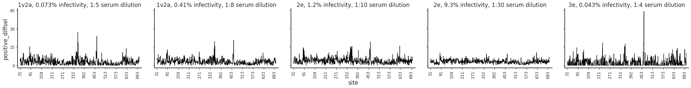


<style  type="text/css" >
    #T_7b072618_dcee_11ea_ab05_90e2baa73b51row0_col0 {
            background-color:  #72bf72;
            color:  #000000;
        }    #T_7b072618_dcee_11ea_ab05_90e2baa73b51row0_col1 {
            background-color:  #caf0ca;
            color:  #000000;
        }    #T_7b072618_dcee_11ea_ab05_90e2baa73b51row0_col2 {
            background-color:  #d2f4d2;
            color:  #000000;
        }    #T_7b072618_dcee_11ea_ab05_90e2baa73b51row0_col3 {
            background-color:  #d3f5d3;
            color:  #000000;
        }    #T_7b072618_dcee_11ea_ab05_90e2baa73b51row0_col4 {
            background-color:  #d5f6d5;
            color:  #000000;
        }    #T_7b072618_dcee_11ea_ab05_90e2baa73b51row1_col0 {
            background-color:  #bfeabf;
            color:  #000000;
        }    #T_7b072618_dcee_11ea_ab05_90e2baa73b51row1_col1 {
            background-color:  #72bf72;
            color:  #000000;
        }    #T_7b072618_dcee_11ea_ab05_90e2baa73b51row1_col2 {
            background-color:  #c5edc5;
            color:  #000000;
        }    #T_7b072618_dcee_11ea_ab05_90e2baa73b51row1_col3 {
            background-color:  #c2ecc2;
            color:  #000000;
        }    #T_7b072618_dcee_11ea_ab05_90e2baa73b51row1_col4 {
            background-color:  #caf0ca;
            color:  #000000;
        }    #T_7b072618_dcee_11ea_ab05_90e2baa73b51row2_col0 {
            background-color:  #d1f4d1;
            color:  #000000;
        }    #T_7b072618_dcee_11ea_ab05_90e2baa73b51row2_col1 {
            background-color:  #d0f3d0;
            color:  #000000;
        }    #T_7b072618_dcee_11ea_ab05_90e2baa73b51row2_col2 {
            background-color:  #72bf72;
            color:  #000000;
        }    #T_7b072618_dcee_11ea_ab05_90e2baa73b51row2_col3 {
            background-color:  #b2e3b2;
            color:  #000000;
        }    #T_7b072618_dcee_11ea_ab05_90e2baa73b51row2_col4 {
            background-color:  #d5f6d5;
            color:  #000000;
        }    #T_7b072618_dcee_11ea_ab05_90e2baa73b51row3_col0 {
            background-color:  #e3fee3;
            color:  #000000;
        }    #T_7b072618_dcee_11ea_ab05_90e2baa73b51row3_col1 {
            background-color:  #dcfadc;
            color:  #000000;
        }    #T_7b072618_dcee_11ea_ab05_90e2baa73b51row3_col2 {
            background-color:  #bde9bd;
            color:  #000000;
        }    #T_7b072618_dcee_11ea_ab05_90e2baa73b51row3_col3 {
            background-color:  #72bf72;
            color:  #000000;
        }    #T_7b072618_dcee_11ea_ab05_90e2baa73b51row3_col4 {
            background-color:  #e5ffe5;
            color:  #000000;
        }    #T_7b072618_dcee_11ea_ab05_90e2baa73b51row4_col0 {
            background-color:  #e5ffe5;
            color:  #000000;
        }    #T_7b072618_dcee_11ea_ab05_90e2baa73b51row4_col1 {
            background-color:  #e5ffe5;
            color:  #000000;
        }    #T_7b072618_dcee_11ea_ab05_90e2baa73b51row4_col2 {
            background-color:  #e5ffe5;
            color:  #000000;
        }    #T_7b072618_dcee_11ea_ab05_90e2baa73b51row4_col3 {
            background-color:  #e5ffe5;
            color:  #000000;
        }    #T_7b072618_dcee_11ea_ab05_90e2baa73b51row4_col4 {
            background-color:  #72bf72;
            color:  #000000;
        }</style><table id="T_7b072618_dcee_11ea_ab05_90e2baa73b51" ><thead>    <tr>        <th class="index_name level0" >name_formatted</th>        <th class="col_heading level0 col0" >1v2a, 0.073% infectivity, 1:5 serum dilution</th>        <th class="col_heading level0 col1" >1v2a, 0.41% infectivity, 1:8 serum dilution</th>        <th class="col_heading level0 col2" >2e, 1.2% infectivity, 1:10 serum dilution</th>        <th class="col_heading level0 col3" >2e, 9.3% infectivity, 1:30 serum dilution</th>        <th class="col_heading level0 col4" >3e, 0.043% infectivity, 1:4 serum dilution</th>    </tr>    <tr>        <th class="index_name level0" >name_formatted</th>        <th class="blank" ></th>        <th class="blank" ></th>        <th class="blank" ></th>        <th class="blank" ></th>        <th class="blank" ></th>    </tr></thead><tbody>
                <tr>
                        <th id="T_7b072618_dcee_11ea_ab05_90e2baa73b51level0_row0" class="row_heading level0 row0" >1v2a, 0.073% infectivity, 1:5 serum dilution</th>
                        <td id="T_7b072618_dcee_11ea_ab05_90e2baa73b51row0_col0" class="data row0 col0" >1</td>
                        <td id="T_7b072618_dcee_11ea_ab05_90e2baa73b51row0_col1" class="data row0 col1" >0.616</td>
                        <td id="T_7b072618_dcee_11ea_ab05_90e2baa73b51row0_col2" class="data row0 col2" >0.526</td>
                        <td id="T_7b072618_dcee_11ea_ab05_90e2baa73b51row0_col3" class="data row0 col3" >0.435</td>
                        <td id="T_7b072618_dcee_11ea_ab05_90e2baa73b51row0_col4" class="data row0 col4" >0.42</td>
            </tr>
            <tr>
                        <th id="T_7b072618_dcee_11ea_ab05_90e2baa73b51level0_row1" class="row_heading level0 row1" >1v2a, 0.41% infectivity, 1:8 serum dilution</th>
                        <td id="T_7b072618_dcee_11ea_ab05_90e2baa73b51row1_col0" class="data row1 col0" >0.616</td>
                        <td id="T_7b072618_dcee_11ea_ab05_90e2baa73b51row1_col1" class="data row1 col1" >1</td>
                        <td id="T_7b072618_dcee_11ea_ab05_90e2baa73b51row1_col2" class="data row1 col2" >0.586</td>
                        <td id="T_7b072618_dcee_11ea_ab05_90e2baa73b51row1_col3" class="data row1 col3" >0.535</td>
                        <td id="T_7b072618_dcee_11ea_ab05_90e2baa73b51row1_col4" class="data row1 col4" >0.49</td>
            </tr>
            <tr>
                        <th id="T_7b072618_dcee_11ea_ab05_90e2baa73b51level0_row2" class="row_heading level0 row2" >2e, 1.2% infectivity, 1:10 serum dilution</th>
                        <td id="T_7b072618_dcee_11ea_ab05_90e2baa73b51row2_col0" class="data row2 col0" >0.526</td>
                        <td id="T_7b072618_dcee_11ea_ab05_90e2baa73b51row2_col1" class="data row2 col1" >0.586</td>
                        <td id="T_7b072618_dcee_11ea_ab05_90e2baa73b51row2_col2" class="data row2 col2" >1</td>
                        <td id="T_7b072618_dcee_11ea_ab05_90e2baa73b51row2_col3" class="data row2 col3" >0.626</td>
                        <td id="T_7b072618_dcee_11ea_ab05_90e2baa73b51row2_col4" class="data row2 col4" >0.423</td>
            </tr>
            <tr>
                        <th id="T_7b072618_dcee_11ea_ab05_90e2baa73b51level0_row3" class="row_heading level0 row3" >2e, 9.3% infectivity, 1:30 serum dilution</th>
                        <td id="T_7b072618_dcee_11ea_ab05_90e2baa73b51row3_col0" class="data row3 col0" >0.435</td>
                        <td id="T_7b072618_dcee_11ea_ab05_90e2baa73b51row3_col1" class="data row3 col1" >0.535</td>
                        <td id="T_7b072618_dcee_11ea_ab05_90e2baa73b51row3_col2" class="data row3 col2" >0.626</td>
                        <td id="T_7b072618_dcee_11ea_ab05_90e2baa73b51row3_col3" class="data row3 col3" >1</td>
                        <td id="T_7b072618_dcee_11ea_ab05_90e2baa73b51row3_col4" class="data row3 col4" >0.325</td>
            </tr>
            <tr>
                        <th id="T_7b072618_dcee_11ea_ab05_90e2baa73b51level0_row4" class="row_heading level0 row4" >3e, 0.043% infectivity, 1:4 serum dilution</th>
                        <td id="T_7b072618_dcee_11ea_ab05_90e2baa73b51row4_col0" class="data row4 col0" >0.42</td>
                        <td id="T_7b072618_dcee_11ea_ab05_90e2baa73b51row4_col1" class="data row4 col1" >0.49</td>
                        <td id="T_7b072618_dcee_11ea_ab05_90e2baa73b51row4_col2" class="data row4 col2" >0.423</td>
                        <td id="T_7b072618_dcee_11ea_ab05_90e2baa73b51row4_col3" class="data row4 col3" >0.325</td>
                        <td id="T_7b072618_dcee_11ea_ab05_90e2baa73b51row4_col4" class="data row4 col4" >1</td>
            </tr>
    </tbody></table>


    
    
    ******************* 2124_pre *******************


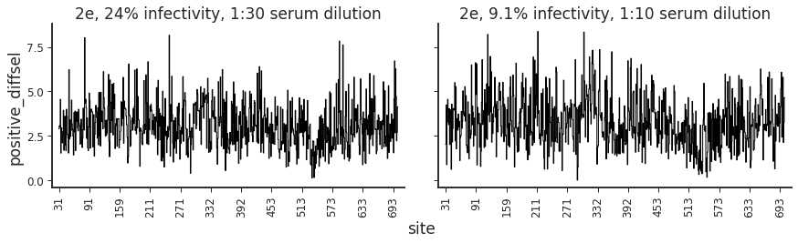


<style  type="text/css" >
    #T_7b505004_dcee_11ea_ab05_90e2baa73b51row0_col0 {
            background-color:  #73c073;
            color:  #000000;
        }    #T_7b505004_dcee_11ea_ab05_90e2baa73b51row0_col1 {
            background-color:  #e5ffe5;
            color:  #000000;
        }    #T_7b505004_dcee_11ea_ab05_90e2baa73b51row1_col0 {
            background-color:  #e5ffe5;
            color:  #000000;
        }    #T_7b505004_dcee_11ea_ab05_90e2baa73b51row1_col1 {
            background-color:  #73c073;
            color:  #000000;
        }</style><table id="T_7b505004_dcee_11ea_ab05_90e2baa73b51" ><thead>    <tr>        <th class="index_name level0" >name_formatted</th>        <th class="col_heading level0 col0" >2e, 24% infectivity, 1:30 serum dilution</th>        <th class="col_heading level0 col1" >2e, 9.1% infectivity, 1:10 serum dilution</th>    </tr>    <tr>        <th class="index_name level0" >name_formatted</th>        <th class="blank" ></th>        <th class="blank" ></th>    </tr></thead><tbody>
                <tr>
                        <th id="T_7b505004_dcee_11ea_ab05_90e2baa73b51level0_row0" class="row_heading level0 row0" >2e, 24% infectivity, 1:30 serum dilution</th>
                        <td id="T_7b505004_dcee_11ea_ab05_90e2baa73b51row0_col0" class="data row0 col0" >1</td>
                        <td id="T_7b505004_dcee_11ea_ab05_90e2baa73b51row0_col1" class="data row0 col1" >0.521</td>
            </tr>
            <tr>
                        <th id="T_7b505004_dcee_11ea_ab05_90e2baa73b51level0_row1" class="row_heading level0 row1" >2e, 9.1% infectivity, 1:10 serum dilution</th>
                        <td id="T_7b505004_dcee_11ea_ab05_90e2baa73b51row1_col0" class="data row1 col0" >0.521</td>
                        <td id="T_7b505004_dcee_11ea_ab05_90e2baa73b51row1_col1" class="data row1 col1" >1</td>
            </tr>
    </tbody></table>


    
    
    ******************* 2214_post *******************


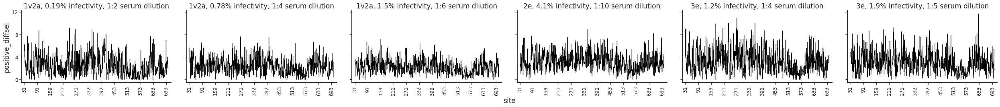


<style  type="text/css" >
    #T_7c1cb27a_dcee_11ea_ab05_90e2baa73b51row0_col0 {
            background-color:  #73c073;
            color:  #000000;
        }    #T_7c1cb27a_dcee_11ea_ab05_90e2baa73b51row0_col1 {
            background-color:  #d2f4d2;
            color:  #000000;
        }    #T_7c1cb27a_dcee_11ea_ab05_90e2baa73b51row0_col2 {
            background-color:  #dcfadc;
            color:  #000000;
        }    #T_7c1cb27a_dcee_11ea_ab05_90e2baa73b51row0_col3 {
            background-color:  #e2fde2;
            color:  #000000;
        }    #T_7c1cb27a_dcee_11ea_ab05_90e2baa73b51row0_col4 {
            background-color:  #dffcdf;
            color:  #000000;
        }    #T_7c1cb27a_dcee_11ea_ab05_90e2baa73b51row0_col5 {
            background-color:  #e2fde2;
            color:  #000000;
        }    #T_7c1cb27a_dcee_11ea_ab05_90e2baa73b51row1_col0 {
            background-color:  #d5f6d5;
            color:  #000000;
        }    #T_7c1cb27a_dcee_11ea_ab05_90e2baa73b51row1_col1 {
            background-color:  #72bf72;
            color:  #000000;
        }    #T_7c1cb27a_dcee_11ea_ab05_90e2baa73b51row1_col2 {
            background-color:  #d8f8d8;
            color:  #000000;
        }    #T_7c1cb27a_dcee_11ea_ab05_90e2baa73b51row1_col3 {
            background-color:  #e5ffe5;
            color:  #000000;
        }    #T_7c1cb27a_dcee_11ea_ab05_90e2baa73b51row1_col4 {
            background-color:  #e5ffe5;
            color:  #000000;
        }    #T_7c1cb27a_dcee_11ea_ab05_90e2baa73b51row1_col5 {
            background-color:  #e5ffe5;
            color:  #000000;
        }    #T_7c1cb27a_dcee_11ea_ab05_90e2baa73b51row2_col0 {
            background-color:  #ddfbdd;
            color:  #000000;
        }    #T_7c1cb27a_dcee_11ea_ab05_90e2baa73b51row2_col1 {
            background-color:  #d6f7d6;
            color:  #000000;
        }    #T_7c1cb27a_dcee_11ea_ab05_90e2baa73b51row2_col2 {
            background-color:  #72bf72;
            color:  #000000;
        }    #T_7c1cb27a_dcee_11ea_ab05_90e2baa73b51row2_col3 {
            background-color:  #e4fee4;
            color:  #000000;
        }    #T_7c1cb27a_dcee_11ea_ab05_90e2baa73b51row2_col4 {
            background-color:  #dbf9db;
            color:  #000000;
        }    #T_7c1cb27a_dcee_11ea_ab05_90e2baa73b51row2_col5 {
            background-color:  #daf9da;
            color:  #000000;
        }    #T_7c1cb27a_dcee_11ea_ab05_90e2baa73b51row3_col0 {
            background-color:  #e5ffe5;
            color:  #000000;
        }    #T_7c1cb27a_dcee_11ea_ab05_90e2baa73b51row3_col1 {
            background-color:  #e5ffe5;
            color:  #000000;
        }    #T_7c1cb27a_dcee_11ea_ab05_90e2baa73b51row3_col2 {
            background-color:  #e5ffe5;
            color:  #000000;
        }    #T_7c1cb27a_dcee_11ea_ab05_90e2baa73b51row3_col3 {
            background-color:  #72bf72;
            color:  #000000;
        }    #T_7c1cb27a_dcee_11ea_ab05_90e2baa73b51row3_col4 {
            background-color:  #e5ffe5;
            color:  #000000;
        }    #T_7c1cb27a_dcee_11ea_ab05_90e2baa73b51row3_col5 {
            background-color:  #e5ffe5;
            color:  #000000;
        }    #T_7c1cb27a_dcee_11ea_ab05_90e2baa73b51row4_col0 {
            background-color:  #defbde;
            color:  #000000;
        }    #T_7c1cb27a_dcee_11ea_ab05_90e2baa73b51row4_col1 {
            background-color:  #e0fce0;
            color:  #000000;
        }    #T_7c1cb27a_dcee_11ea_ab05_90e2baa73b51row4_col2 {
            background-color:  #d8f8d8;
            color:  #000000;
        }    #T_7c1cb27a_dcee_11ea_ab05_90e2baa73b51row4_col3 {
            background-color:  #e1fde1;
            color:  #000000;
        }    #T_7c1cb27a_dcee_11ea_ab05_90e2baa73b51row4_col4 {
            background-color:  #72bf72;
            color:  #000000;
        }    #T_7c1cb27a_dcee_11ea_ab05_90e2baa73b51row4_col5 {
            background-color:  #cff3cf;
            color:  #000000;
        }    #T_7c1cb27a_dcee_11ea_ab05_90e2baa73b51row5_col0 {
            background-color:  #e0fce0;
            color:  #000000;
        }    #T_7c1cb27a_dcee_11ea_ab05_90e2baa73b51row5_col1 {
            background-color:  #dffcdf;
            color:  #000000;
        }    #T_7c1cb27a_dcee_11ea_ab05_90e2baa73b51row5_col2 {
            background-color:  #d7f7d7;
            color:  #000000;
        }    #T_7c1cb27a_dcee_11ea_ab05_90e2baa73b51row5_col3 {
            background-color:  #e0fce0;
            color:  #000000;
        }    #T_7c1cb27a_dcee_11ea_ab05_90e2baa73b51row5_col4 {
            background-color:  #cef2ce;
            color:  #000000;
        }    #T_7c1cb27a_dcee_11ea_ab05_90e2baa73b51row5_col5 {
            background-color:  #72bf72;
            color:  #000000;
        }</style><table id="T_7c1cb27a_dcee_11ea_ab05_90e2baa73b51" ><thead>    <tr>        <th class="index_name level0" >name_formatted</th>        <th class="col_heading level0 col0" >1v2a, 0.19% infectivity, 1:2 serum dilution</th>        <th class="col_heading level0 col1" >1v2a, 0.78% infectivity, 1:4 serum dilution</th>        <th class="col_heading level0 col2" >1v2a, 1.5% infectivity, 1:6 serum dilution</th>        <th class="col_heading level0 col3" >2e, 4.1% infectivity, 1:10 serum dilution</th>        <th class="col_heading level0 col4" >3e, 1.2% infectivity, 1:4 serum dilution</th>        <th class="col_heading level0 col5" >3e, 1.9% infectivity, 1:5 serum dilution</th>    </tr>    <tr>        <th class="index_name level0" >name_formatted</th>        <th class="blank" ></th>        <th class="blank" ></th>        <th class="blank" ></th>        <th class="blank" ></th>        <th class="blank" ></th>        <th class="blank" ></th>    </tr></thead><tbody>
                <tr>
                        <th id="T_7c1cb27a_dcee_11ea_ab05_90e2baa73b51level0_row0" class="row_heading level0 row0" >1v2a, 0.19% infectivity, 1:2 serum dilution</th>
                        <td id="T_7c1cb27a_dcee_11ea_ab05_90e2baa73b51row0_col0" class="data row0 col0" >1</td>
                        <td id="T_7c1cb27a_dcee_11ea_ab05_90e2baa73b51row0_col1" class="data row0 col1" >0.453</td>
                        <td id="T_7c1cb27a_dcee_11ea_ab05_90e2baa73b51row0_col2" class="data row0 col2" >0.409</td>
                        <td id="T_7c1cb27a_dcee_11ea_ab05_90e2baa73b51row0_col3" class="data row0 col3" >0.36</td>
                        <td id="T_7c1cb27a_dcee_11ea_ab05_90e2baa73b51row0_col4" class="data row0 col4" >0.4</td>
                        <td id="T_7c1cb27a_dcee_11ea_ab05_90e2baa73b51row0_col5" class="data row0 col5" >0.393</td>
            </tr>
            <tr>
                        <th id="T_7c1cb27a_dcee_11ea_ab05_90e2baa73b51level0_row1" class="row_heading level0 row1" >1v2a, 0.78% infectivity, 1:4 serum dilution</th>
                        <td id="T_7c1cb27a_dcee_11ea_ab05_90e2baa73b51row1_col0" class="data row1 col0" >0.453</td>
                        <td id="T_7c1cb27a_dcee_11ea_ab05_90e2baa73b51row1_col1" class="data row1 col1" >1</td>
                        <td id="T_7c1cb27a_dcee_11ea_ab05_90e2baa73b51row1_col2" class="data row1 col2" >0.431</td>
                        <td id="T_7c1cb27a_dcee_11ea_ab05_90e2baa73b51row1_col3" class="data row1 col3" >0.338</td>
                        <td id="T_7c1cb27a_dcee_11ea_ab05_90e2baa73b51row1_col4" class="data row1 col4" >0.374</td>
                        <td id="T_7c1cb27a_dcee_11ea_ab05_90e2baa73b51row1_col5" class="data row1 col5" >0.377</td>
            </tr>
            <tr>
                        <th id="T_7c1cb27a_dcee_11ea_ab05_90e2baa73b51level0_row2" class="row_heading level0 row2" >1v2a, 1.5% infectivity, 1:6 serum dilution</th>
                        <td id="T_7c1cb27a_dcee_11ea_ab05_90e2baa73b51row2_col0" class="data row2 col0" >0.409</td>
                        <td id="T_7c1cb27a_dcee_11ea_ab05_90e2baa73b51row2_col1" class="data row2 col1" >0.431</td>
                        <td id="T_7c1cb27a_dcee_11ea_ab05_90e2baa73b51row2_col2" class="data row2 col2" >1</td>
                        <td id="T_7c1cb27a_dcee_11ea_ab05_90e2baa73b51row2_col3" class="data row2 col3" >0.351</td>
                        <td id="T_7c1cb27a_dcee_11ea_ab05_90e2baa73b51row2_col4" class="data row2 col4" >0.428</td>
                        <td id="T_7c1cb27a_dcee_11ea_ab05_90e2baa73b51row2_col5" class="data row2 col5" >0.436</td>
            </tr>
            <tr>
                        <th id="T_7c1cb27a_dcee_11ea_ab05_90e2baa73b51level0_row3" class="row_heading level0 row3" >2e, 4.1% infectivity, 1:10 serum dilution</th>
                        <td id="T_7c1cb27a_dcee_11ea_ab05_90e2baa73b51row3_col0" class="data row3 col0" >0.36</td>
                        <td id="T_7c1cb27a_dcee_11ea_ab05_90e2baa73b51row3_col1" class="data row3 col1" >0.338</td>
                        <td id="T_7c1cb27a_dcee_11ea_ab05_90e2baa73b51row3_col2" class="data row3 col2" >0.351</td>
                        <td id="T_7c1cb27a_dcee_11ea_ab05_90e2baa73b51row3_col3" class="data row3 col3" >1</td>
                        <td id="T_7c1cb27a_dcee_11ea_ab05_90e2baa73b51row3_col4" class="data row3 col4" >0.365</td>
                        <td id="T_7c1cb27a_dcee_11ea_ab05_90e2baa73b51row3_col5" class="data row3 col5" >0.371</td>
            </tr>
            <tr>
                        <th id="T_7c1cb27a_dcee_11ea_ab05_90e2baa73b51level0_row4" class="row_heading level0 row4" >3e, 1.2% infectivity, 1:4 serum dilution</th>
                        <td id="T_7c1cb27a_dcee_11ea_ab05_90e2baa73b51row4_col0" class="data row4 col0" >0.4</td>
                        <td id="T_7c1cb27a_dcee_11ea_ab05_90e2baa73b51row4_col1" class="data row4 col1" >0.374</td>
                        <td id="T_7c1cb27a_dcee_11ea_ab05_90e2baa73b51row4_col2" class="data row4 col2" >0.428</td>
                        <td id="T_7c1cb27a_dcee_11ea_ab05_90e2baa73b51row4_col3" class="data row4 col3" >0.365</td>
                        <td id="T_7c1cb27a_dcee_11ea_ab05_90e2baa73b51row4_col4" class="data row4 col4" >1</td>
                        <td id="T_7c1cb27a_dcee_11ea_ab05_90e2baa73b51row4_col5" class="data row4 col5" >0.496</td>
            </tr>
            <tr>
                        <th id="T_7c1cb27a_dcee_11ea_ab05_90e2baa73b51level0_row5" class="row_heading level0 row5" >3e, 1.9% infectivity, 1:5 serum dilution</th>
                        <td id="T_7c1cb27a_dcee_11ea_ab05_90e2baa73b51row5_col0" class="data row5 col0" >0.393</td>
                        <td id="T_7c1cb27a_dcee_11ea_ab05_90e2baa73b51row5_col1" class="data row5 col1" >0.377</td>
                        <td id="T_7c1cb27a_dcee_11ea_ab05_90e2baa73b51row5_col2" class="data row5 col2" >0.436</td>
                        <td id="T_7c1cb27a_dcee_11ea_ab05_90e2baa73b51row5_col3" class="data row5 col3" >0.371</td>
                        <td id="T_7c1cb27a_dcee_11ea_ab05_90e2baa73b51row5_col4" class="data row5 col4" >0.496</td>
                        <td id="T_7c1cb27a_dcee_11ea_ab05_90e2baa73b51row5_col5" class="data row5 col5" >1</td>
            </tr>
    </tbody></table>


    
    
    ******************* 2214_pre *******************


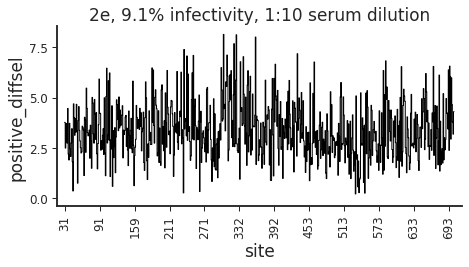


<style  type="text/css" >
    #T_7c46f328_dcee_11ea_ab05_90e2baa73b51row0_col0 {
            background-color:  #e5ffe5;
            color:  #000000;
        }</style><table id="T_7c46f328_dcee_11ea_ab05_90e2baa73b51" ><thead>    <tr>        <th class="index_name level0" >name_formatted</th>        <th class="col_heading level0 col0" >2e, 9.1% infectivity, 1:10 serum dilution</th>    </tr>    <tr>        <th class="index_name level0" >name_formatted</th>        <th class="blank" ></th>    </tr></thead><tbody>
                <tr>
                        <th id="T_7c46f328_dcee_11ea_ab05_90e2baa73b51level0_row0" class="row_heading level0 row0" >2e, 9.1% infectivity, 1:10 serum dilution</th>
                        <td id="T_7c46f328_dcee_11ea_ab05_90e2baa73b51row0_col0" class="data row0 col0" >1</td>
            </tr>
    </tbody></table>


    
    
    ******************* 2423_post *******************


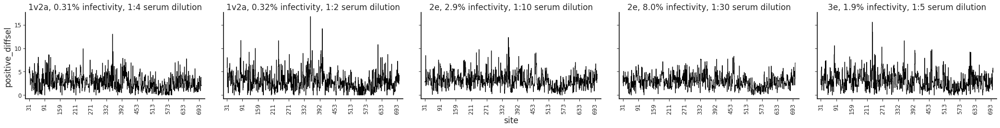


<style  type="text/css" >
    #T_7d083ce0_dcee_11ea_ab05_90e2baa73b51row0_col0 {
            background-color:  #72bf72;
            color:  #000000;
        }    #T_7d083ce0_dcee_11ea_ab05_90e2baa73b51row0_col1 {
            background-color:  #cdf2cd;
            color:  #000000;
        }    #T_7d083ce0_dcee_11ea_ab05_90e2baa73b51row0_col2 {
            background-color:  #e5ffe5;
            color:  #000000;
        }    #T_7d083ce0_dcee_11ea_ab05_90e2baa73b51row0_col3 {
            background-color:  #e5ffe5;
            color:  #000000;
        }    #T_7d083ce0_dcee_11ea_ab05_90e2baa73b51row0_col4 {
            background-color:  #daf9da;
            color:  #000000;
        }    #T_7d083ce0_dcee_11ea_ab05_90e2baa73b51row1_col0 {
            background-color:  #caf0ca;
            color:  #000000;
        }    #T_7d083ce0_dcee_11ea_ab05_90e2baa73b51row1_col1 {
            background-color:  #72bf72;
            color:  #000000;
        }    #T_7d083ce0_dcee_11ea_ab05_90e2baa73b51row1_col2 {
            background-color:  #e5ffe5;
            color:  #000000;
        }    #T_7d083ce0_dcee_11ea_ab05_90e2baa73b51row1_col3 {
            background-color:  #e1fde1;
            color:  #000000;
        }    #T_7d083ce0_dcee_11ea_ab05_90e2baa73b51row1_col4 {
            background-color:  #e0fce0;
            color:  #000000;
        }    #T_7d083ce0_dcee_11ea_ab05_90e2baa73b51row2_col0 {
            background-color:  #dcfadc;
            color:  #000000;
        }    #T_7d083ce0_dcee_11ea_ab05_90e2baa73b51row2_col1 {
            background-color:  #e2fde2;
            color:  #000000;
        }    #T_7d083ce0_dcee_11ea_ab05_90e2baa73b51row2_col2 {
            background-color:  #72bf72;
            color:  #000000;
        }    #T_7d083ce0_dcee_11ea_ab05_90e2baa73b51row2_col3 {
            background-color:  #c2ebc2;
            color:  #000000;
        }    #T_7d083ce0_dcee_11ea_ab05_90e2baa73b51row2_col4 {
            background-color:  #dcfadc;
            color:  #000000;
        }    #T_7d083ce0_dcee_11ea_ab05_90e2baa73b51row3_col0 {
            background-color:  #e5ffe5;
            color:  #000000;
        }    #T_7d083ce0_dcee_11ea_ab05_90e2baa73b51row3_col1 {
            background-color:  #e5ffe5;
            color:  #000000;
        }    #T_7d083ce0_dcee_11ea_ab05_90e2baa73b51row3_col2 {
            background-color:  #c9efc9;
            color:  #000000;
        }    #T_7d083ce0_dcee_11ea_ab05_90e2baa73b51row3_col3 {
            background-color:  #72bf72;
            color:  #000000;
        }    #T_7d083ce0_dcee_11ea_ab05_90e2baa73b51row3_col4 {
            background-color:  #e5ffe5;
            color:  #000000;
        }    #T_7d083ce0_dcee_11ea_ab05_90e2baa73b51row4_col0 {
            background-color:  #cff3cf;
            color:  #000000;
        }    #T_7d083ce0_dcee_11ea_ab05_90e2baa73b51row4_col1 {
            background-color:  #d8f8d8;
            color:  #000000;
        }    #T_7d083ce0_dcee_11ea_ab05_90e2baa73b51row4_col2 {
            background-color:  #d9f8d9;
            color:  #000000;
        }    #T_7d083ce0_dcee_11ea_ab05_90e2baa73b51row4_col3 {
            background-color:  #daf9da;
            color:  #000000;
        }    #T_7d083ce0_dcee_11ea_ab05_90e2baa73b51row4_col4 {
            background-color:  #73c073;
            color:  #000000;
        }</style><table id="T_7d083ce0_dcee_11ea_ab05_90e2baa73b51" ><thead>    <tr>        <th class="index_name level0" >name_formatted</th>        <th class="col_heading level0 col0" >1v2a, 0.31% infectivity, 1:4 serum dilution</th>        <th class="col_heading level0 col1" >1v2a, 0.32% infectivity, 1:2 serum dilution</th>        <th class="col_heading level0 col2" >2e, 2.9% infectivity, 1:10 serum dilution</th>        <th class="col_heading level0 col3" >2e, 8.0% infectivity, 1:30 serum dilution</th>        <th class="col_heading level0 col4" >3e, 1.9% infectivity, 1:5 serum dilution</th>    </tr>    <tr>        <th class="index_name level0" >name_formatted</th>        <th class="blank" ></th>        <th class="blank" ></th>        <th class="blank" ></th>        <th class="blank" ></th>        <th class="blank" ></th>    </tr></thead><tbody>
                <tr>
                        <th id="T_7d083ce0_dcee_11ea_ab05_90e2baa73b51level0_row0" class="row_heading level0 row0" >1v2a, 0.31% infectivity, 1:4 serum dilution</th>
                        <td id="T_7d083ce0_dcee_11ea_ab05_90e2baa73b51row0_col0" class="data row0 col0" >1</td>
                        <td id="T_7d083ce0_dcee_11ea_ab05_90e2baa73b51row0_col1" class="data row0 col1" >0.49</td>
                        <td id="T_7d083ce0_dcee_11ea_ab05_90e2baa73b51row0_col2" class="data row0 col2" >0.377</td>
                        <td id="T_7d083ce0_dcee_11ea_ab05_90e2baa73b51row0_col3" class="data row0 col3" >0.323</td>
                        <td id="T_7d083ce0_dcee_11ea_ab05_90e2baa73b51row0_col4" class="data row0 col4" >0.458</td>
            </tr>
            <tr>
                        <th id="T_7d083ce0_dcee_11ea_ab05_90e2baa73b51level0_row1" class="row_heading level0 row1" >1v2a, 0.32% infectivity, 1:2 serum dilution</th>
                        <td id="T_7d083ce0_dcee_11ea_ab05_90e2baa73b51row1_col0" class="data row1 col0" >0.49</td>
                        <td id="T_7d083ce0_dcee_11ea_ab05_90e2baa73b51row1_col1" class="data row1 col1" >1</td>
                        <td id="T_7d083ce0_dcee_11ea_ab05_90e2baa73b51row1_col2" class="data row1 col2" >0.377</td>
                        <td id="T_7d083ce0_dcee_11ea_ab05_90e2baa73b51row1_col3" class="data row1 col3" >0.353</td>
                        <td id="T_7d083ce0_dcee_11ea_ab05_90e2baa73b51row1_col4" class="data row1 col4" >0.429</td>
            </tr>
            <tr>
                        <th id="T_7d083ce0_dcee_11ea_ab05_90e2baa73b51level0_row2" class="row_heading level0 row2" >2e, 2.9% infectivity, 1:10 serum dilution</th>
                        <td id="T_7d083ce0_dcee_11ea_ab05_90e2baa73b51row2_col0" class="data row2 col0" >0.377</td>
                        <td id="T_7d083ce0_dcee_11ea_ab05_90e2baa73b51row2_col1" class="data row2 col1" >0.377</td>
                        <td id="T_7d083ce0_dcee_11ea_ab05_90e2baa73b51row2_col2" class="data row2 col2" >1</td>
                        <td id="T_7d083ce0_dcee_11ea_ab05_90e2baa73b51row2_col3" class="data row2 col3" >0.535</td>
                        <td id="T_7d083ce0_dcee_11ea_ab05_90e2baa73b51row2_col4" class="data row2 col4" >0.45</td>
            </tr>
            <tr>
                        <th id="T_7d083ce0_dcee_11ea_ab05_90e2baa73b51level0_row3" class="row_heading level0 row3" >2e, 8.0% infectivity, 1:30 serum dilution</th>
                        <td id="T_7d083ce0_dcee_11ea_ab05_90e2baa73b51row3_col0" class="data row3 col0" >0.323</td>
                        <td id="T_7d083ce0_dcee_11ea_ab05_90e2baa73b51row3_col1" class="data row3 col1" >0.353</td>
                        <td id="T_7d083ce0_dcee_11ea_ab05_90e2baa73b51row3_col2" class="data row3 col2" >0.535</td>
                        <td id="T_7d083ce0_dcee_11ea_ab05_90e2baa73b51row3_col3" class="data row3 col3" >1</td>
                        <td id="T_7d083ce0_dcee_11ea_ab05_90e2baa73b51row3_col4" class="data row3 col4" >0.396</td>
            </tr>
            <tr>
                        <th id="T_7d083ce0_dcee_11ea_ab05_90e2baa73b51level0_row4" class="row_heading level0 row4" >3e, 1.9% infectivity, 1:5 serum dilution</th>
                        <td id="T_7d083ce0_dcee_11ea_ab05_90e2baa73b51row4_col0" class="data row4 col0" >0.458</td>
                        <td id="T_7d083ce0_dcee_11ea_ab05_90e2baa73b51row4_col1" class="data row4 col1" >0.429</td>
                        <td id="T_7d083ce0_dcee_11ea_ab05_90e2baa73b51row4_col2" class="data row4 col2" >0.45</td>
                        <td id="T_7d083ce0_dcee_11ea_ab05_90e2baa73b51row4_col3" class="data row4 col3" >0.396</td>
                        <td id="T_7d083ce0_dcee_11ea_ab05_90e2baa73b51row4_col4" class="data row4 col4" >1</td>
            </tr>
    </tbody></table>


    
    
    ******************* 2423_pre *******************


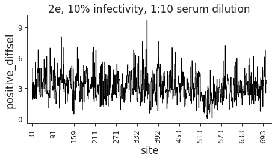


<style  type="text/css" >
    #T_7d3174a2_dcee_11ea_ab05_90e2baa73b51row0_col0 {
            background-color:  #e5ffe5;
            color:  #000000;
        }</style><table id="T_7d3174a2_dcee_11ea_ab05_90e2baa73b51" ><thead>    <tr>        <th class="index_name level0" >name_formatted</th>        <th class="col_heading level0 col0" >2e, 10% infectivity, 1:10 serum dilution</th>    </tr>    <tr>        <th class="index_name level0" >name_formatted</th>        <th class="blank" ></th>    </tr></thead><tbody>
                <tr>
                        <th id="T_7d3174a2_dcee_11ea_ab05_90e2baa73b51level0_row0" class="row_heading level0 row0" >2e, 10% infectivity, 1:10 serum dilution</th>
                        <td id="T_7d3174a2_dcee_11ea_ab05_90e2baa73b51row0_col0" class="data row0 col0" >1</td>
            </tr>
    </tbody></table>


    
    
    ******************* 2425_post *******************


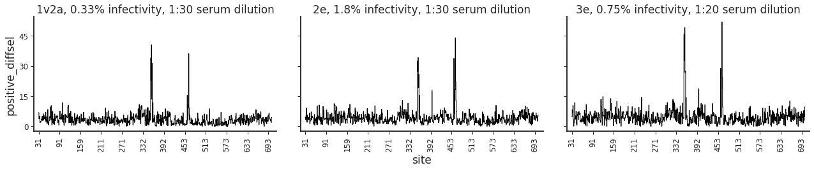


<style  type="text/css" >
    #T_7d9b532c_dcee_11ea_ab05_90e2baa73b51row0_col0 {
            background-color:  #72bf72;
            color:  #000000;
        }    #T_7d9b532c_dcee_11ea_ab05_90e2baa73b51row0_col1 {
            background-color:  #e5ffe5;
            color:  #000000;
        }    #T_7d9b532c_dcee_11ea_ab05_90e2baa73b51row0_col2 {
            background-color:  #e5ffe5;
            color:  #000000;
        }    #T_7d9b532c_dcee_11ea_ab05_90e2baa73b51row1_col0 {
            background-color:  #e5ffe5;
            color:  #000000;
        }    #T_7d9b532c_dcee_11ea_ab05_90e2baa73b51row1_col1 {
            background-color:  #72bf72;
            color:  #000000;
        }    #T_7d9b532c_dcee_11ea_ab05_90e2baa73b51row1_col2 {
            background-color:  #d0f3d0;
            color:  #000000;
        }    #T_7d9b532c_dcee_11ea_ab05_90e2baa73b51row2_col0 {
            background-color:  #dffcdf;
            color:  #000000;
        }    #T_7d9b532c_dcee_11ea_ab05_90e2baa73b51row2_col1 {
            background-color:  #caf0ca;
            color:  #000000;
        }    #T_7d9b532c_dcee_11ea_ab05_90e2baa73b51row2_col2 {
            background-color:  #73c073;
            color:  #000000;
        }</style><table id="T_7d9b532c_dcee_11ea_ab05_90e2baa73b51" ><thead>    <tr>        <th class="index_name level0" >name_formatted</th>        <th class="col_heading level0 col0" >1v2a, 0.33% infectivity, 1:30 serum dilution</th>        <th class="col_heading level0 col1" >2e, 1.8% infectivity, 1:30 serum dilution</th>        <th class="col_heading level0 col2" >3e, 0.75% infectivity, 1:20 serum dilution</th>    </tr>    <tr>        <th class="index_name level0" >name_formatted</th>        <th class="blank" ></th>        <th class="blank" ></th>        <th class="blank" ></th>    </tr></thead><tbody>
                <tr>
                        <th id="T_7d9b532c_dcee_11ea_ab05_90e2baa73b51level0_row0" class="row_heading level0 row0" >1v2a, 0.33% infectivity, 1:30 serum dilution</th>
                        <td id="T_7d9b532c_dcee_11ea_ab05_90e2baa73b51row0_col0" class="data row0 col0" >1</td>
                        <td id="T_7d9b532c_dcee_11ea_ab05_90e2baa73b51row0_col1" class="data row0 col1" >0.753</td>
                        <td id="T_7d9b532c_dcee_11ea_ab05_90e2baa73b51row0_col2" class="data row0 col2" >0.767</td>
            </tr>
            <tr>
                        <th id="T_7d9b532c_dcee_11ea_ab05_90e2baa73b51level0_row1" class="row_heading level0 row1" >2e, 1.8% infectivity, 1:30 serum dilution</th>
                        <td id="T_7d9b532c_dcee_11ea_ab05_90e2baa73b51row1_col0" class="data row1 col0" >0.753</td>
                        <td id="T_7d9b532c_dcee_11ea_ab05_90e2baa73b51row1_col1" class="data row1 col1" >1</td>
                        <td id="T_7d9b532c_dcee_11ea_ab05_90e2baa73b51row1_col2" class="data row1 col2" >0.812</td>
            </tr>
            <tr>
                        <th id="T_7d9b532c_dcee_11ea_ab05_90e2baa73b51level0_row2" class="row_heading level0 row2" >3e, 0.75% infectivity, 1:20 serum dilution</th>
                        <td id="T_7d9b532c_dcee_11ea_ab05_90e2baa73b51row2_col0" class="data row2 col0" >0.767</td>
                        <td id="T_7d9b532c_dcee_11ea_ab05_90e2baa73b51row2_col1" class="data row2 col1" >0.812</td>
                        <td id="T_7d9b532c_dcee_11ea_ab05_90e2baa73b51row2_col2" class="data row2 col2" >1</td>
            </tr>
    </tbody></table>


    
    
    ******************* 2425_pre *******************


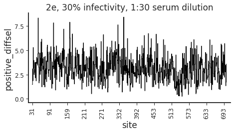


<style  type="text/css" >
    #T_7dc50dde_dcee_11ea_ab05_90e2baa73b51row0_col0 {
            background-color:  #e5ffe5;
            color:  #000000;
        }</style><table id="T_7dc50dde_dcee_11ea_ab05_90e2baa73b51" ><thead>    <tr>        <th class="index_name level0" >name_formatted</th>        <th class="col_heading level0 col0" >2e, 30% infectivity, 1:30 serum dilution</th>    </tr>    <tr>        <th class="index_name level0" >name_formatted</th>        <th class="blank" ></th>    </tr></thead><tbody>
                <tr>
                        <th id="T_7dc50dde_dcee_11ea_ab05_90e2baa73b51level0_row0" class="row_heading level0 row0" >2e, 30% infectivity, 1:30 serum dilution</th>
                        <td id="T_7dc50dde_dcee_11ea_ab05_90e2baa73b51row0_col0" class="data row0 col0" >1</td>
            </tr>
    </tbody></table>


    
    
    ******************* 5724_post *******************


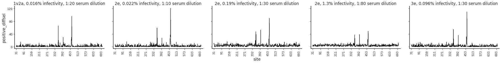


<style  type="text/css" >
    #T_7e6fa974_dcee_11ea_ab05_90e2baa73b51row0_col0 {
            background-color:  #72bf72;
            color:  #000000;
        }    #T_7e6fa974_dcee_11ea_ab05_90e2baa73b51row0_col1 {
            background-color:  #b2e3b2;
            color:  #000000;
        }    #T_7e6fa974_dcee_11ea_ab05_90e2baa73b51row0_col2 {
            background-color:  #e5ffe5;
            color:  #000000;
        }    #T_7e6fa974_dcee_11ea_ab05_90e2baa73b51row0_col3 {
            background-color:  #e0fce0;
            color:  #000000;
        }    #T_7e6fa974_dcee_11ea_ab05_90e2baa73b51row0_col4 {
            background-color:  #c4edc4;
            color:  #000000;
        }    #T_7e6fa974_dcee_11ea_ab05_90e2baa73b51row1_col0 {
            background-color:  #b6e5b6;
            color:  #000000;
        }    #T_7e6fa974_dcee_11ea_ab05_90e2baa73b51row1_col1 {
            background-color:  #73c073;
            color:  #000000;
        }    #T_7e6fa974_dcee_11ea_ab05_90e2baa73b51row1_col2 {
            background-color:  #d4f6d4;
            color:  #000000;
        }    #T_7e6fa974_dcee_11ea_ab05_90e2baa73b51row1_col3 {
            background-color:  #e5ffe5;
            color:  #000000;
        }    #T_7e6fa974_dcee_11ea_ab05_90e2baa73b51row1_col4 {
            background-color:  #b3e3b3;
            color:  #000000;
        }    #T_7e6fa974_dcee_11ea_ab05_90e2baa73b51row2_col0 {
            background-color:  #c8efc8;
            color:  #000000;
        }    #T_7e6fa974_dcee_11ea_ab05_90e2baa73b51row2_col1 {
            background-color:  #b7e5b7;
            color:  #000000;
        }    #T_7e6fa974_dcee_11ea_ab05_90e2baa73b51row2_col2 {
            background-color:  #72bf72;
            color:  #000000;
        }    #T_7e6fa974_dcee_11ea_ab05_90e2baa73b51row2_col3 {
            background-color:  #c3ecc3;
            color:  #000000;
        }    #T_7e6fa974_dcee_11ea_ab05_90e2baa73b51row2_col4 {
            background-color:  #c1ebc1;
            color:  #000000;
        }    #T_7e6fa974_dcee_11ea_ab05_90e2baa73b51row3_col0 {
            background-color:  #e5ffe5;
            color:  #000000;
        }    #T_7e6fa974_dcee_11ea_ab05_90e2baa73b51row3_col1 {
            background-color:  #e5ffe5;
            color:  #000000;
        }    #T_7e6fa974_dcee_11ea_ab05_90e2baa73b51row3_col2 {
            background-color:  #e5ffe5;
            color:  #000000;
        }    #T_7e6fa974_dcee_11ea_ab05_90e2baa73b51row3_col3 {
            background-color:  #73c073;
            color:  #000000;
        }    #T_7e6fa974_dcee_11ea_ab05_90e2baa73b51row3_col4 {
            background-color:  #e5ffe5;
            color:  #000000;
        }    #T_7e6fa974_dcee_11ea_ab05_90e2baa73b51row4_col0 {
            background-color:  #bde9bd;
            color:  #000000;
        }    #T_7e6fa974_dcee_11ea_ab05_90e2baa73b51row4_col1 {
            background-color:  #abdfab;
            color:  #000000;
        }    #T_7e6fa974_dcee_11ea_ab05_90e2baa73b51row4_col2 {
            background-color:  #d4f6d4;
            color:  #000000;
        }    #T_7e6fa974_dcee_11ea_ab05_90e2baa73b51row4_col3 {
            background-color:  #d7f7d7;
            color:  #000000;
        }    #T_7e6fa974_dcee_11ea_ab05_90e2baa73b51row4_col4 {
            background-color:  #72bf72;
            color:  #000000;
        }</style><table id="T_7e6fa974_dcee_11ea_ab05_90e2baa73b51" ><thead>    <tr>        <th class="index_name level0" >name_formatted</th>        <th class="col_heading level0 col0" >1v2a, 0.016% infectivity, 1:20 serum dilution</th>        <th class="col_heading level0 col1" >2e, 0.022% infectivity, 1:10 serum dilution</th>        <th class="col_heading level0 col2" >2e, 0.19% infectivity, 1:30 serum dilution</th>        <th class="col_heading level0 col3" >2e, 1.3% infectivity, 1:80 serum dilution</th>        <th class="col_heading level0 col4" >3e, 0.096% infectivity, 1:30 serum dilution</th>    </tr>    <tr>        <th class="index_name level0" >name_formatted</th>        <th class="blank" ></th>        <th class="blank" ></th>        <th class="blank" ></th>        <th class="blank" ></th>        <th class="blank" ></th>    </tr></thead><tbody>
                <tr>
                        <th id="T_7e6fa974_dcee_11ea_ab05_90e2baa73b51level0_row0" class="row_heading level0 row0" >1v2a, 0.016% infectivity, 1:20 serum dilution</th>
                        <td id="T_7e6fa974_dcee_11ea_ab05_90e2baa73b51row0_col0" class="data row0 col0" >1</td>
                        <td id="T_7e6fa974_dcee_11ea_ab05_90e2baa73b51row0_col1" class="data row0 col1" >0.84</td>
                        <td id="T_7e6fa974_dcee_11ea_ab05_90e2baa73b51row0_col2" class="data row0 col2" >0.798</td>
                        <td id="T_7e6fa974_dcee_11ea_ab05_90e2baa73b51row0_col3" class="data row0 col3" >0.725</td>
                        <td id="T_7e6fa974_dcee_11ea_ab05_90e2baa73b51row0_col4" class="data row0 col4" >0.822</td>
            </tr>
            <tr>
                        <th id="T_7e6fa974_dcee_11ea_ab05_90e2baa73b51level0_row1" class="row_heading level0 row1" >2e, 0.022% infectivity, 1:10 serum dilution</th>
                        <td id="T_7e6fa974_dcee_11ea_ab05_90e2baa73b51row1_col0" class="data row1 col0" >0.84</td>
                        <td id="T_7e6fa974_dcee_11ea_ab05_90e2baa73b51row1_col1" class="data row1 col1" >1</td>
                        <td id="T_7e6fa974_dcee_11ea_ab05_90e2baa73b51row1_col2" class="data row1 col2" >0.829</td>
                        <td id="T_7e6fa974_dcee_11ea_ab05_90e2baa73b51row1_col3" class="data row1 col3" >0.711</td>
                        <td id="T_7e6fa974_dcee_11ea_ab05_90e2baa73b51row1_col4" class="data row1 col4" >0.86</td>
            </tr>
            <tr>
                        <th id="T_7e6fa974_dcee_11ea_ab05_90e2baa73b51level0_row2" class="row_heading level0 row2" >2e, 0.19% infectivity, 1:30 serum dilution</th>
                        <td id="T_7e6fa974_dcee_11ea_ab05_90e2baa73b51row2_col0" class="data row2 col0" >0.798</td>
                        <td id="T_7e6fa974_dcee_11ea_ab05_90e2baa73b51row2_col1" class="data row2 col1" >0.829</td>
                        <td id="T_7e6fa974_dcee_11ea_ab05_90e2baa73b51row2_col2" class="data row2 col2" >1</td>
                        <td id="T_7e6fa974_dcee_11ea_ab05_90e2baa73b51row2_col3" class="data row2 col3" >0.798</td>
                        <td id="T_7e6fa974_dcee_11ea_ab05_90e2baa73b51row2_col4" class="data row2 col4" >0.829</td>
            </tr>
            <tr>
                        <th id="T_7e6fa974_dcee_11ea_ab05_90e2baa73b51level0_row3" class="row_heading level0 row3" >2e, 1.3% infectivity, 1:80 serum dilution</th>
                        <td id="T_7e6fa974_dcee_11ea_ab05_90e2baa73b51row3_col0" class="data row3 col0" >0.725</td>
                        <td id="T_7e6fa974_dcee_11ea_ab05_90e2baa73b51row3_col1" class="data row3 col1" >0.711</td>
                        <td id="T_7e6fa974_dcee_11ea_ab05_90e2baa73b51row3_col2" class="data row3 col2" >0.798</td>
                        <td id="T_7e6fa974_dcee_11ea_ab05_90e2baa73b51row3_col3" class="data row3 col3" >1</td>
                        <td id="T_7e6fa974_dcee_11ea_ab05_90e2baa73b51row3_col4" class="data row3 col4" >0.748</td>
            </tr>
            <tr>
                        <th id="T_7e6fa974_dcee_11ea_ab05_90e2baa73b51level0_row4" class="row_heading level0 row4" >3e, 0.096% infectivity, 1:30 serum dilution</th>
                        <td id="T_7e6fa974_dcee_11ea_ab05_90e2baa73b51row4_col0" class="data row4 col0" >0.822</td>
                        <td id="T_7e6fa974_dcee_11ea_ab05_90e2baa73b51row4_col1" class="data row4 col1" >0.86</td>
                        <td id="T_7e6fa974_dcee_11ea_ab05_90e2baa73b51row4_col2" class="data row4 col2" >0.829</td>
                        <td id="T_7e6fa974_dcee_11ea_ab05_90e2baa73b51row4_col3" class="data row4 col3" >0.748</td>
                        <td id="T_7e6fa974_dcee_11ea_ab05_90e2baa73b51row4_col4" class="data row4 col4" >1</td>
            </tr>
    </tbody></table>


    
    
    ******************* 5724_pre *******************


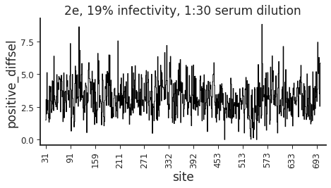


<style  type="text/css" >
    #T_7eb37b2c_dcee_11ea_ab05_90e2baa73b51row0_col0 {
            background-color:  #e5ffe5;
            color:  #000000;
        }</style><table id="T_7eb37b2c_dcee_11ea_ab05_90e2baa73b51" ><thead>    <tr>        <th class="index_name level0" >name_formatted</th>        <th class="col_heading level0 col0" >2e, 19% infectivity, 1:30 serum dilution</th>    </tr>    <tr>        <th class="index_name level0" >name_formatted</th>        <th class="blank" ></th>    </tr></thead><tbody>
                <tr>
                        <th id="T_7eb37b2c_dcee_11ea_ab05_90e2baa73b51level0_row0" class="row_heading level0 row0" >2e, 19% infectivity, 1:30 serum dilution</th>
                        <td id="T_7eb37b2c_dcee_11ea_ab05_90e2baa73b51row0_col0" class="data row0 col0" >1</td>
            </tr>
    </tbody></table>


    
    
    ******************* 5727_post *******************


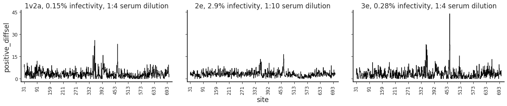


<style  type="text/css" >
    #T_7f20df1e_dcee_11ea_ab05_90e2baa73b51row0_col0 {
            background-color:  #72bf72;
            color:  #000000;
        }    #T_7f20df1e_dcee_11ea_ab05_90e2baa73b51row0_col1 {
            background-color:  #e5ffe5;
            color:  #000000;
        }    #T_7f20df1e_dcee_11ea_ab05_90e2baa73b51row0_col2 {
            background-color:  #e4fee4;
            color:  #000000;
        }    #T_7f20df1e_dcee_11ea_ab05_90e2baa73b51row1_col0 {
            background-color:  #e5ffe5;
            color:  #000000;
        }    #T_7f20df1e_dcee_11ea_ab05_90e2baa73b51row1_col1 {
            background-color:  #72bf72;
            color:  #000000;
        }    #T_7f20df1e_dcee_11ea_ab05_90e2baa73b51row1_col2 {
            background-color:  #e5ffe5;
            color:  #000000;
        }    #T_7f20df1e_dcee_11ea_ab05_90e2baa73b51row2_col0 {
            background-color:  #d3f5d3;
            color:  #000000;
        }    #T_7f20df1e_dcee_11ea_ab05_90e2baa73b51row2_col1 {
            background-color:  #d5f6d5;
            color:  #000000;
        }    #T_7f20df1e_dcee_11ea_ab05_90e2baa73b51row2_col2 {
            background-color:  #72bf72;
            color:  #000000;
        }</style><table id="T_7f20df1e_dcee_11ea_ab05_90e2baa73b51" ><thead>    <tr>        <th class="index_name level0" >name_formatted</th>        <th class="col_heading level0 col0" >1v2a, 0.15% infectivity, 1:4 serum dilution</th>        <th class="col_heading level0 col1" >2e, 2.9% infectivity, 1:10 serum dilution</th>        <th class="col_heading level0 col2" >3e, 0.28% infectivity, 1:4 serum dilution</th>    </tr>    <tr>        <th class="index_name level0" >name_formatted</th>        <th class="blank" ></th>        <th class="blank" ></th>        <th class="blank" ></th>    </tr></thead><tbody>
                <tr>
                        <th id="T_7f20df1e_dcee_11ea_ab05_90e2baa73b51level0_row0" class="row_heading level0 row0" >1v2a, 0.15% infectivity, 1:4 serum dilution</th>
                        <td id="T_7f20df1e_dcee_11ea_ab05_90e2baa73b51row0_col0" class="data row0 col0" >1</td>
                        <td id="T_7f20df1e_dcee_11ea_ab05_90e2baa73b51row0_col1" class="data row0 col1" >0.456</td>
                        <td id="T_7f20df1e_dcee_11ea_ab05_90e2baa73b51row0_col2" class="data row0 col2" >0.543</td>
            </tr>
            <tr>
                        <th id="T_7f20df1e_dcee_11ea_ab05_90e2baa73b51level0_row1" class="row_heading level0 row1" >2e, 2.9% infectivity, 1:10 serum dilution</th>
                        <td id="T_7f20df1e_dcee_11ea_ab05_90e2baa73b51row1_col0" class="data row1 col0" >0.456</td>
                        <td id="T_7f20df1e_dcee_11ea_ab05_90e2baa73b51row1_col1" class="data row1 col1" >1</td>
                        <td id="T_7f20df1e_dcee_11ea_ab05_90e2baa73b51row1_col2" class="data row1 col2" >0.535</td>
            </tr>
            <tr>
                        <th id="T_7f20df1e_dcee_11ea_ab05_90e2baa73b51level0_row2" class="row_heading level0 row2" >3e, 0.28% infectivity, 1:4 serum dilution</th>
                        <td id="T_7f20df1e_dcee_11ea_ab05_90e2baa73b51row2_col0" class="data row2 col0" >0.543</td>
                        <td id="T_7f20df1e_dcee_11ea_ab05_90e2baa73b51row2_col1" class="data row2 col1" >0.535</td>
                        <td id="T_7f20df1e_dcee_11ea_ab05_90e2baa73b51row2_col2" class="data row2 col2" >1</td>
            </tr>
    </tbody></table>


    
    
    ******************* 5727_pre *******************


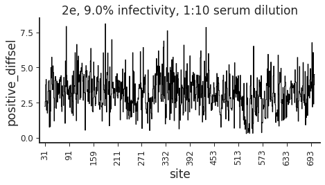


<style  type="text/css" >
    #T_7f4baa0a_dcee_11ea_ab05_90e2baa73b51row0_col0 {
            background-color:  #e5ffe5;
            color:  #000000;
        }</style><table id="T_7f4baa0a_dcee_11ea_ab05_90e2baa73b51" ><thead>    <tr>        <th class="index_name level0" >name_formatted</th>        <th class="col_heading level0 col0" >2e, 9.0% infectivity, 1:10 serum dilution</th>    </tr>    <tr>        <th class="index_name level0" >name_formatted</th>        <th class="blank" ></th>    </tr></thead><tbody>
                <tr>
                        <th id="T_7f4baa0a_dcee_11ea_ab05_90e2baa73b51level0_row0" class="row_heading level0 row0" >2e, 9.0% infectivity, 1:10 serum dilution</th>
                        <td id="T_7f4baa0a_dcee_11ea_ab05_90e2baa73b51row0_col0" class="data row0 col0" >1</td>
            </tr>
    </tbody></table>


### More closely plot the correlation between replicates
Now, I will show the actual correlation plots at the site and mutation level. 


```python
names = batchdf["group"].astype(str)
names = names.tolist()
diffselprefix = "./results/diffsel/summary_"
```


```python
for seltype in ['mutdiffsel', 'positivesitediffsel']:
    print("\n{0} correlations:".format(seltype))
    plots = []
    for g in names:
        plot = diffselprefix + g + '-' + seltype + 'corr.pdf'
        if os.path.isfile(plot):
            plots.append(plot)
        else:
            print("{0} does not exist.".format(plot))
    showPDF(plots, width=1800)
```

    
    mutdiffsel correlations:


    
    positivesitediffsel correlations:


```python
sel_df['rabbit_id'] = sel_df['rabbit_id'].astype(int).astype(str)
```


```python
#We will use axes with shared ylimits across rows for all plots except for the antibody serum group:

share_ylim_across_rows = {serum_group: ('antibody' not in serum_group)
                          for serum_group in sel_df['rabbit_id'].unique()}


```


```python
#I will by hand decide what sites to zoom in on. These will include both the 241/289 and C3/465 epitopes of interest. 
ZoomSitesList = ["84", "85", "86", "87", "88", "89", "90", "91",  "229", "230", "231", "232", "240","241", "242", "243", "268", "279", "280", "288", "289", "290", "291", "350","351","352", "353", "354", "355", "356", "357", "358", "359", "360", "396", "459", "460", "461", "462", "463", "464", "465", "466", "467", "629"]

```


```python
#add a column to the sel_df to indicated if the site should be plotted.

sel_df["zoom_site"] = False
sel_df.loc[sel_df['site'].isin(ZoomSitesList), 'zoom_site'] = True
#sel_df
```


```python
sel_df = sel_df.assign(site_label=lambda x: x['wildtype'] +
                               x['site'].astype('str'))
```


```python

sel_df["verydiscrip_name"] = (sel_df["serum_alldils_name"].astype(str) + "-vacc, " + sel_df["name_formatted"].astype(str))
display(HTML(sel_df.head(n=5).to_html(index=False)))
```


<table border="1" class="dataframe">
  <thead>
    <tr style="text-align: right;">
      <th>sample</th>
      <th>rabbit_id</th>
      <th>vaccine_status</th>
      <th>library</th>
      <th>dilution</th>
      <th>fraction_surviving</th>
      <th>percent_infectivity</th>
      <th>R1</th>
      <th>SRA_accession</th>
      <th>R2</th>
      <th>serum</th>
      <th>serum_name</th>
      <th>serum_description</th>
      <th>serum_group</th>
      <th>serum_vaccination</th>
      <th>serum_immunogen</th>
      <th>serum_dilution</th>
      <th>group</th>
      <th>name</th>
      <th>sel</th>
      <th>mock</th>
      <th>err</th>
      <th>mds_name</th>
      <th>site</th>
      <th>wildtype</th>
      <th>mutation</th>
      <th>mutdiffsel</th>
      <th>abs_diffsel</th>
      <th>positive_diffsel</th>
      <th>negative_diffsel</th>
      <th>max_diffsel</th>
      <th>min_diffsel</th>
      <th>isite</th>
      <th>serum_name_formatted</th>
      <th>name_formatted</th>
      <th>serum_alldils_name</th>
      <th>zoom_site</th>
      <th>site_label</th>
      <th>verydiscrip_name</th>
    </tr>
  </thead>
  <tbody>
    <tr>
      <td>mut-virus-rep2e-5727-Wk26-d10</td>
      <td>5727</td>
      <td>post</td>
      <td>2e</td>
      <td>10</td>
      <td>0.0289316</td>
      <td>2.89316</td>
      <td>mut-virus-rep2e-5727-Wk26-d10_R1.fastq.gz</td>
      <td>SRR12431184</td>
      <td>mut-virus-rep2e-5727-Wk26-d10_R2.fastq.gz</td>
      <td>BG5-M2E-5727-Wk26-d10</td>
      <td>5727-Wk26-d10</td>
      <td>rabbit sera provided by John Moore. et al, vaccinated with BG505 trimer</td>
      <td>mainly 465</td>
      <td>post</td>
      <td>BG505 SOSIP.664 x 4</td>
      <td>10</td>
      <td>5727-Wk26</td>
      <td>2e-2.9</td>
      <td>mut-virus-rep2e-5727-Wk26-d10</td>
      <td>mut-virus-rep2e</td>
      <td>wt-DNA-rep2</td>
      <td>5727-Wk26-rep2e-d10</td>
      <td>184f</td>
      <td>N</td>
      <td>A</td>
      <td>2.363613</td>
      <td>11.150211</td>
      <td>5.616064</td>
      <td>-5.534147</td>
      <td>2.363613</td>
      <td>-1.360174</td>
      <td>151</td>
      <td>5727-Wk26-d10</td>
      <td>2e, 2.9% infectivity, 1:10 serum dilution</td>
      <td>5727_post</td>
      <td>False</td>
      <td>N184f</td>
      <td>5727_post-vacc, 2e, 2.9% infectivity, 1:10 serum dilution</td>
    </tr>
    <tr>
      <td>mut-virus-rep2e-5727-Wk26-d10</td>
      <td>5727</td>
      <td>post</td>
      <td>2e</td>
      <td>10</td>
      <td>0.0289316</td>
      <td>2.89316</td>
      <td>mut-virus-rep2e-5727-Wk26-d10_R1.fastq.gz</td>
      <td>SRR12431184</td>
      <td>mut-virus-rep2e-5727-Wk26-d10_R2.fastq.gz</td>
      <td>BG5-M2E-5727-Wk26-d10</td>
      <td>5727-Wk26-d10</td>
      <td>rabbit sera provided by John Moore. et al, vaccinated with BG505 trimer</td>
      <td>mainly 465</td>
      <td>post</td>
      <td>BG505 SOSIP.664 x 4</td>
      <td>10</td>
      <td>5727-Wk26</td>
      <td>2e-2.9</td>
      <td>mut-virus-rep2e-5727-Wk26-d10</td>
      <td>mut-virus-rep2e</td>
      <td>wt-DNA-rep2</td>
      <td>5727-Wk26-rep2e-d10</td>
      <td>184f</td>
      <td>N</td>
      <td>T</td>
      <td>0.669328</td>
      <td>11.150211</td>
      <td>5.616064</td>
      <td>-5.534147</td>
      <td>2.363613</td>
      <td>-1.360174</td>
      <td>151</td>
      <td>5727-Wk26-d10</td>
      <td>2e, 2.9% infectivity, 1:10 serum dilution</td>
      <td>5727_post</td>
      <td>False</td>
      <td>N184f</td>
      <td>5727_post-vacc, 2e, 2.9% infectivity, 1:10 serum dilution</td>
    </tr>
    <tr>
      <td>mut-virus-rep2e-5727-Wk26-d10</td>
      <td>5727</td>
      <td>post</td>
      <td>2e</td>
      <td>10</td>
      <td>0.0289316</td>
      <td>2.89316</td>
      <td>mut-virus-rep2e-5727-Wk26-d10_R1.fastq.gz</td>
      <td>SRR12431184</td>
      <td>mut-virus-rep2e-5727-Wk26-d10_R2.fastq.gz</td>
      <td>BG5-M2E-5727-Wk26-d10</td>
      <td>5727-Wk26-d10</td>
      <td>rabbit sera provided by John Moore. et al, vaccinated with BG505 trimer</td>
      <td>mainly 465</td>
      <td>post</td>
      <td>BG505 SOSIP.664 x 4</td>
      <td>10</td>
      <td>5727-Wk26</td>
      <td>2e-2.9</td>
      <td>mut-virus-rep2e-5727-Wk26-d10</td>
      <td>mut-virus-rep2e</td>
      <td>wt-DNA-rep2</td>
      <td>5727-Wk26-rep2e-d10</td>
      <td>184f</td>
      <td>N</td>
      <td>M</td>
      <td>0.657208</td>
      <td>11.150211</td>
      <td>5.616064</td>
      <td>-5.534147</td>
      <td>2.363613</td>
      <td>-1.360174</td>
      <td>151</td>
      <td>5727-Wk26-d10</td>
      <td>2e, 2.9% infectivity, 1:10 serum dilution</td>
      <td>5727_post</td>
      <td>False</td>
      <td>N184f</td>
      <td>5727_post-vacc, 2e, 2.9% infectivity, 1:10 serum dilution</td>
    </tr>
    <tr>
      <td>mut-virus-rep2e-5727-Wk26-d10</td>
      <td>5727</td>
      <td>post</td>
      <td>2e</td>
      <td>10</td>
      <td>0.0289316</td>
      <td>2.89316</td>
      <td>mut-virus-rep2e-5727-Wk26-d10_R1.fastq.gz</td>
      <td>SRR12431184</td>
      <td>mut-virus-rep2e-5727-Wk26-d10_R2.fastq.gz</td>
      <td>BG5-M2E-5727-Wk26-d10</td>
      <td>5727-Wk26-d10</td>
      <td>rabbit sera provided by John Moore. et al, vaccinated with BG505 trimer</td>
      <td>mainly 465</td>
      <td>post</td>
      <td>BG505 SOSIP.664 x 4</td>
      <td>10</td>
      <td>5727-Wk26</td>
      <td>2e-2.9</td>
      <td>mut-virus-rep2e-5727-Wk26-d10</td>
      <td>mut-virus-rep2e</td>
      <td>wt-DNA-rep2</td>
      <td>5727-Wk26-rep2e-d10</td>
      <td>184f</td>
      <td>N</td>
      <td>P</td>
      <td>0.593790</td>
      <td>11.150211</td>
      <td>5.616064</td>
      <td>-5.534147</td>
      <td>2.363613</td>
      <td>-1.360174</td>
      <td>151</td>
      <td>5727-Wk26-d10</td>
      <td>2e, 2.9% infectivity, 1:10 serum dilution</td>
      <td>5727_post</td>
      <td>False</td>
      <td>N184f</td>
      <td>5727_post-vacc, 2e, 2.9% infectivity, 1:10 serum dilution</td>
    </tr>
    <tr>
      <td>mut-virus-rep2e-5727-Wk26-d10</td>
      <td>5727</td>
      <td>post</td>
      <td>2e</td>
      <td>10</td>
      <td>0.0289316</td>
      <td>2.89316</td>
      <td>mut-virus-rep2e-5727-Wk26-d10_R1.fastq.gz</td>
      <td>SRR12431184</td>
      <td>mut-virus-rep2e-5727-Wk26-d10_R2.fastq.gz</td>
      <td>BG5-M2E-5727-Wk26-d10</td>
      <td>5727-Wk26-d10</td>
      <td>rabbit sera provided by John Moore. et al, vaccinated with BG505 trimer</td>
      <td>mainly 465</td>
      <td>post</td>
      <td>BG505 SOSIP.664 x 4</td>
      <td>10</td>
      <td>5727-Wk26</td>
      <td>2e-2.9</td>
      <td>mut-virus-rep2e-5727-Wk26-d10</td>
      <td>mut-virus-rep2e</td>
      <td>wt-DNA-rep2</td>
      <td>5727-Wk26-rep2e-d10</td>
      <td>184f</td>
      <td>N</td>
      <td>L</td>
      <td>0.567204</td>
      <td>11.150211</td>
      <td>5.616064</td>
      <td>-5.534147</td>
      <td>2.363613</td>
      <td>-1.360174</td>
      <td>151</td>
      <td>5727-Wk26-d10</td>
      <td>2e, 2.9% infectivity, 1:10 serum dilution</td>
      <td>5727_post</td>
      <td>False</td>
      <td>N184f</td>
      <td>5727_post-vacc, 2e, 2.9% infectivity, 1:10 serum dilution</td>
    </tr>
  </tbody>
</table>


```python
sel_df.sort_values('percent_infectivity')
```


<div>
<style scoped>
    .dataframe tbody tr th:only-of-type {
        vertical-align: middle;
    }

    .dataframe tbody tr th {
        vertical-align: top;
    }

    .dataframe thead th {
        text-align: right;
    }
</style>
<table border="1" class="dataframe">
  <thead>
    <tr style="text-align: right;">
      <th></th>
      <th>sample</th>
      <th>rabbit_id</th>
      <th>vaccine_status</th>
      <th>library</th>
      <th>dilution</th>
      <th>fraction_surviving</th>
      <th>percent_infectivity</th>
      <th>R1</th>
      <th>SRA_accession</th>
      <th>R2</th>
      <th>...</th>
      <th>negative_diffsel</th>
      <th>max_diffsel</th>
      <th>min_diffsel</th>
      <th>isite</th>
      <th>serum_name_formatted</th>
      <th>name_formatted</th>
      <th>serum_alldils_name</th>
      <th>zoom_site</th>
      <th>site_label</th>
      <th>verydiscrip_name</th>
    </tr>
  </thead>
  <tbody>
    <tr>
      <th>103849</th>
      <td>mut-virus-rep1v2a-5724-Wk26-d20</td>
      <td>5724</td>
      <td>post</td>
      <td>1v2a</td>
      <td>20</td>
      <td>0.000163432</td>
      <td>0.0163432</td>
      <td>mut-virus-rep1v2a-5724-Wk26-d20_R1.fastq.gz</td>
      <td>SRR12431174</td>
      <td>mut-virus-rep1v2a-5724-Wk26-d20_R2.fastq.gz</td>
      <td>...</td>
      <td>-7.262556</td>
      <td>0.000000</td>
      <td>-1.138427</td>
      <td>363</td>
      <td>5724-Wk26-d20</td>
      <td>1v2a, 0.016% infectivity, 1:20 serum dilution</td>
      <td>5724_post</td>
      <td>False</td>
      <td>W395</td>
      <td>5724_post-vacc, 1v2a, 0.016% infectivity, 1:20 serum dilution</td>
    </tr>
    <tr>
      <th>98272</th>
      <td>mut-virus-rep1v2a-5724-Wk26-d20</td>
      <td>5724</td>
      <td>post</td>
      <td>1v2a</td>
      <td>20</td>
      <td>0.000163432</td>
      <td>0.0163432</td>
      <td>mut-virus-rep1v2a-5724-Wk26-d20_R1.fastq.gz</td>
      <td>SRR12431174</td>
      <td>mut-virus-rep1v2a-5724-Wk26-d20_R2.fastq.gz</td>
      <td>...</td>
      <td>-16.098995</td>
      <td>2.709762</td>
      <td>-2.061553</td>
      <td>665</td>
      <td>5724-Wk26-d20</td>
      <td>1v2a, 0.016% infectivity, 1:20 serum dilution</td>
      <td>5724_post</td>
      <td>False</td>
      <td>V698</td>
      <td>5724_post-vacc, 1v2a, 0.016% infectivity, 1:20 serum dilution</td>
    </tr>
    <tr>
      <th>98271</th>
      <td>mut-virus-rep1v2a-5724-Wk26-d20</td>
      <td>5724</td>
      <td>post</td>
      <td>1v2a</td>
      <td>20</td>
      <td>0.000163432</td>
      <td>0.0163432</td>
      <td>mut-virus-rep1v2a-5724-Wk26-d20_R1.fastq.gz</td>
      <td>SRR12431174</td>
      <td>mut-virus-rep1v2a-5724-Wk26-d20_R2.fastq.gz</td>
      <td>...</td>
      <td>-16.098995</td>
      <td>2.709762</td>
      <td>-2.061553</td>
      <td>665</td>
      <td>5724-Wk26-d20</td>
      <td>1v2a, 0.016% infectivity, 1:20 serum dilution</td>
      <td>5724_post</td>
      <td>False</td>
      <td>V698</td>
      <td>5724_post-vacc, 1v2a, 0.016% infectivity, 1:20 serum dilution</td>
    </tr>
    <tr>
      <th>98270</th>
      <td>mut-virus-rep1v2a-5724-Wk26-d20</td>
      <td>5724</td>
      <td>post</td>
      <td>1v2a</td>
      <td>20</td>
      <td>0.000163432</td>
      <td>0.0163432</td>
      <td>mut-virus-rep1v2a-5724-Wk26-d20_R1.fastq.gz</td>
      <td>SRR12431174</td>
      <td>mut-virus-rep1v2a-5724-Wk26-d20_R2.fastq.gz</td>
      <td>...</td>
      <td>-16.098995</td>
      <td>2.709762</td>
      <td>-2.061553</td>
      <td>665</td>
      <td>5724-Wk26-d20</td>
      <td>1v2a, 0.016% infectivity, 1:20 serum dilution</td>
      <td>5724_post</td>
      <td>False</td>
      <td>V698</td>
      <td>5724_post-vacc, 1v2a, 0.016% infectivity, 1:20 serum dilution</td>
    </tr>
    <tr>
      <th>98269</th>
      <td>mut-virus-rep1v2a-5724-Wk26-d20</td>
      <td>5724</td>
      <td>post</td>
      <td>1v2a</td>
      <td>20</td>
      <td>0.000163432</td>
      <td>0.0163432</td>
      <td>mut-virus-rep1v2a-5724-Wk26-d20_R1.fastq.gz</td>
      <td>SRR12431174</td>
      <td>mut-virus-rep1v2a-5724-Wk26-d20_R2.fastq.gz</td>
      <td>...</td>
      <td>-16.098995</td>
      <td>2.709762</td>
      <td>-2.061553</td>
      <td>665</td>
      <td>5724-Wk26-d20</td>
      <td>1v2a, 0.016% infectivity, 1:20 serum dilution</td>
      <td>5724_post</td>
      <td>False</td>
      <td>V698</td>
      <td>5724_post-vacc, 1v2a, 0.016% infectivity, 1:20 serum dilution</td>
    </tr>
    <tr>
      <th>...</th>
      <td>...</td>
      <td>...</td>
      <td>...</td>
      <td>...</td>
      <td>...</td>
      <td>...</td>
      <td>...</td>
      <td>...</td>
      <td>...</td>
      <td>...</td>
      <td>...</td>
      <td>...</td>
      <td>...</td>
      <td>...</td>
      <td>...</td>
      <td>...</td>
      <td>...</td>
      <td>...</td>
      <td>...</td>
      <td>...</td>
      <td>...</td>
    </tr>
    <tr>
      <th>178673</th>
      <td>mut-virus-rep2e-2425-Wk0-d30</td>
      <td>2425</td>
      <td>pre</td>
      <td>2e</td>
      <td>30</td>
      <td>0.297575</td>
      <td>29.7575</td>
      <td>mut-virus-rep2e-2425-Wk0-d30_R1.fastq.gz</td>
      <td>SRR12431154</td>
      <td>mut-virus-rep2e-2425-Wk0-d30_R2.fastq.gz</td>
      <td>...</td>
      <td>-1.503803</td>
      <td>0.933182</td>
      <td>-0.743209</td>
      <td>527</td>
      <td>2425-Wk0-d30</td>
      <td>2e, 30% infectivity, 1:30 serum dilution</td>
      <td>2425_pre</td>
      <td>False</td>
      <td>E560</td>
      <td>2425_pre-vacc, 2e, 30% infectivity, 1:30 serum dilution</td>
    </tr>
    <tr>
      <th>178674</th>
      <td>mut-virus-rep2e-2425-Wk0-d30</td>
      <td>2425</td>
      <td>pre</td>
      <td>2e</td>
      <td>30</td>
      <td>0.297575</td>
      <td>29.7575</td>
      <td>mut-virus-rep2e-2425-Wk0-d30_R1.fastq.gz</td>
      <td>SRR12431154</td>
      <td>mut-virus-rep2e-2425-Wk0-d30_R2.fastq.gz</td>
      <td>...</td>
      <td>-1.503803</td>
      <td>0.933182</td>
      <td>-0.743209</td>
      <td>527</td>
      <td>2425-Wk0-d30</td>
      <td>2e, 30% infectivity, 1:30 serum dilution</td>
      <td>2425_pre</td>
      <td>False</td>
      <td>E560</td>
      <td>2425_pre-vacc, 2e, 30% infectivity, 1:30 serum dilution</td>
    </tr>
    <tr>
      <th>178675</th>
      <td>mut-virus-rep2e-2425-Wk0-d30</td>
      <td>2425</td>
      <td>pre</td>
      <td>2e</td>
      <td>30</td>
      <td>0.297575</td>
      <td>29.7575</td>
      <td>mut-virus-rep2e-2425-Wk0-d30_R1.fastq.gz</td>
      <td>SRR12431154</td>
      <td>mut-virus-rep2e-2425-Wk0-d30_R2.fastq.gz</td>
      <td>...</td>
      <td>-1.503803</td>
      <td>0.933182</td>
      <td>-0.743209</td>
      <td>527</td>
      <td>2425-Wk0-d30</td>
      <td>2e, 30% infectivity, 1:30 serum dilution</td>
      <td>2425_pre</td>
      <td>False</td>
      <td>E560</td>
      <td>2425_pre-vacc, 2e, 30% infectivity, 1:30 serum dilution</td>
    </tr>
    <tr>
      <th>178703</th>
      <td>mut-virus-rep2e-2425-Wk0-d30</td>
      <td>2425</td>
      <td>pre</td>
      <td>2e</td>
      <td>30</td>
      <td>0.297575</td>
      <td>29.7575</td>
      <td>mut-virus-rep2e-2425-Wk0-d30_R1.fastq.gz</td>
      <td>SRR12431154</td>
      <td>mut-virus-rep2e-2425-Wk0-d30_R2.fastq.gz</td>
      <td>...</td>
      <td>-1.947949</td>
      <td>0.930426</td>
      <td>-0.539272</td>
      <td>626</td>
      <td>2425-Wk0-d30</td>
      <td>2e, 30% infectivity, 1:30 serum dilution</td>
      <td>2425_pre</td>
      <td>False</td>
      <td>D659</td>
      <td>2425_pre-vacc, 2e, 30% infectivity, 1:30 serum dilution</td>
    </tr>
    <tr>
      <th>174201</th>
      <td>mut-virus-rep2e-2425-Wk0-d30</td>
      <td>2425</td>
      <td>pre</td>
      <td>2e</td>
      <td>30</td>
      <td>0.297575</td>
      <td>29.7575</td>
      <td>mut-virus-rep2e-2425-Wk0-d30_R1.fastq.gz</td>
      <td>SRR12431154</td>
      <td>mut-virus-rep2e-2425-Wk0-d30_R2.fastq.gz</td>
      <td>...</td>
      <td>-1.901866</td>
      <td>2.268743</td>
      <td>-0.640734</td>
      <td>52</td>
      <td>2425-Wk0-d30</td>
      <td>2e, 30% infectivity, 1:30 serum dilution</td>
      <td>2425_pre</td>
      <td>False</td>
      <td>E83</td>
      <td>2425_pre-vacc, 2e, 30% infectivity, 1:30 serum dilution</td>
    </tr>
  </tbody>
</table>
<p>455600 rows × 39 columns</p>
</div>


```python
os.makedirs("./results/diffsel/zoom/", exist_ok=True) #"./results/diffsel/zoom/"

for rabbit_id, df in sel_df.groupby('rabbit_id'):

    plotfile = os.path.join("./results/diffsel/zoom/",
                            f"{rabbit_id}.pdf")
    print(f"\n\n{'*' * 72}\nSerum group {rabbit_id}, saving to {plotfile}\n")

    fig, axes = dmslogo.facet_plot(
            data=df,#.query('library == @avg_type'),
            x_col='isite',
            show_col='zoom_site',
            gridrow_col='verydiscrip_name',
            share_xlabel=True,
            share_ylabel=True,
            share_ylim_across_rows=share_ylim_across_rows[rabbit_id],
            wspace=0.6,
            draw_line_kwargs=dict(
                    height_col='positive_diffsel',
                    xtick_col='site',
                    ylabel='immune selection',
                    ),
            draw_logo_kwargs=dict(
                    letter_col='mutation',
                    letter_height_col='mutdiffsel',
                    xtick_col='site_label',
                    xlabel='site',
                    ylabel='immune selection',
                    clip_negative_heights=True,
                    ),
            )
    display(fig)
    fig.savefig(plotfile)
    plt.close(fig)
```

    
    
    ************************************************************************
    Serum group 2124, saving to ./results/diffsel/zoom/2124.pdf
    


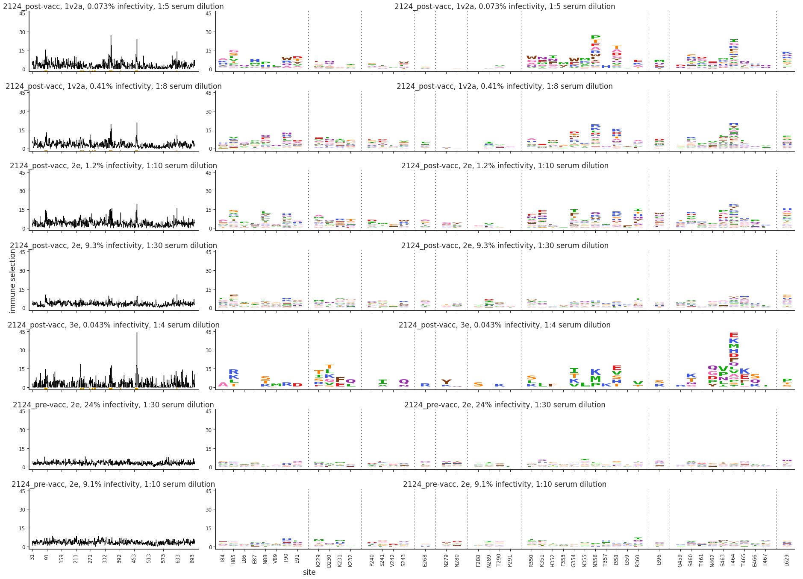


    
    
    ************************************************************************
    Serum group 2214, saving to ./results/diffsel/zoom/2214.pdf
    


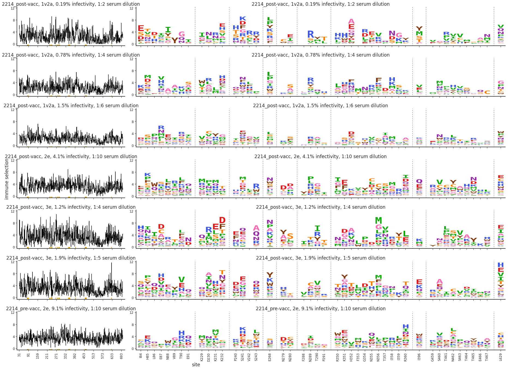


    
    
    ************************************************************************
    Serum group 2423, saving to ./results/diffsel/zoom/2423.pdf
    


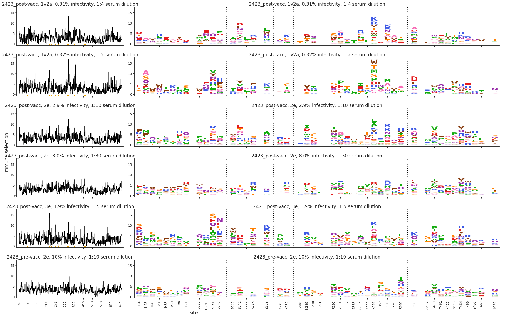


    
    
    ************************************************************************
    Serum group 2425, saving to ./results/diffsel/zoom/2425.pdf
    


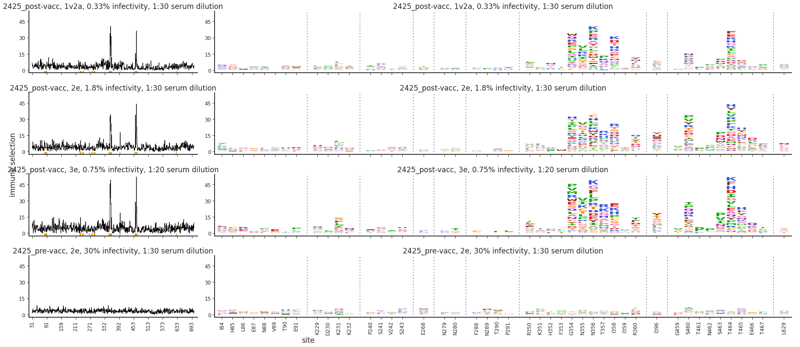


    
    
    ************************************************************************
    Serum group 5724, saving to ./results/diffsel/zoom/5724.pdf
    


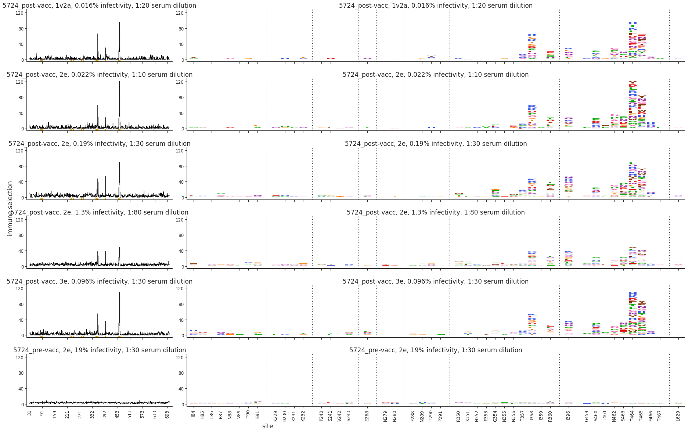


    
    
    ************************************************************************
    Serum group 5727, saving to ./results/diffsel/zoom/5727.pdf
    


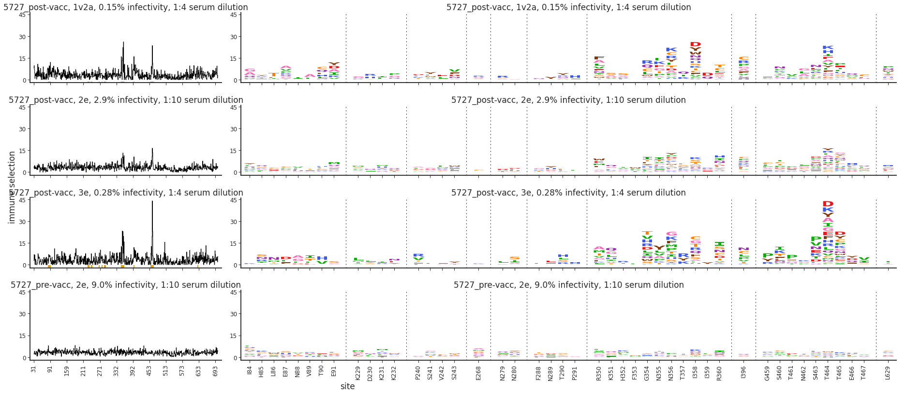


```python
diffseldir = "./results/diffsel/"
```


```python
ind_names = list(set(selections["mds_name"].tolist()))
```


```python
for antibody in ind_names:
    mutdiffsel = os.path.join(diffseldir, '{0}_mutdiffsel.csv'.format(antibody))
    
    #scale bar unit is maximum effect
    mutdiffseldf = pd.read_csv(mutdiffsel)
    scaleunit = '{0:.1g}'.format(mutdiffseldf['mutdiffsel'].max())
    #print(scaleunit)
    scalelabel = '"differential selection = {0}"'.format(scaleunit)
    logoplot = os.path.join(diffseldir, '{0}_diffsel.pdf'.format(antibody))
    #print(logoplot)
    logoname = '{0}'.format(antibody)
    print("\nCreating logo plot for {0} from {1}".format(antibody, mutdiffsel))
    log = !dms2_logoplot \
            --diffsel {mutdiffsel} \
            --name {logoname} \
            --outdir {diffseldir} \
            --restrictdiffsel positive \
            --sepline no \
            --nperline 84 \
            --overlay1 {mutdiffsel} wildtype wildtype \
            --scalebar {scaleunit} {scalelabel} \
            --underlay yes \
            --use_existing {config['use_existing']}
    #showPDF(logoplot)
```

    
    Creating logo plot for 2214-Wk43-rep3e-d5 from ./results/diffsel/2214-Wk43-rep3e-d5_mutdiffsel.csv
    
    Creating logo plot for 5724-Wk26-rep2e-d30 from ./results/diffsel/5724-Wk26-rep2e-d30_mutdiffsel.csv
    
    Creating logo plot for 2124-Wk22-rep2e-d10 from ./results/diffsel/2124-Wk22-rep2e-d10_mutdiffsel.csv
    
    Creating logo plot for 5727-Wk26-rep3e-d3-75 from ./results/diffsel/5727-Wk26-rep3e-d3-75_mutdiffsel.csv
    
    Creating logo plot for 2423-Wk18-rep1v2a-d3-75 from ./results/diffsel/2423-Wk18-rep1v2a-d3-75_mutdiffsel.csv
    
    Creating logo plot for 2124-Wk22-rep1v2a-d7-5 from ./results/diffsel/2124-Wk22-rep1v2a-d7-5_mutdiffsel.csv
    
    Creating logo plot for 2425-Wk18-rep3e-d20 from ./results/diffsel/2425-Wk18-rep3e-d20_mutdiffsel.csv
    
    Creating logo plot for 2214-Wk0-rep2e-d10 from ./results/diffsel/2214-Wk0-rep2e-d10_mutdiffsel.csv
    
    Creating logo plot for 5724-Wk0-rep2e-d30 from ./results/diffsel/5724-Wk0-rep2e-d30_mutdiffsel.csv
    
    Creating logo plot for 2214-Wk43-rep1v2a-d6 from ./results/diffsel/2214-Wk43-rep1v2a-d6_mutdiffsel.csv
    
    Creating logo plot for 2423-Wk18-rep3e-d5 from ./results/diffsel/2423-Wk18-rep3e-d5_mutdiffsel.csv
    
    Creating logo plot for 5724-Wk26-rep1v2a-d20 from ./results/diffsel/5724-Wk26-rep1v2a-d20_mutdiffsel.csv
    
    Creating logo plot for 2423-Wk18-rep2e-d10 from ./results/diffsel/2423-Wk18-rep2e-d10_mutdiffsel.csv
    
    Creating logo plot for 2214-Wk43-rep1v2a-d2-5 from ./results/diffsel/2214-Wk43-rep1v2a-d2-5_mutdiffsel.csv
    
    Creating logo plot for 2214-Wk43-rep1v2a-d4 from ./results/diffsel/2214-Wk43-rep1v2a-d4_mutdiffsel.csv
    
    Creating logo plot for 2423-Wk0-rep2e-d10 from ./results/diffsel/2423-Wk0-rep2e-d10_mutdiffsel.csv
    
    Creating logo plot for 2425-Wk0-rep2e-d30 from ./results/diffsel/2425-Wk0-rep2e-d30_mutdiffsel.csv
    
    Creating logo plot for 2124-Wk22-rep1v2a-d5 from ./results/diffsel/2124-Wk22-rep1v2a-d5_mutdiffsel.csv
    
    Creating logo plot for 5727-Wk0-rep2e-d10 from ./results/diffsel/5727-Wk0-rep2e-d10_mutdiffsel.csv
    
    Creating logo plot for 2423-Wk18-rep2e-d30 from ./results/diffsel/2423-Wk18-rep2e-d30_mutdiffsel.csv
    
    Creating logo plot for 5727-Wk26-rep2e-d10 from ./results/diffsel/5727-Wk26-rep2e-d10_mutdiffsel.csv
    
    Creating logo plot for 2425-Wk18-rep2e-d30 from ./results/diffsel/2425-Wk18-rep2e-d30_mutdiffsel.csv
    
    Creating logo plot for 2423-Wk18-rep1v2a-d2-5 from ./results/diffsel/2423-Wk18-rep1v2a-d2-5_mutdiffsel.csv
    
    Creating logo plot for 2214-Wk43-rep2e-d10 from ./results/diffsel/2214-Wk43-rep2e-d10_mutdiffsel.csv
    
    Creating logo plot for 2214-Wk43-rep3e-d3-75 from ./results/diffsel/2214-Wk43-rep3e-d3-75_mutdiffsel.csv
    
    Creating logo plot for 2124-Wk22-rep2e-d30 from ./results/diffsel/2124-Wk22-rep2e-d30_mutdiffsel.csv
    
    Creating logo plot for 2124-Wk22-rep3e-d3-75 from ./results/diffsel/2124-Wk22-rep3e-d3-75_mutdiffsel.csv
    
    Creating logo plot for 2124-Wk0-rep2e-d30 from ./results/diffsel/2124-Wk0-rep2e-d30_mutdiffsel.csv
    
    Creating logo plot for 2124-Wk0-rep2e-d10 from ./results/diffsel/2124-Wk0-rep2e-d10_mutdiffsel.csv
    
    Creating logo plot for 5724-Wk26-rep2e-d77 from ./results/diffsel/5724-Wk26-rep2e-d77_mutdiffsel.csv
    
    Creating logo plot for 5727-Wk26-rep1v2a-d4 from ./results/diffsel/5727-Wk26-rep1v2a-d4_mutdiffsel.csv
    
    Creating logo plot for 2425-Wk18-rep1v2a-d30 from ./results/diffsel/2425-Wk18-rep1v2a-d30_mutdiffsel.csv
    
    Creating logo plot for 5724-Wk26-rep3e-d30 from ./results/diffsel/5724-Wk26-rep3e-d30_mutdiffsel.csv
    
    Creating logo plot for 5724-Wk26-rep2e-d10 from ./results/diffsel/5724-Wk26-rep2e-d10_mutdiffsel.csv


### Now, plot average data for each sample


```python
groupnames = list(set(batchdf["group"].tolist()))
#groupnames
```


```python
outdir = config['avgdiffsel_full_dir']
os.makedirs(outdir, exist_ok=True)
```


```python
#outdir = "./results/diffsel/full_logo_plots/"
```


```python
for name in groupnames: #groupnames:    
    #scale bar unit is maximum effect
    #print(name)
    med_deffsel_file = "./results/diffsel/summary_{0}-medianmutdiffsel.csv".format(name)
    mutdiffseldf =  pd.read_csv(med_deffsel_file)
    scaleunit = '{0:.1g}'.format(mutdiffseldf['mutdiffsel'].max())
    #print(scaleunit)
    scalelabel = '"differential selection = {0}"'.format(scaleunit)
    logoplot = './results/diffsel/full_logo_plots/median-{0}-diffsel.pdf'.format(name)
    #print(logoplot)
    logoname = 'median-{0}'.format(name)
    print("\nCreating logo plot for {0} from {1}".format(name, med_deffsel_file))
    log = !dms2_logoplot \
            --diffsel {med_deffsel_file} \
            --name {logoname} \
            --outdir {outdir} \
            --restrictdiffsel positive \
            --sepline no \
            --nperline 84 \
            --overlay1 {mutdiffsel} wildtype wildtype \
            --scalebar {scaleunit} {scalelabel} \
            --underlay yes \
            --use_existing {config['use_existing']}

```

    
    Creating logo plot for 2425-Wk18 from ./results/diffsel/summary_2425-Wk18-medianmutdiffsel.csv
    
    Creating logo plot for 2214-Wk43 from ./results/diffsel/summary_2214-Wk43-medianmutdiffsel.csv
    
    Creating logo plot for 2423-Wk18 from ./results/diffsel/summary_2423-Wk18-medianmutdiffsel.csv
    
    Creating logo plot for 2124-Wk22 from ./results/diffsel/summary_2124-Wk22-medianmutdiffsel.csv
    
    Creating logo plot for 2425-Wk0 from ./results/diffsel/summary_2425-Wk0-medianmutdiffsel.csv
    
    Creating logo plot for 5727-Wk26 from ./results/diffsel/summary_5727-Wk26-medianmutdiffsel.csv
    
    Creating logo plot for 5727-Wk0 from ./results/diffsel/summary_5727-Wk0-medianmutdiffsel.csv
    
    Creating logo plot for 2423-Wk0 from ./results/diffsel/summary_2423-Wk0-medianmutdiffsel.csv
    
    Creating logo plot for 5724-Wk26 from ./results/diffsel/summary_5724-Wk26-medianmutdiffsel.csv
    
    Creating logo plot for 2214-Wk0 from ./results/diffsel/summary_2214-Wk0-medianmutdiffsel.csv
    
    Creating logo plot for 5724-Wk0 from ./results/diffsel/summary_5724-Wk0-medianmutdiffsel.csv
    
    Creating logo plot for 2124-Wk0 from ./results/diffsel/summary_2124-Wk0-medianmutdiffsel.csv


Now, we want to make line and logoplots at above but with the avg pre and post  data as above. 
Additionally, we will make the plot the median values on the structure. 


```python
sel_df["serum_alldils_name"] = (sel_df["rabbit_id"].astype(str) + "_" + sel_df["vaccine_status"].astype(str))

display(HTML(sel_df.head(n=5).to_html(index=False)))
```


<table border="1" class="dataframe">
  <thead>
    <tr style="text-align: right;">
      <th>sample</th>
      <th>rabbit_id</th>
      <th>vaccine_status</th>
      <th>library</th>
      <th>dilution</th>
      <th>fraction_surviving</th>
      <th>percent_infectivity</th>
      <th>R1</th>
      <th>SRA_accession</th>
      <th>R2</th>
      <th>serum</th>
      <th>serum_name</th>
      <th>serum_description</th>
      <th>serum_group</th>
      <th>serum_vaccination</th>
      <th>serum_immunogen</th>
      <th>serum_dilution</th>
      <th>group</th>
      <th>name</th>
      <th>sel</th>
      <th>mock</th>
      <th>err</th>
      <th>mds_name</th>
      <th>site</th>
      <th>wildtype</th>
      <th>mutation</th>
      <th>mutdiffsel</th>
      <th>abs_diffsel</th>
      <th>positive_diffsel</th>
      <th>negative_diffsel</th>
      <th>max_diffsel</th>
      <th>min_diffsel</th>
      <th>isite</th>
      <th>serum_name_formatted</th>
      <th>name_formatted</th>
      <th>serum_alldils_name</th>
      <th>zoom_site</th>
      <th>site_label</th>
      <th>verydiscrip_name</th>
    </tr>
  </thead>
  <tbody>
    <tr>
      <td>mut-virus-rep2e-5727-Wk26-d10</td>
      <td>5727</td>
      <td>post</td>
      <td>2e</td>
      <td>10</td>
      <td>0.0289316</td>
      <td>2.89316</td>
      <td>mut-virus-rep2e-5727-Wk26-d10_R1.fastq.gz</td>
      <td>SRR12431184</td>
      <td>mut-virus-rep2e-5727-Wk26-d10_R2.fastq.gz</td>
      <td>BG5-M2E-5727-Wk26-d10</td>
      <td>5727-Wk26-d10</td>
      <td>rabbit sera provided by John Moore. et al, vaccinated with BG505 trimer</td>
      <td>mainly 465</td>
      <td>post</td>
      <td>BG505 SOSIP.664 x 4</td>
      <td>10</td>
      <td>5727-Wk26</td>
      <td>2e-2.9</td>
      <td>mut-virus-rep2e-5727-Wk26-d10</td>
      <td>mut-virus-rep2e</td>
      <td>wt-DNA-rep2</td>
      <td>5727-Wk26-rep2e-d10</td>
      <td>184f</td>
      <td>N</td>
      <td>A</td>
      <td>2.363613</td>
      <td>11.150211</td>
      <td>5.616064</td>
      <td>-5.534147</td>
      <td>2.363613</td>
      <td>-1.360174</td>
      <td>151</td>
      <td>5727-Wk26-d10</td>
      <td>2e, 2.9% infectivity, 1:10 serum dilution</td>
      <td>5727_post</td>
      <td>False</td>
      <td>N184f</td>
      <td>5727_post-vacc, 2e, 2.9% infectivity, 1:10 serum dilution</td>
    </tr>
    <tr>
      <td>mut-virus-rep2e-5727-Wk26-d10</td>
      <td>5727</td>
      <td>post</td>
      <td>2e</td>
      <td>10</td>
      <td>0.0289316</td>
      <td>2.89316</td>
      <td>mut-virus-rep2e-5727-Wk26-d10_R1.fastq.gz</td>
      <td>SRR12431184</td>
      <td>mut-virus-rep2e-5727-Wk26-d10_R2.fastq.gz</td>
      <td>BG5-M2E-5727-Wk26-d10</td>
      <td>5727-Wk26-d10</td>
      <td>rabbit sera provided by John Moore. et al, vaccinated with BG505 trimer</td>
      <td>mainly 465</td>
      <td>post</td>
      <td>BG505 SOSIP.664 x 4</td>
      <td>10</td>
      <td>5727-Wk26</td>
      <td>2e-2.9</td>
      <td>mut-virus-rep2e-5727-Wk26-d10</td>
      <td>mut-virus-rep2e</td>
      <td>wt-DNA-rep2</td>
      <td>5727-Wk26-rep2e-d10</td>
      <td>184f</td>
      <td>N</td>
      <td>T</td>
      <td>0.669328</td>
      <td>11.150211</td>
      <td>5.616064</td>
      <td>-5.534147</td>
      <td>2.363613</td>
      <td>-1.360174</td>
      <td>151</td>
      <td>5727-Wk26-d10</td>
      <td>2e, 2.9% infectivity, 1:10 serum dilution</td>
      <td>5727_post</td>
      <td>False</td>
      <td>N184f</td>
      <td>5727_post-vacc, 2e, 2.9% infectivity, 1:10 serum dilution</td>
    </tr>
    <tr>
      <td>mut-virus-rep2e-5727-Wk26-d10</td>
      <td>5727</td>
      <td>post</td>
      <td>2e</td>
      <td>10</td>
      <td>0.0289316</td>
      <td>2.89316</td>
      <td>mut-virus-rep2e-5727-Wk26-d10_R1.fastq.gz</td>
      <td>SRR12431184</td>
      <td>mut-virus-rep2e-5727-Wk26-d10_R2.fastq.gz</td>
      <td>BG5-M2E-5727-Wk26-d10</td>
      <td>5727-Wk26-d10</td>
      <td>rabbit sera provided by John Moore. et al, vaccinated with BG505 trimer</td>
      <td>mainly 465</td>
      <td>post</td>
      <td>BG505 SOSIP.664 x 4</td>
      <td>10</td>
      <td>5727-Wk26</td>
      <td>2e-2.9</td>
      <td>mut-virus-rep2e-5727-Wk26-d10</td>
      <td>mut-virus-rep2e</td>
      <td>wt-DNA-rep2</td>
      <td>5727-Wk26-rep2e-d10</td>
      <td>184f</td>
      <td>N</td>
      <td>M</td>
      <td>0.657208</td>
      <td>11.150211</td>
      <td>5.616064</td>
      <td>-5.534147</td>
      <td>2.363613</td>
      <td>-1.360174</td>
      <td>151</td>
      <td>5727-Wk26-d10</td>
      <td>2e, 2.9% infectivity, 1:10 serum dilution</td>
      <td>5727_post</td>
      <td>False</td>
      <td>N184f</td>
      <td>5727_post-vacc, 2e, 2.9% infectivity, 1:10 serum dilution</td>
    </tr>
    <tr>
      <td>mut-virus-rep2e-5727-Wk26-d10</td>
      <td>5727</td>
      <td>post</td>
      <td>2e</td>
      <td>10</td>
      <td>0.0289316</td>
      <td>2.89316</td>
      <td>mut-virus-rep2e-5727-Wk26-d10_R1.fastq.gz</td>
      <td>SRR12431184</td>
      <td>mut-virus-rep2e-5727-Wk26-d10_R2.fastq.gz</td>
      <td>BG5-M2E-5727-Wk26-d10</td>
      <td>5727-Wk26-d10</td>
      <td>rabbit sera provided by John Moore. et al, vaccinated with BG505 trimer</td>
      <td>mainly 465</td>
      <td>post</td>
      <td>BG505 SOSIP.664 x 4</td>
      <td>10</td>
      <td>5727-Wk26</td>
      <td>2e-2.9</td>
      <td>mut-virus-rep2e-5727-Wk26-d10</td>
      <td>mut-virus-rep2e</td>
      <td>wt-DNA-rep2</td>
      <td>5727-Wk26-rep2e-d10</td>
      <td>184f</td>
      <td>N</td>
      <td>P</td>
      <td>0.593790</td>
      <td>11.150211</td>
      <td>5.616064</td>
      <td>-5.534147</td>
      <td>2.363613</td>
      <td>-1.360174</td>
      <td>151</td>
      <td>5727-Wk26-d10</td>
      <td>2e, 2.9% infectivity, 1:10 serum dilution</td>
      <td>5727_post</td>
      <td>False</td>
      <td>N184f</td>
      <td>5727_post-vacc, 2e, 2.9% infectivity, 1:10 serum dilution</td>
    </tr>
    <tr>
      <td>mut-virus-rep2e-5727-Wk26-d10</td>
      <td>5727</td>
      <td>post</td>
      <td>2e</td>
      <td>10</td>
      <td>0.0289316</td>
      <td>2.89316</td>
      <td>mut-virus-rep2e-5727-Wk26-d10_R1.fastq.gz</td>
      <td>SRR12431184</td>
      <td>mut-virus-rep2e-5727-Wk26-d10_R2.fastq.gz</td>
      <td>BG5-M2E-5727-Wk26-d10</td>
      <td>5727-Wk26-d10</td>
      <td>rabbit sera provided by John Moore. et al, vaccinated with BG505 trimer</td>
      <td>mainly 465</td>
      <td>post</td>
      <td>BG505 SOSIP.664 x 4</td>
      <td>10</td>
      <td>5727-Wk26</td>
      <td>2e-2.9</td>
      <td>mut-virus-rep2e-5727-Wk26-d10</td>
      <td>mut-virus-rep2e</td>
      <td>wt-DNA-rep2</td>
      <td>5727-Wk26-rep2e-d10</td>
      <td>184f</td>
      <td>N</td>
      <td>L</td>
      <td>0.567204</td>
      <td>11.150211</td>
      <td>5.616064</td>
      <td>-5.534147</td>
      <td>2.363613</td>
      <td>-1.360174</td>
      <td>151</td>
      <td>5727-Wk26-d10</td>
      <td>2e, 2.9% infectivity, 1:10 serum dilution</td>
      <td>5727_post</td>
      <td>False</td>
      <td>N184f</td>
      <td>5727_post-vacc, 2e, 2.9% infectivity, 1:10 serum dilution</td>
    </tr>
  </tbody>
</table>


```python
selections["serum_alldils_name"] = (selections["rabbit_id"].astype(str) + "_" + selections["vaccine_status"].astype(str))
#display(HTML(selections.head(n=20).to_html(index=False)))


```


```python
tempnames = list(set(selections["rabbit_id"].tolist()))
tempnames
```


    ['5724', '2423', '2425', '5727', '2214', '2124']


```python
avg_selections = selections.copy()
avg_selections.drop(["sample","serum_dilution", "fraction_surviving", "percent_infectivity", "R1", "serum", "serum_name", "name", "sel", "mutdiffsel_file", "sitediffsel_file"], axis=1, inplace=True)
avg_selections = avg_selections.drop_duplicates(subset='serum_alldils_name', keep='first')
avg_selections.head()
```


<div>
<style scoped>
    .dataframe tbody tr th:only-of-type {
        vertical-align: middle;
    }

    .dataframe tbody tr th {
        vertical-align: top;
    }

    .dataframe thead th {
        text-align: right;
    }
</style>
<table border="1" class="dataframe">
  <thead>
    <tr style="text-align: right;">
      <th></th>
      <th>rabbit_id</th>
      <th>vaccine_status</th>
      <th>library</th>
      <th>dilution</th>
      <th>SRA_accession</th>
      <th>R2</th>
      <th>serum_description</th>
      <th>serum_group</th>
      <th>serum_vaccination</th>
      <th>serum_immunogen</th>
      <th>group</th>
      <th>mock</th>
      <th>err</th>
      <th>mds_name</th>
      <th>serum_alldils_name</th>
    </tr>
  </thead>
  <tbody>
    <tr>
      <th>16</th>
      <td>5727</td>
      <td>post</td>
      <td>2e</td>
      <td>10.0</td>
      <td>SRR12431184</td>
      <td>mut-virus-rep2e-5727-Wk26-d10_R2.fastq.gz</td>
      <td>rabbit sera provided by John Moore. et al, vaccinated with BG505 trimer</td>
      <td>mainly 465</td>
      <td>post</td>
      <td>BG505 SOSIP.664 x 4</td>
      <td>5727-Wk26</td>
      <td>mut-virus-rep2e</td>
      <td>wt-DNA-rep2</td>
      <td>5727-Wk26-rep2e-d10</td>
      <td>5727_post</td>
    </tr>
    <tr>
      <th>15</th>
      <td>5727</td>
      <td>pre</td>
      <td>2e</td>
      <td>10.0</td>
      <td>SRR12431185</td>
      <td>mut-virus-rep2e-5727-Wk0-d10_R2.fastq.gz</td>
      <td>rabbit sera provided by John Moore. et al, vaccinated with BG505 trimer</td>
      <td>mainly 465</td>
      <td>pre</td>
      <td>None</td>
      <td>5727-Wk0</td>
      <td>mut-virus-rep2e</td>
      <td>wt-DNA-rep2</td>
      <td>5727-Wk0-rep2e-d10</td>
      <td>5727_pre</td>
    </tr>
    <tr>
      <th>14</th>
      <td>5724</td>
      <td>post</td>
      <td>2e</td>
      <td>77.0</td>
      <td>SRR12431186</td>
      <td>mut-virus-rep2e-5724-Wk26-d77_R2.fastq.gz</td>
      <td>rabbit sera provided by John Moore. et al, vaccinated with BG505 trimer</td>
      <td>C3/465</td>
      <td>post</td>
      <td>BG505 SOSIP.664 x 4</td>
      <td>5724-Wk26</td>
      <td>mut-virus-rep2e</td>
      <td>wt-DNA-rep2</td>
      <td>5724-Wk26-rep2e-d77</td>
      <td>5724_post</td>
    </tr>
    <tr>
      <th>11</th>
      <td>5724</td>
      <td>pre</td>
      <td>2e</td>
      <td>30.0</td>
      <td>SRR12431189</td>
      <td>mut-virus-rep2e-5724-Wk0-d30_R2.fastq.gz</td>
      <td>rabbit sera provided by John Moore. et al, vaccinated with BG505 trimer</td>
      <td>C3/465</td>
      <td>pre</td>
      <td>None</td>
      <td>5724-Wk0</td>
      <td>mut-virus-rep2e</td>
      <td>wt-DNA-rep2</td>
      <td>5724-Wk0-rep2e-d30</td>
      <td>5724_pre</td>
    </tr>
    <tr>
      <th>10</th>
      <td>2425</td>
      <td>post</td>
      <td>2e</td>
      <td>30.0</td>
      <td>SRR12431153</td>
      <td>mut-virus-rep2e-2425-Wk18-d30_R2.fastq.gz</td>
      <td>rabbit sera provided by John Moore. et al, vaccinated with BG505 trimer</td>
      <td>C3/465</td>
      <td>post</td>
      <td>BG505 SOSIP.v4.1 x 3</td>
      <td>2425-Wk18</td>
      <td>mut-virus-rep2e</td>
      <td>wt-DNA-rep2</td>
      <td>2425-Wk18-rep2e-d30</td>
      <td>2425_post</td>
    </tr>
  </tbody>
</table>
</div>


```python
mediansiteselfiledict={}
medianmutselfiledict = {}
for name in groupnames:
    mediansiteselfiledict[name] = "./results/diffsel/summary_{0}-mediansitediffsel.csv".format(name)
    medianmutselfiledict[name] = "./results/diffsel/summary_{0}-medianmutdiffsel.csv".format(name)
```


```python
mediansiteselfile_df = pd.DataFrame(list(mediansiteselfiledict.items()), columns=['group','sitediffsel_file'])
medianmutselfile_df = pd.DataFrame(list(medianmutselfiledict.items()), columns=['group','mutdiffsel_file'])
avg_selections = avg_selections.merge(mediansiteselfile_df, left_on='group', right_on='group')
avg_selections = avg_selections.merge(medianmutselfile_df, left_on='group', right_on='group')
#avg_selections


```


```python
avg_selections['rabbit_id'] = avg_selections['rabbit_id'].astype(str)
share_ylim_across_rows = {serum_group: ('antibody' not in serum_group)
                          for serum_group in avg_selections['rabbit_id'].unique()}
```


```python
selfilecols = ['mutdiffsel_file', 'sitediffsel_file']
avg_sel_df = (dms_tools2.diffsel.df_read_filecols(avg_selections, selfilecols)
          .drop(columns=selfilecols)
          )
```


```python
ZoomSitesList = ["84", "85", "86", "87", "88", "89", "90", "91",  "229", "230", "231", "232", "240","241", "242", "243", "268",  "289", "290", "291","347", "350","351","352", "353", "354", "355", "356", "357", "358", "359", "360", "396", "459", "460", "461", "462", "463", "464", "465", "466", "467", "629"]
hole241 = ["84", "85", "86", "87", "88", "89", "90", "91", "229", "230", "231", "232", "240","241", "242", "243", "268", "289", "290", "291", "347", "629"]
c3465 = ["350","351","352", "353", "354", "355", "356", "357", "358", "359", "360", "396", "459", "460", "461", "462", "463", "464", "465", "466", "467"]

avg_sel_df["zoom_site"] = False
avg_sel_df.loc[avg_sel_df['site'].isin(ZoomSitesList), 'zoom_site'] = True

avg_sel_df = avg_sel_df.assign(site_label=lambda x: x['wildtype'] +
                               x['site'].astype('str'))

avg_sel_df["color"] = "gray"
avg_sel_df.loc[avg_sel_df['site'].isin(hole241), 'color'] = "green"
avg_sel_df.loc[avg_sel_df['site'].isin(c3465), 'color'] = "blue"

avg_sel_df.loc[(avg_sel_df['site_label'] == "S241") & (avg_sel_df['mutation'] == "N"), 'color'] = "red"

avg_sel_df.loc[(avg_sel_df['site_label'] == "P291") & (avg_sel_df['mutation'] == "T"), 'color'] = "red"
avg_sel_df.loc[(avg_sel_df['site_label'] == "P291") & (avg_sel_df['mutation'] == "S"), 'color'] = "red"

avg_sel_df.loc[(avg_sel_df['site_label'] == "I358") & (avg_sel_df['mutation'] == "T"), 'color'] = "red"
avg_sel_df.loc[(avg_sel_df['site_label'] == "I358") & (avg_sel_df['mutation'] == "S"), 'color'] = "red"

avg_sel_df.loc[(avg_sel_df['site_label'] == "T465") & (avg_sel_df['mutation'] == "N"), 'color'] = "red"

```


```python
avg_sel_df["verydiscrip_name"] = (avg_sel_df["group"].astype(str) + "-vacc, TZM-mapped specificity:" + avg_sel_df["serum_group"].astype(str))

```


```python
#share_ylim_across_rows
```


```python
plotfile =  "./results/diffsel/AllSamples_SameScaleZoomed.pdf"
fig, axes = dmslogo.facet_plot(
        data=avg_sel_df,#.query('library == @avg_type'),
        x_col='isite',
        show_col='zoom_site',
        gridrow_col='serum_alldils_name',
        share_xlabel=True,
        share_ylabel=True,
        share_ylim_across_rows=False,
        wspace=0.6,
        #
        draw_line_kwargs=dict(
                height_col='positive_diffsel',
                xtick_col='site',
                ylabel='immune selection',
                ),
        draw_logo_kwargs=dict(
                letter_col='mutation',
                letter_height_col='mutdiffsel',
                xtick_col='site_label',
                xlabel='site',
                ylabel='immune selection',
                clip_negative_heights=True,
                ),
        )
#display(fig)
fig.savefig(plotfile)
plt.close(fig)
```


```python
#plot y scale differently... 
#first, query by each sample the 90th percentile. then make sure y max < than 90th percentile*10, then set y max to 90th percentile*10
```


```python
nintiethpercentile_dict = avg_sel_df.groupby("group").positive_diffsel.quantile(.9)
nintiethpercentile_x10_dict = {}
nintiethpercentile_x5_dict = {}
for name in groupnames:
    nintiethpercentile_x10_dict[name] = nintiethpercentile_dict[name] * 10
    nintiethpercentile_x5_dict[name] = nintiethpercentile_dict[name] * 5
nintiethpercentile_x10_dict
nintiethpercentile_x5_dict
```


    {'2425-Wk18': 22.249096172909365,
     '2214-Wk43': 9.878864910529261,
     '2423-Wk18': 12.639323538979419,
     '2124-Wk22': 10.135132682824901,
     '2425-Wk0': 25.15709769655093,
     '5727-Wk26': 15.60611663013917,
     '5727-Wk0': 23.897234808593918,
     '2423-Wk0': 25.265879537033044,
     '5724-Wk26': 6.781270354878424,
     '2214-Wk0': 26.448687302988468,
     '5724-Wk0': 24.985849175960922,
     '2124-Wk0': 21.96547092372635}


```python
max_dict = avg_sel_df.groupby("group").positive_diffsel.quantile(1)
max_dict
```


    group
    2124-Wk0       7.052694
    2124-Wk22     19.272802
    2214-Wk0       8.133172
    2214-Wk43      5.116609
    2423-Wk0       9.609191
    2423-Wk18      9.029074
    2425-Wk0       8.415448
    2425-Wk18     44.226667
    5724-Wk0       8.809110
    5724-Wk26    100.434107
    5727-Wk0       8.110198
    5727-Wk26     27.611616
    Name: positive_diffsel, dtype: float64


```python
ymax_dict = {}
ymaxx5_dict = {}
for name in groupnames:
    ymax_dict[name] = max(max_dict[name] * 1.055, nintiethpercentile_x10_dict[name])
    ymaxx5_dict[name] = max(max_dict[name] * 1.055, nintiethpercentile_x5_dict[name])
```


```python
for name in groupnames:
    print("\n",name)
    print("max value is:\n", max_dict[name])
    print("90th percentilex10 is \n", nintiethpercentile_x10_dict[name])
    print("used y max value is \n", ymax_dict[name])
```

    
     2425-Wk18
    max value is:
     44.22666682216751
    90th percentilex10 is 
     44.49819234581873
    used y max value is 
     46.65913349738672
    
     2214-Wk43
    max value is:
     5.116609063991265
    90th percentilex10 is 
     19.757729821058522
    used y max value is 
     19.757729821058522
    
     2423-Wk18
    max value is:
     9.02907422319424
    90th percentilex10 is 
     25.278647077958837
    used y max value is 
     25.278647077958837
    
     2124-Wk22
    max value is:
     19.27280224063353
    90th percentilex10 is 
     20.270265365649802
    used y max value is 
     20.332806363868375
    
     2425-Wk0
    max value is:
     8.415447990073734
    90th percentilex10 is 
     50.31419539310186
    used y max value is 
     50.31419539310186
    
     5727-Wk26
    max value is:
     27.611616159638906
    90th percentilex10 is 
     31.21223326027834
    used y max value is 
     31.21223326027834
    
     5727-Wk0
    max value is:
     8.110197806393593
    90th percentilex10 is 
     47.794469617187836
    used y max value is 
     47.794469617187836
    
     2423-Wk0
    max value is:
     9.609191056682972
    90th percentilex10 is 
     50.53175907406609
    used y max value is 
     50.53175907406609
    
     5724-Wk26
    max value is:
     100.43410746466411
    90th percentilex10 is 
     13.562540709756847
    used y max value is 
     105.95798337522064
    
     2214-Wk0
    max value is:
     8.133171717396321
    90th percentilex10 is 
     52.897374605976935
    used y max value is 
     52.897374605976935
    
     5724-Wk0
    max value is:
     8.80911011934939
    90th percentilex10 is 
     49.971698351921845
    used y max value is 
     49.971698351921845
    
     2124-Wk0
    max value is:
     7.052694016462398
    90th percentilex10 is 
     43.9309418474527
    used y max value is 
     43.9309418474527


```python
rabbit_post_ymax_dict = ymax_dict.copy()

rabbit_post_ymax_dict["2124"] = rabbit_post_ymax_dict.pop("2124-Wk22")
rabbit_post_ymax_dict["2214"] = rabbit_post_ymax_dict.pop("2214-Wk43")
rabbit_post_ymax_dict["5724"] = rabbit_post_ymax_dict.pop("5724-Wk26")
rabbit_post_ymax_dict["5727"] = rabbit_post_ymax_dict.pop("5727-Wk26")
rabbit_post_ymax_dict["2425"] = rabbit_post_ymax_dict.pop("2425-Wk18")
rabbit_post_ymax_dict["2423"] = rabbit_post_ymax_dict.pop("2423-Wk18")
#rabbit_post_ymax_dict
```


```python

rabbit_post_ymaxx5_dict = ymaxx5_dict.copy()

rabbit_post_ymaxx5_dict["2124"] = rabbit_post_ymaxx5_dict.pop("2124-Wk22")
rabbit_post_ymaxx5_dict["2214"] = rabbit_post_ymaxx5_dict.pop("2214-Wk43")
rabbit_post_ymaxx5_dict["5724"] = rabbit_post_ymaxx5_dict.pop("5724-Wk26")
rabbit_post_ymaxx5_dict["5727"] = rabbit_post_ymaxx5_dict.pop("5727-Wk26")
rabbit_post_ymaxx5_dict["2425"] = rabbit_post_ymaxx5_dict.pop("2425-Wk18")
rabbit_post_ymaxx5_dict["2423"] = rabbit_post_ymaxx5_dict.pop("2423-Wk18")
#rabbit_post_ymaxx5_dict
```


```python
#rabbit_post_ymax_dict
```


```python
rabbitnames = list(set(avg_sel_df["rabbit_id"].tolist()))
#rabbitnames
```


```python
os.makedirs("./results/diffsel/AvgAcrossDils/", exist_ok=True)

for rabbit_id, df in avg_sel_df.groupby('rabbit_id'):

    print(rabbit_id)
    print(rabbit_post_ymax_dict[rabbit_id])
    ymin = -0.055 * rabbit_post_ymax_dict[rabbit_id]
    plotfile = os.path.join("./results/diffsel/AvgAcrossDils/",
                            f"{rabbit_id}.pdf")
    print(f"\n\n{'*' * 72}\nSerum group {rabbit_id}, saving to {plotfile}\n")
    fig, axes = dmslogo.facet_plot(
            data=df,#.query('library == @avg_type'),
            x_col='isite',
            show_col='zoom_site',
            gridrow_col='serum_alldils_name',
            share_xlabel=True,
            share_ylabel=True,
            #share_ylim_across_rows=True,#share_ylim_across_rows[rabbit_id],
            wspace=0.6,
            #fixed_ymax=rabbit_post_ymax_dict[rabbit_id],
            set_ylims = (ymin, rabbit_post_ymax_dict[rabbit_id]),
            draw_line_kwargs=dict(
                    height_col='positive_diffsel',
                    xtick_col='site',
                    ylabel='immune selection',
                    #fixed_ymax=rabbit_post_ymax_dict[rabbit_id],
                    ),
            draw_logo_kwargs=dict(
                    letter_col='mutation',
                    letter_height_col='mutdiffsel',
                    xtick_col='site_label',
                    xlabel='site',
                    ylabel='immune selection',
                    clip_negative_heights=True,
                    #fixed_ymax=rabbit_post_ymax_dict[rabbit_id],
                    ),
            )
    display(fig)
    fig.savefig(plotfile)
    plt.close(fig)
```

    2124
    20.332806363868375
    
    
    ************************************************************************
    Serum group 2124, saving to ./results/diffsel/AvgAcrossDils/2124.pdf
    


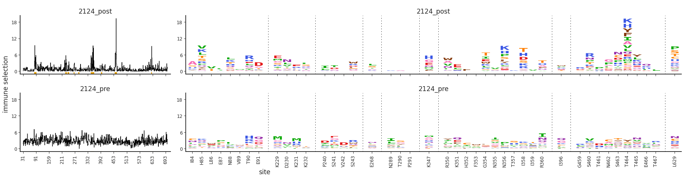


    2214
    19.757729821058522
    
    
    ************************************************************************
    Serum group 2214, saving to ./results/diffsel/AvgAcrossDils/2214.pdf
    


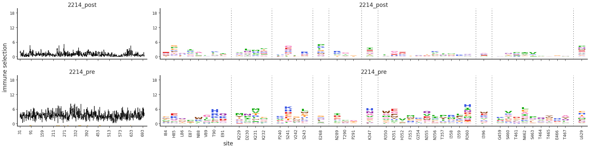


    2423
    25.278647077958837
    
    
    ************************************************************************
    Serum group 2423, saving to ./results/diffsel/AvgAcrossDils/2423.pdf
    


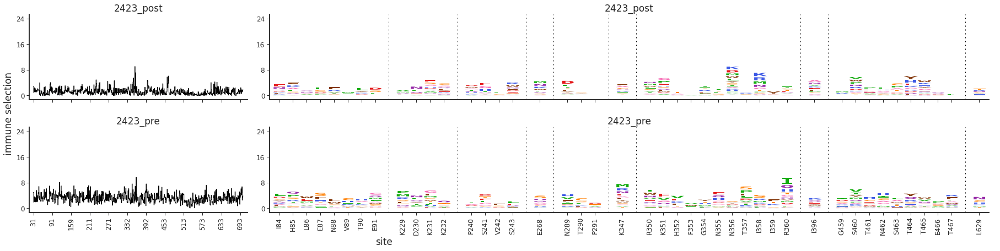


    2425
    46.65913349738672
    
    
    ************************************************************************
    Serum group 2425, saving to ./results/diffsel/AvgAcrossDils/2425.pdf
    


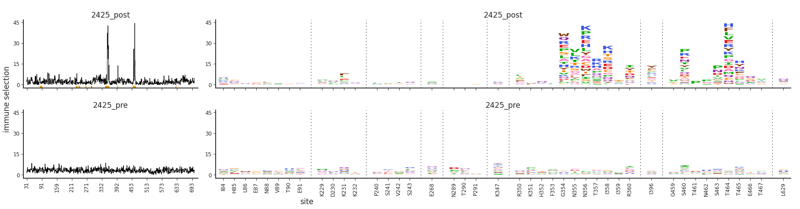


    5724
    105.95798337522064
    
    
    ************************************************************************
    Serum group 5724, saving to ./results/diffsel/AvgAcrossDils/5724.pdf
    


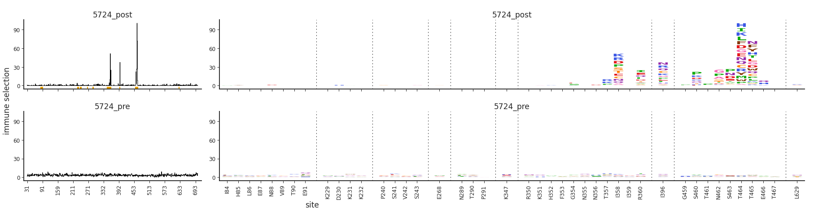


    5727
    31.21223326027834
    
    
    ************************************************************************
    Serum group 5727, saving to ./results/diffsel/AvgAcrossDils/5727.pdf
    


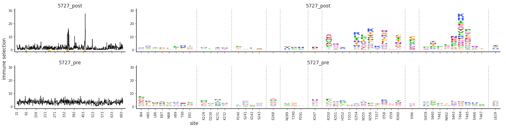


```python
os.makedirs("./results/diffsel/AvgAcrossDils_individual/", exist_ok=True)

for rabbit_id, df in avg_sel_df.groupby('serum_alldils_name'):

    plotfile = os.path.join("./results/diffsel/AvgAcrossDils_individual/",
                            f"{rabbit_id}_NewPNGRed.pdf")
    print(f"\n\n{'*' * 72}\nSerum group {rabbit_id}, saving to {plotfile}\n")
    rabbitname = rabbit_id.split("_")[0]
    ymin = -0.055 * rabbit_post_ymaxx5_dict[rabbitname]
    print(rabbitname)
    fig, axes = dmslogo.facet_plot(
            data=df,#.query('library == @avg_type'),
            #nintiethpercentile
            #ymax= nintiethpercentile * 10
            x_col='isite',
            show_col='zoom_site',
            gridrow_col='serum_alldils_name',
            share_xlabel=True,
            share_ylabel=True,
            #share_ylim_across_rows=rabbit_post_ymax_dict[rabbitname],
            set_ylims = (ymin, rabbit_post_ymaxx5_dict[rabbitname]),
            wspace=0.6,
            draw_line_kwargs=dict(
                    height_col='positive_diffsel',
                    xtick_col='site',
                    ylabel='immune selection',
                    ),
            draw_logo_kwargs=dict(
                    letter_col='mutation',
                    letter_height_col='mutdiffsel',
                    xtick_col='site_label',
                    xlabel='site',
                    ylabel='immune selection',
                    clip_negative_heights=True,
                    color_col='color'
                    ),
            )
    display(fig)
    fig.savefig(plotfile)
    plt.close(fig)
```

    
    
    ************************************************************************
    Serum group 2124_post, saving to ./results/diffsel/AvgAcrossDils_individual/2124_post_NewPNGRed.pdf
    
    2124


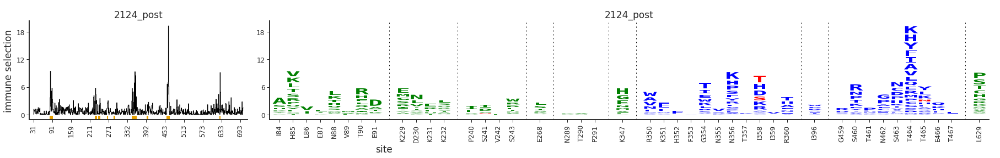


    
    
    ************************************************************************
    Serum group 2124_pre, saving to ./results/diffsel/AvgAcrossDils_individual/2124_pre_NewPNGRed.pdf
    
    2124


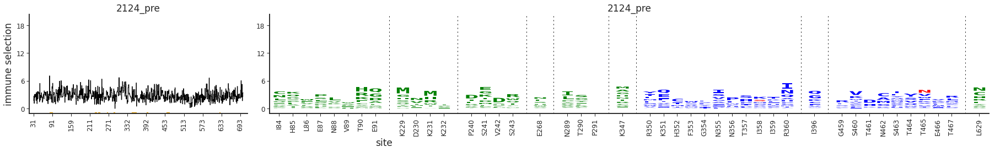


    
    
    ************************************************************************
    Serum group 2214_post, saving to ./results/diffsel/AvgAcrossDils_individual/2214_post_NewPNGRed.pdf
    
    2214


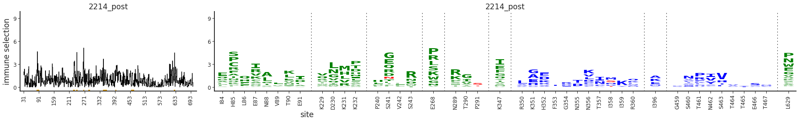


    
    
    ************************************************************************
    Serum group 2214_pre, saving to ./results/diffsel/AvgAcrossDils_individual/2214_pre_NewPNGRed.pdf
    
    2214


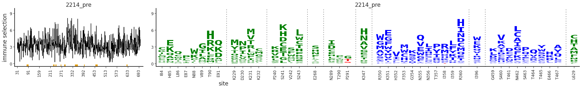


    
    
    ************************************************************************
    Serum group 2423_post, saving to ./results/diffsel/AvgAcrossDils_individual/2423_post_NewPNGRed.pdf
    
    2423


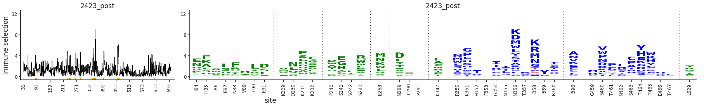


    
    
    ************************************************************************
    Serum group 2423_pre, saving to ./results/diffsel/AvgAcrossDils_individual/2423_pre_NewPNGRed.pdf
    
    2423


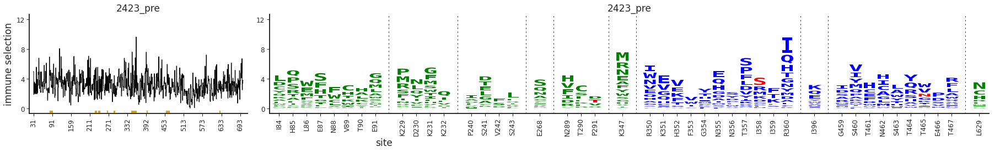


    
    
    ************************************************************************
    Serum group 2425_post, saving to ./results/diffsel/AvgAcrossDils_individual/2425_post_NewPNGRed.pdf
    
    2425


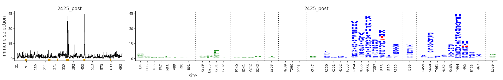


    
    
    ************************************************************************
    Serum group 2425_pre, saving to ./results/diffsel/AvgAcrossDils_individual/2425_pre_NewPNGRed.pdf
    
    2425


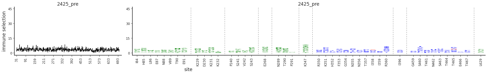


    
    
    ************************************************************************
    Serum group 5724_post, saving to ./results/diffsel/AvgAcrossDils_individual/5724_post_NewPNGRed.pdf
    
    5724


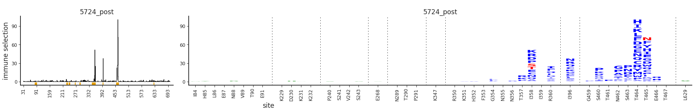


    
    
    ************************************************************************
    Serum group 5724_pre, saving to ./results/diffsel/AvgAcrossDils_individual/5724_pre_NewPNGRed.pdf
    
    5724


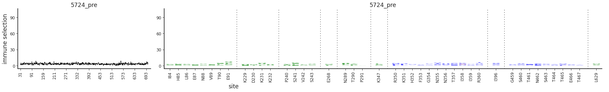


    
    
    ************************************************************************
    Serum group 5727_post, saving to ./results/diffsel/AvgAcrossDils_individual/5727_post_NewPNGRed.pdf
    
    5727


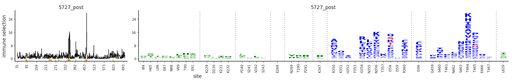


    
    
    ************************************************************************
    Serum group 5727_pre, saving to ./results/diffsel/AvgAcrossDils_individual/5727_pre_NewPNGRed.pdf
    
    5727


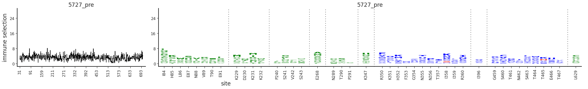


```python
rabbitnames = ['5724', '2425', '5727', '2124', '2423', '2214']
postpdfnamelist = []
for name in rabbitnames:
    postpdfnamelist.append("./results/diffsel/AvgAcrossDils_individual/{0}_post_NewPNGRed.pdf".format(name))
#postpdfnamelist
```


```python
for pdf in postpdfnamelist:
    showPDF(pdf)
```


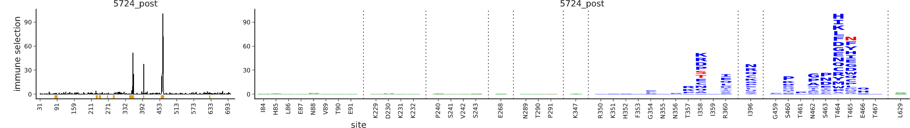


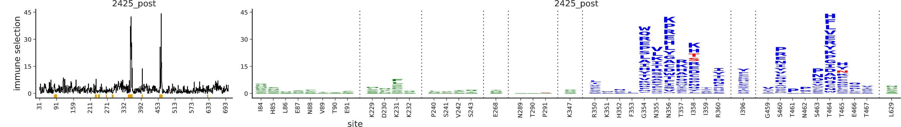


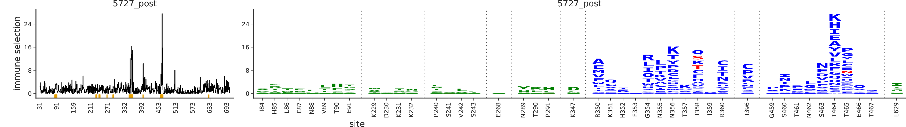


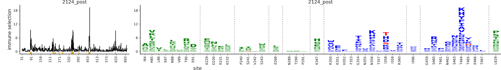


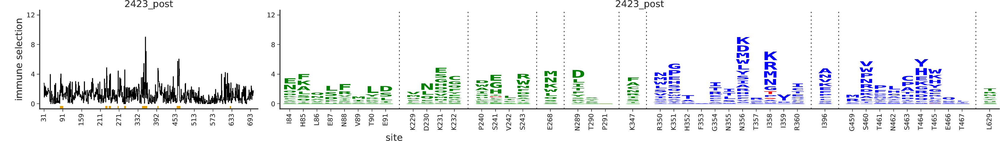


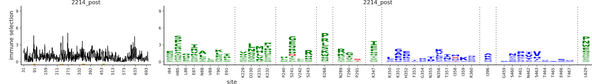


```python
#avg_sel_df.head()
```


```python
avg_sel_df["zoom_siteC3"] = False
avg_sel_df.loc[avg_sel_df['site'].isin(c3465), 'zoom_siteC3'] = True

avg_sel_df["zoom_site241"] = False
avg_sel_df.loc[avg_sel_df['site'].isin(hole241), 'zoom_site241'] = True

```


```python
#now we are going to plot only the median values from two samples

os.makedirs("./results/diffsel/AvgAcrossDils/C3V5/", exist_ok=True)

avg_sel_df["color"] = "gray"
avg_sel_df.loc[avg_sel_df['site'].isin(hole241), 'color'] = "green"
avg_sel_df.loc[avg_sel_df['site'].isin(c3465), 'color'] = "blue"

avg_sel_df.loc[(avg_sel_df['site_label'] == "K351") & (avg_sel_df['mutation'] == "E"), 'color'] = "red"
avg_sel_df.loc[(avg_sel_df['site_label'] == "N355") & (avg_sel_df['mutation'] == "L"), 'color'] = "red"
avg_sel_df.loc[(avg_sel_df['site_label'] == "R350") & (avg_sel_df['mutation'] == "M"), 'color'] = "red"
avg_sel_df.loc[(avg_sel_df['site_label'] == "N356") & (avg_sel_df['mutation'] == "K"), 'color'] = "red"
avg_sel_df.loc[(avg_sel_df['site_label'] == "T464") & (avg_sel_df['mutation'] == "H"), 'color'] = "red"
avg_sel_df.loc[(avg_sel_df['site_label'] == "T464") & (avg_sel_df['mutation'] == "K"), 'color'] = "red"
avg_sel_df.loc[(avg_sel_df['site_label'] == "I358") & (avg_sel_df['mutation'] == "K"), 'color'] = "red"


for rabbit_id, df in avg_sel_df.groupby('serum_alldils_name'):

    plotfile = os.path.join("./results/diffsel/AvgAcrossDils/C3V5/",
                            f"{rabbit_id}.pdf")
    print(f"\n\n{'*' * 72}\nSerum group {rabbit_id}, saving to {plotfile}\n")
    fig, axes = dmslogo.facet_plot(
            data=df,#.query('library == @avg_type'),
            x_col='isite',
            show_col='zoom_siteC3',
            gridrow_col='serum_alldils_name',
            share_xlabel=True,
            share_ylabel=True,
            #share_ylim_across_rows=share_ylim_across_rows[rabbit_id],
            wspace=0.6,
            draw_line_kwargs=dict(
                    height_col='positive_diffsel',
                    xtick_col='site',
                    ylabel='immune selection',
                    ),
            draw_logo_kwargs=dict(
                    letter_col='mutation',
                    letter_height_col='mutdiffsel',
                    xtick_col='site_label',
                    xlabel='site',
                    ylabel='immune selection',
                    clip_negative_heights=True,
                    color_col='color',
                    ),
            )
    display(fig)
    fig.savefig(plotfile)
    plt.close(fig)

```

    
    
    ************************************************************************
    Serum group 2124_post, saving to ./results/diffsel/AvgAcrossDils/C3V5/2124_post.pdf
    


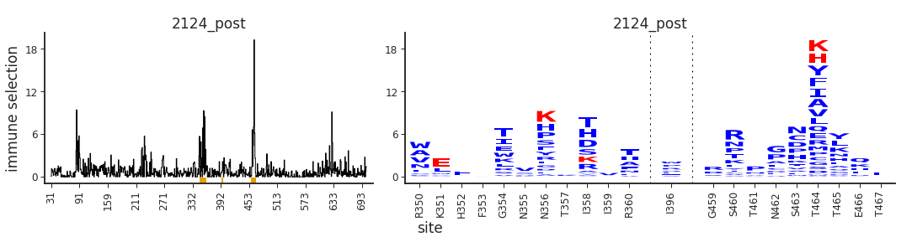


    
    
    ************************************************************************
    Serum group 2124_pre, saving to ./results/diffsel/AvgAcrossDils/C3V5/2124_pre.pdf
    


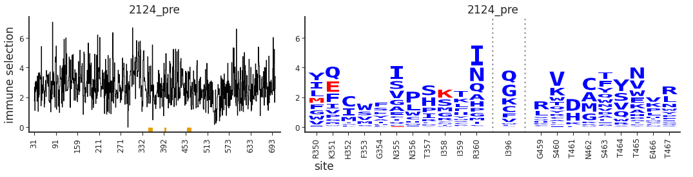


    
    
    ************************************************************************
    Serum group 2214_post, saving to ./results/diffsel/AvgAcrossDils/C3V5/2214_post.pdf
    


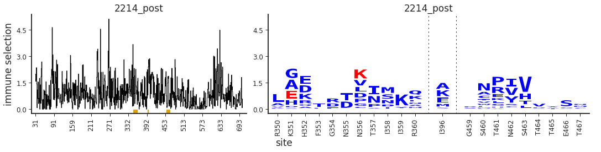


    
    
    ************************************************************************
    Serum group 2214_pre, saving to ./results/diffsel/AvgAcrossDils/C3V5/2214_pre.pdf
    


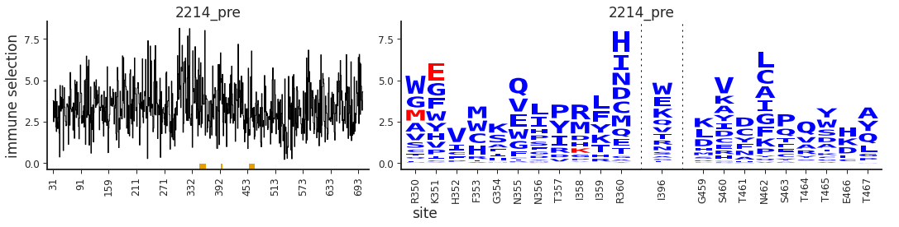


    
    
    ************************************************************************
    Serum group 2423_post, saving to ./results/diffsel/AvgAcrossDils/C3V5/2423_post.pdf
    


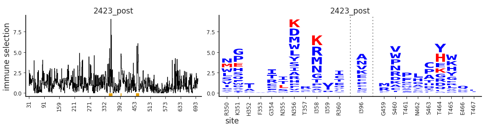


    
    
    ************************************************************************
    Serum group 2423_pre, saving to ./results/diffsel/AvgAcrossDils/C3V5/2423_pre.pdf
    


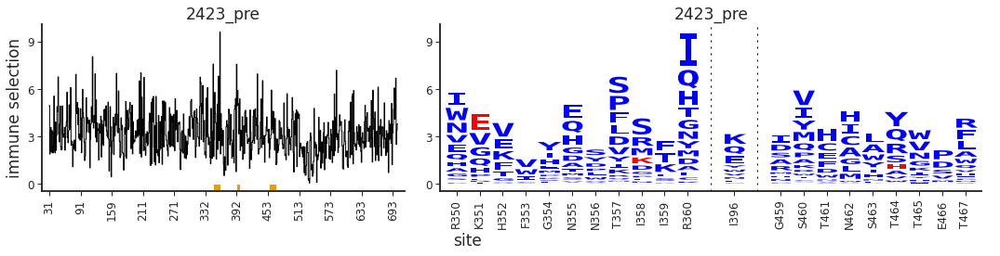


    
    
    ************************************************************************
    Serum group 2425_post, saving to ./results/diffsel/AvgAcrossDils/C3V5/2425_post.pdf
    


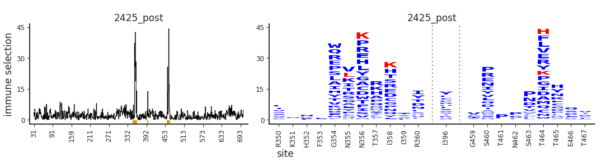


    
    
    ************************************************************************
    Serum group 2425_pre, saving to ./results/diffsel/AvgAcrossDils/C3V5/2425_pre.pdf
    


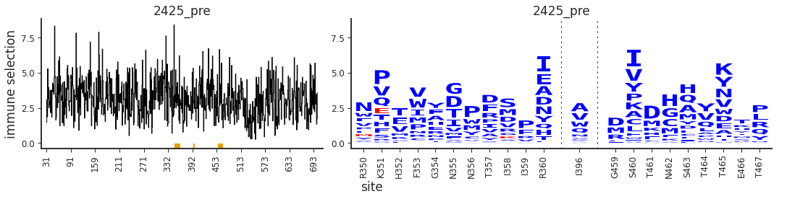


    
    
    ************************************************************************
    Serum group 5724_post, saving to ./results/diffsel/AvgAcrossDils/C3V5/5724_post.pdf
    


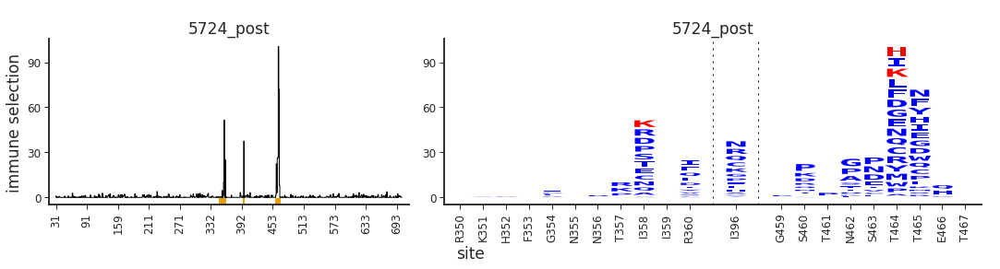


    
    
    ************************************************************************
    Serum group 5724_pre, saving to ./results/diffsel/AvgAcrossDils/C3V5/5724_pre.pdf
    


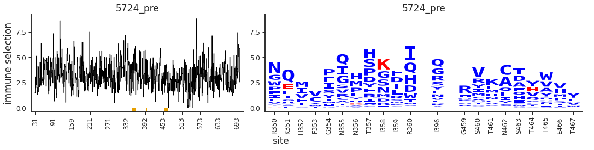


    
    
    ************************************************************************
    Serum group 5727_post, saving to ./results/diffsel/AvgAcrossDils/C3V5/5727_post.pdf
    


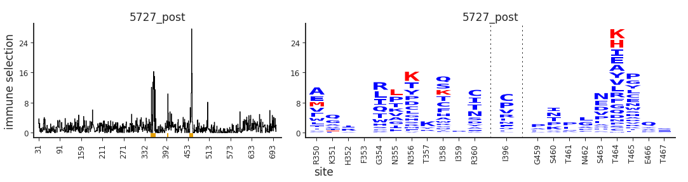


    
    
    ************************************************************************
    Serum group 5727_pre, saving to ./results/diffsel/AvgAcrossDils/C3V5/5727_pre.pdf
    


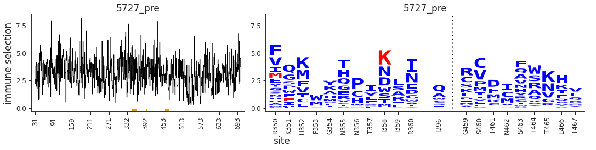


```python

os.makedirs("./results/diffsel/AvgAcrossDils/241/", exist_ok=True)

avg_sel_df["color"] = "gray"
avg_sel_df.loc[avg_sel_df['site'].isin(hole241), 'color'] = "green"
avg_sel_df.loc[avg_sel_df['site'].isin(c3465), 'color'] = "blue"

avg_sel_df.loc[(avg_sel_df['site_label'] == "I84") & (avg_sel_df['mutation'] == "E"), 'color'] = "red"
avg_sel_df.loc[(avg_sel_df['site_label'] == "N289") & (avg_sel_df['mutation'] == "D"), 'color'] = "red"
avg_sel_df.loc[(avg_sel_df['site_label'] == "L629") & (avg_sel_df['mutation'] == "P"), 'color'] = "red"
avg_sel_df.loc[(avg_sel_df['site_label'] == "N289") & (avg_sel_df['mutation'] == "R"), 'color'] = "red"
avg_sel_df.loc[(avg_sel_df['site_label'] == "T464") & (avg_sel_df['mutation'] == "H"), 'color'] = "red"
avg_sel_df.loc[(avg_sel_df['site_label'] == "S241") & (avg_sel_df['mutation'] == "G"), 'color'] = "red"
avg_sel_df.loc[(avg_sel_df['site_label'] == "E268") & (avg_sel_df['mutation'] == "P"), 'color'] = "red"


for rabbit_id, df in avg_sel_df.groupby('serum_alldils_name'):

    plotfile = os.path.join("./results/diffsel/AvgAcrossDils/241/",
                            f"{rabbit_id}.pdf")
    print(f"\n\n{'*' * 72}\nSerum group {rabbit_id}, saving to {plotfile}\n")
    fig, axes = dmslogo.facet_plot(
            data=df,#.query('library == @avg_type'),
            x_col='isite',
            show_col='zoom_site241',
            gridrow_col='serum_alldils_name',
            share_xlabel=True,
            share_ylabel=True,
            #share_ylim_across_rows=share_ylim_across_rows[rabbit_id],
            wspace=0.6,
            draw_line_kwargs=dict(
                    height_col='positive_diffsel',
                    xtick_col='site',
                    ylabel='immune selection',
                    ),
            draw_logo_kwargs=dict(
                    letter_col='mutation',
                    letter_height_col='mutdiffsel',
                    xtick_col='site_label',
                    xlabel='site',
                    ylabel='immune selection',
                    clip_negative_heights=True,
                    color_col='color',
                    ),
            )
    display(fig)
    fig.savefig(plotfile)
    plt.close(fig)
```

    
    
    ************************************************************************
    Serum group 2124_post, saving to ./results/diffsel/AvgAcrossDils/241/2124_post.pdf
    


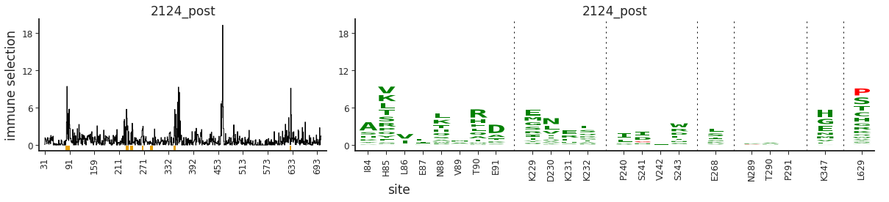


    
    
    ************************************************************************
    Serum group 2124_pre, saving to ./results/diffsel/AvgAcrossDils/241/2124_pre.pdf
    


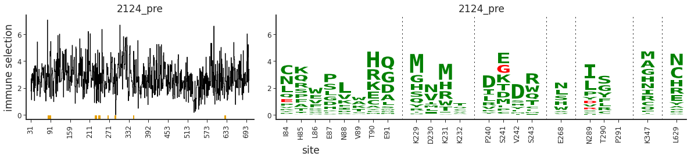


    
    
    ************************************************************************
    Serum group 2214_post, saving to ./results/diffsel/AvgAcrossDils/241/2214_post.pdf
    


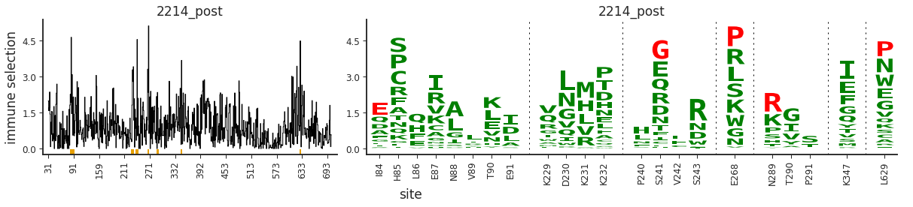


    
    
    ************************************************************************
    Serum group 2214_pre, saving to ./results/diffsel/AvgAcrossDils/241/2214_pre.pdf
    


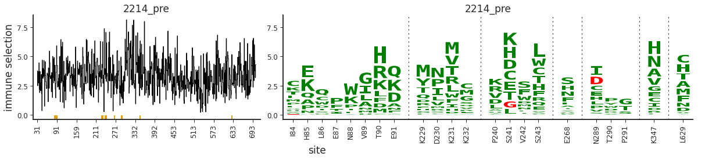


    
    
    ************************************************************************
    Serum group 2423_post, saving to ./results/diffsel/AvgAcrossDils/241/2423_post.pdf
    


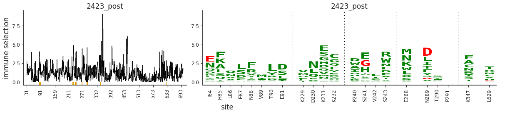


    
    
    ************************************************************************
    Serum group 2423_pre, saving to ./results/diffsel/AvgAcrossDils/241/2423_pre.pdf
    


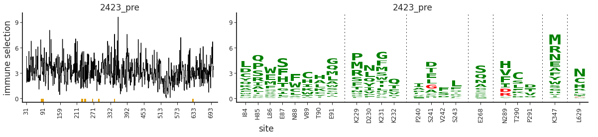


    
    
    ************************************************************************
    Serum group 2425_post, saving to ./results/diffsel/AvgAcrossDils/241/2425_post.pdf
    


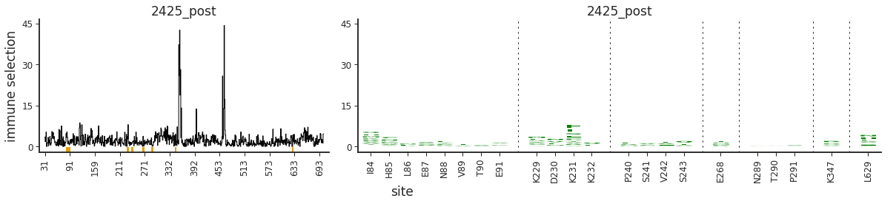


    
    
    ************************************************************************
    Serum group 2425_pre, saving to ./results/diffsel/AvgAcrossDils/241/2425_pre.pdf
    


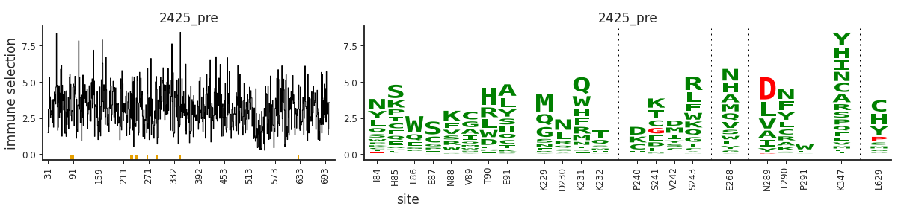


    
    
    ************************************************************************
    Serum group 5724_post, saving to ./results/diffsel/AvgAcrossDils/241/5724_post.pdf
    


    
    
    ************************************************************************
    Serum group 5724_pre, saving to ./results/diffsel/AvgAcrossDils/241/5724_pre.pdf
    


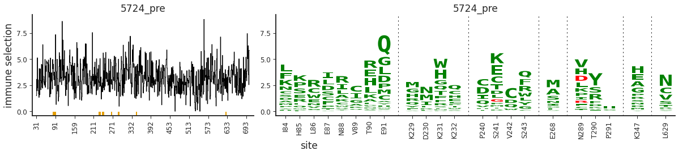


    
    
    ************************************************************************
    Serum group 5727_post, saving to ./results/diffsel/AvgAcrossDils/241/5727_post.pdf
    


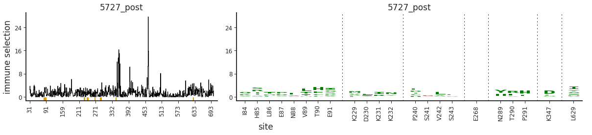


    
    
    ************************************************************************
    Serum group 5727_pre, saving to ./results/diffsel/AvgAcrossDils/241/5727_pre.pdf
    


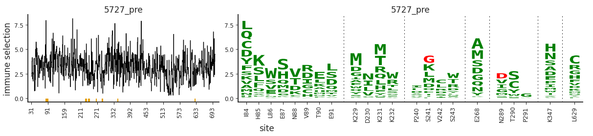


## Map differential selection onto structure


```python
from colour import Color
import pandas as pd
import pandas as pd
from io import StringIO
colors = ('#fafafa', '#ff0000')
def MapDiffselColorToSite_15(diffselfile, scriptfile, script_type='pymol', 
                          map_type='abs_diffsel', colors = colors, sitecolorfile=None,
                          script_preamble=False, restrict_to_chain=False, script_postamble=False, abname=None):
    '''Produces a colormapping based on differential selection and writes a script for `pymol` or `chimera`
    to color a structure by this colormapping.
    
    Uses the data in *diffselfile*, which can be either a mutdiffsel or a sitediffsel file, 
    depending on the specified *map_type*. 
    
    Writes a python script to *scriptfile* for the molecular visualization program specified 
    in *script_type* (either `pymol` or `chimera`).
    
    *colors* is a list of two colors defined by hex or r,g,b codes.
    
    How the mapping from differential selection to color is determined is specified by the 
    following choices for *map_type*:
    
        * `abs_diffsel`: plot total absolute differential selection at each site. 
        Total absolute differential selection will be converted to color by interpolating between 
        the two *colors*, which will be used to show the minimum and maximum values, respectively.
        Requries *diffselfile* to be a '*sitediffsel.txt' file.
        
        * `positive_diffsel`: plot the absolute positive selection at each site. 
        Absolute positive differential selection will be converted to color by interpolating between 
        the two *colors*, which will be used to show the minimum and maximum values, respectively.
        Requries *diffselfile* to be a '*sitediffsel.txt' file.
        
        * `negative_diffsel`: plot the absolute negative selection at each site. 
        Absolute negative differential selection will be converted to color by interpolating between 
        the two *colors*, which will be used to show the (absolute) minimum and maximum values, respectively.
        Requries *diffselfile* to be a '*sitediffsel.txt' file.
        
        * `max_pos_mutdiffsel`: plot the maximum positive mutdiffsel at each site (the value for the most 
        strongly enriched mutation at each site).
        Requries *diffselfile* to be a '*mutdiffsel.txt' file.
    
    If you want to restrict the recoloring to a single chain, specify the name of the chain to color to *restrict_to_chain*.
        
    Optionally, provide a path for a *sitecolorfile* to which the (site, hexcolor, rgbcolor) mappings are
    written.
    
    Optionally, if a *script_preamble* is provided, it is written to the top of the script before the 
    commands for colormapping. This may be a useful place to add other pymol or chimera commands to load 
    the pdb file, orient the view, etc.
    '''

    # read in the data from the diffselfile:
    df = pd.read_csv(diffselfile)
    df = df.dropna()
    
    #drop rows that are insertions relative to HXB2. This is not ideal, but done to ensure the coloring script works. note insertions relative to HXB2 in the sturcture are not colored according to diffsel metrics.
    
    df = df[df.site.apply(lambda x: x.isnumeric())]
    column_names = list(df)
   
    if column_names == ['site', 'wildtype', 'mutation', 'mutdiffsel'] or column_names == ['site', 'wildtype', 'mutation', 'mutfracsurvive']:
        filetype = 'mutdiffsel'
    elif column_names == ['site', 'abs_diffsel', 'positive_diffsel', 'negative_diffsel', 'max_diffsel', 'min_diffsel']:
        filetype = 'sitediffsel' 
    else:

        raise ValueError('diffsel file does not have appropriate set of column identifiers for {0}'.format(column_names))
    
    # establish the color spectrum in hex and rgb.
    n_subdivisions = 500 # the color spectrum will be divided into this many discrete colors
    color1 = Color(colors[0])
    color2 = Color(colors[1])
    hex_spectrum = [c.hex for c in color1.range_to(color2, n_subdivisions)]
    hex_spectrum_dict = dict([(i, hex_spectrum[i]) for i in range(len(hex_spectrum))]) 
    rgb_spectrum = [c.rgb for c in color1.range_to(color2, n_subdivisions)]
    rgb_spectrum_dict = dict([(i, rgb_spectrum[i]) for i in range(len(rgb_spectrum))])
    
    # generate the site ==> colorindex mapping based on *map_type*:
    if map_type == 'abs_diffsel':
        assert filetype == 'sitediffsel'
        min_diff = df.min()['abs_diffsel']  
        max_diff = df.max()['abs_diffsel']  # the min and max will be mapped to color1 and color2, respectively
        range_diff = max_diff - min_diff
        df['colorindex'] =  (df.abs_diffsel - min_diff)/range_diff*(n_subdivisions-1)
        
    elif map_type == 'negative_diffsel':
        assert filetype == 'sitediffsel'
        abs_neg_col = abs(df['negative_diffsel'])
        df = df.assign(abs_neg=abs_neg_col)
        min_diff = df.min()['abs_neg']  
        max_diff = df.max()['abs_neg']  # the min and max will be mapped to color1 and color2, respectively
        range_diff = max_diff - min_diff
        df['colorindex'] =  (df.abs_neg - min_diff)/range_diff*(n_subdivisions-1)
            
    elif map_type == 'positive_diffsel':
        assert filetype == 'sitediffsel'
        abs_pos_col = abs(df['positive_diffsel'])
        df = df.assign(abs_pos=abs_pos_col)
        #df = df.append({'site' : '0' , 'abs_pos' : 15} , ignore_index=True) #this is added to standardize color scheme across all samples
        df['positive_diffsel'] = df['positive_diffsel'].clip(upper=15) #clip everything above 15 to 15 
        min_diff = df.min()['abs_pos']  
        max_diff = df.max()['abs_pos']  # the min and max will be mapped to color1 and color2, respectively
        range_diff = max_diff - min_diff
        df['colorindex'] =  (df.abs_pos - min_diff)/range_diff*(n_subdivisions-1)
    
    elif map_type == 'max_pos_mutdiffsel':
        assert filetype == 'mutdiffsel'
        # sort mutdiffsel file by diffsel in case it wasn't already:
        df.sort_values('mutdiffsel', ascending=False, inplace=True)
        # a new dataframe to only store the max mutdiffsel from each site
        newdf = pd.DataFrame(columns=['site', 'wildtype', 'mutation', 'mutdiffsel']) 
        for row in df.itertuples():
            if not any(newdf['site'].astype(int) == int(row[1])):
                newdf = newdf.append(pd.DataFrame([row[1:]], columns = ['site', 'wildtype', 'mutation', 'mutdiffsel']))
        
        newdf['site'] = newdf['site'].apply(int)
        
        
        # replace negative values with zero at sites where there was no positive selection:
        #newdf = newdf.clip(lower=0) #old
        newdf['site'] = newdf['site'].clip(lower=0) #new
        min_diff = newdf.min()['mutdiffsel']  
        max_diff = newdf.max()['mutdiffsel']  # the min and max will be mapped to color1 and color2, respectively
        range_diff = max_diff - min_diff
        newdf['colorindex'] =  (newdf.mutdiffsel - min_diff)/range_diff*(n_subdivisions-1)
        df = newdf

    else:
        raise ValueError("%s is not a recognized map_type." % map_type)
        
    # add a column for colors for each site
    df['colorindex'] = df['colorindex'].astype(int) # round to nearest index
    df['hex'] = df['colorindex'].map(hex_spectrum_dict)
    df['rgb'] = df['colorindex'].map(rgb_spectrum_dict)        
    site_color_mapping = pd.concat([df['site'], df['hex'], df['rgb']], axis=1)
    
    if sitecolorfile:
        site_color_mapping.to_csv(sitecolorfile, index=False)
    
    # write out the script to *scriptfile*:
    f = open(scriptfile, 'w')
    
    if script_preamble:
        preamblef = open(script_preamble, 'r')
        for line in preamblef:
            f.write(line)
    
    if script_type == 'chimera':
        f.write("from chimera import runCommand\n")
        for i in range(len(df.index)):
            f.write("runCommand(color %s :%s)" % (site_color_mapping.iloc[i]['hex'], site_color_mapping.iloc[i]['site']) )
    elif script_type == 'pymol':
        for i in range(len(df.index)):
            rgblist = [min(1, c) for c in site_color_mapping.iloc[i]['rgb']]
            f.write("cmd.set_color(\'color%s\', \'%s\')\n" % (site_color_mapping.iloc[i]['site'], rgblist))
            if restrict_to_chain:
                f.write("cmd.color(\'color%s\', \'chain %s and resi %s\')\n" % (site_color_mapping.iloc[i]['site'], restrict_to_chain, site_color_mapping.iloc[i]['site']))
            else:
                f.write("cmd.color(\'color%s\', \'resi %s\')\n" % (site_color_mapping.iloc[i]['site'], site_color_mapping.iloc[i]['site']))
    else:
        raise ValueError("script_type must be chimera or pymol.")
    
    if script_postamble:
        postamblef = open(script_postamble, 'r')
        f.write('abname = "{0}"'.format(abname))
        for line in postamblef:
            f.write(line)
    
    f.close()
```


```python
pymoldir = "./results/diffsel/pymol/"
if not os.path.isdir(pymoldir):
    os.mkdir(pymoldir)
```


```python
for ab in mediansiteselfiledict:
    mutdiffselfile= medianmutselfiledict[ab]
    scriptfile= './results/diffsel/pymol/median-max15-{0}-ColorMaxPositive.py'.format(ab)
    #MapDiffselColorToSite(mutdiffselfile, scriptfile, script_type='pymol', map_type='max_pos_mutdiffsel')
    
    sitediffselfile= mediansiteselfiledict[ab] #'./results/diffsel/median-{0}_sitediffsel.csv'.format(ab)

    scriptfile= './results/diffsel/pymol/median-max15-{0}-ColorPositiveDiff.py'.format(ab)
    MapDiffselColorToSite_15(sitediffselfile, scriptfile, script_type='pymol', map_type='positive_diffsel', abname=ab, script_preamble="./data/5YFL_general_preamble.txt", script_postamble="./data/5YFL_general_postamble.txt")
    
    scriptfile= './results/diffsel/pymol/median-max15-{0}-nopreamble-ColorPositiveDiff.py'.format(ab)
    MapDiffselColorToSite_15(sitediffselfile, scriptfile, script_type='pymol', map_type='positive_diffsel', abname=ab)

    scriptfile= './results/diffsel/pymol/median-max15-{0}-241pic-ColorPositiveDiff.py'.format(ab)
    MapDiffselColorToSite_15(sitediffselfile, scriptfile, script_type='pymol', map_type='positive_diffsel', abname=ab, script_preamble="./data/5YFL_monomer_preamble.txt", script_postamble="./data/5YFL_241hole_postamble.txt")
    
    
    scriptfile= './results/diffsel/pymol/median-max15-{0}-C3465pic-ColorPositiveDiff.py'.format(ab)
    MapDiffselColorToSite_15(sitediffselfile, scriptfile, script_type='pymol', map_type='positive_diffsel', abname=ab, script_preamble="./data/5YFL_monomer_preamble.txt", script_postamble="./data/5YFL_c3465_postamble1.txt")

    scriptfile= './results/diffsel/pymol/median-max15-{0}-C3465picZOOM-ColorPositiveDiff.py'.format(ab)
    MapDiffselColorToSite_15(sitediffselfile, scriptfile, script_type='pymol', map_type='positive_diffsel', abname=ab, script_preamble="./data/5YFL_monomer_preamble.txt", script_postamble="./data/5YFL_c3465Zoom_postamble1.txt")

    
    
    scriptfile= './results/diffsel/pymol/median-max15-{0}-ColorPositiveDiff_view2.py'.format(ab)
    #MapDiffselColorToSite(sitediffselfile, scriptfile, script_type='pymol', map_type='positive_diffsel', abname=ab, script_preamble="./data/5YFL_general_preamble.txt", script_postamble="./data/5YFL_general_postamble2.txt")

    
    scriptfile= './results/diffsel/pymol/median-{0}-ColorAbsDiff.py'.format(ab)
    #MapDiffselColorToSite(sitediffselfile, scriptfile, script_type='pymol', map_type='abs_diffsel')
    scriptfile= './results/diffsel/pymol/median-{0}-ColorNegDiff.py'.format(ab)
    #MapDiffselColorToSite(sitediffselfile, scriptfile, script_type='pymol', map_type='negative_diffsel')
```
